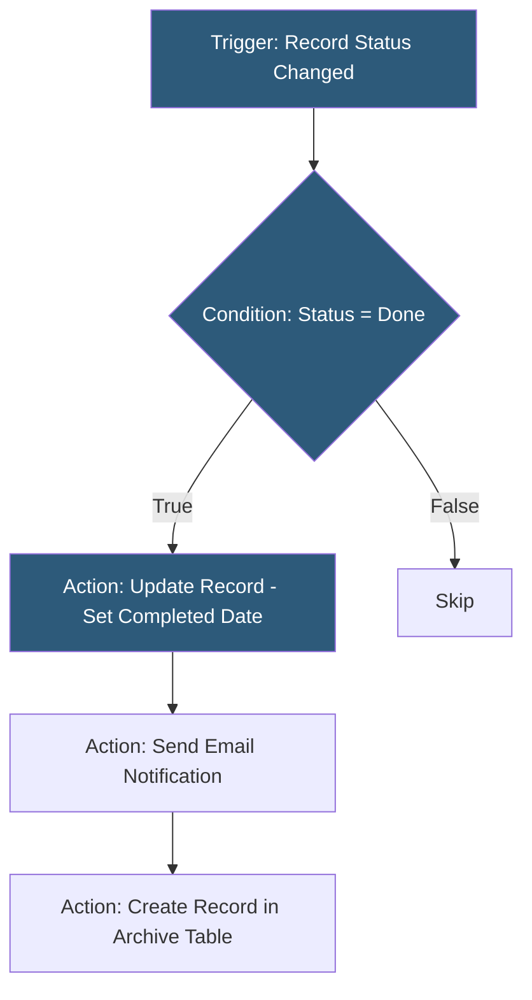

**Category:** Low-Code/No-Code Platforms
**Difficulty:** Beginner
**Reading time:** 5 min read

---

Airtable Automations is a built-in workflow automation system that triggers actions when records change, are created, or meet specified conditions. It enables non-technical users to automate repetitive tasks like sending notifications, updating records, and calling external services.

- **Automation** — A named rule consisting of a trigger and one or more action steps
- **Trigger** — The condition starting an automation: record created, field changed, form submitted, scheduled time
- **Action** — A step performing an operation: update record, send email, create record, call webhook, run script
- **Condition** — A filter added to a trigger or between action steps to control execution
- **Run Script Action** — A JavaScript execution step for custom logic within an automation
- **Webhook Action** — An HTTP POST step sending data to external services or Zapier/Make webhooks
- **Test Run** — The ability to manually execute an automation with a specific record for debugging
- **Run History** — A log of automation executions with success/failure status and step outputs

Automations in Airtable are configured through the Automations tab in any base. Each automation has a single trigger and a sequence of action steps. Triggers watch for specific database events: a record being created in a table, a specific field changing to a particular value, or a scheduled time.

When a trigger fires, Airtable passes the triggering record's field values into the automation context. These values are referenced in action steps using a field-picker interface — dragging fields into message templates or update values.

Action steps run sequentially. Update Record changes field values on the triggering record or on other linked records. Create Record adds a new row in any table. Send Email sends a formatted email to an address from a field value. Find Records queries a table to find matching records before taking action on them.

The Run Script action unlocks JavaScript execution for complex logic: string manipulation, conditional branching, API calls, or mathematical calculations. Scripts receive input variables from previous steps and return output variables usable by subsequent steps.

Webhook actions POST a JSON payload to any URL — this is the primary integration point for Zapier, Make, Slack, and custom APIs. The payload is built using the field-picker to include relevant data.

- Sending Slack notifications when high-priority tasks are marked urgent
- Auto-assigning records to team members using round-robin logic
- Emailing clients when their project status changes to "Delivered"
- Creating follow-up tasks automatically when a deal closes
- Syncing Airtable data to external systems via webhook on record changes

| Advantage | Disadvantage |
|-----------|--------------|
| Zero setup; automations are built where the data lives | Limited to Airtable's trigger types; complex triggers need workarounds |
| Run Script provides JavaScript flexibility | Automation run limits on lower Airtable plans |
| Webhook integration connects to thousands of external services | Debugging errors in automations can be difficult without good logging |
| Condition steps prevent unnecessary action execution | More powerful workflows require dedicated tools like Zapier or Make |

- [Airtable Database Platform](airtable-database-platform.md)
- [Airtable Interfaces](airtable-interfaces.md)
- [Retool Workflows](retool-workflows.md)

---
*Part of the [Low-Code/No-Code Platforms](index.md) category · [Back to Master Index](../../index.md)*
