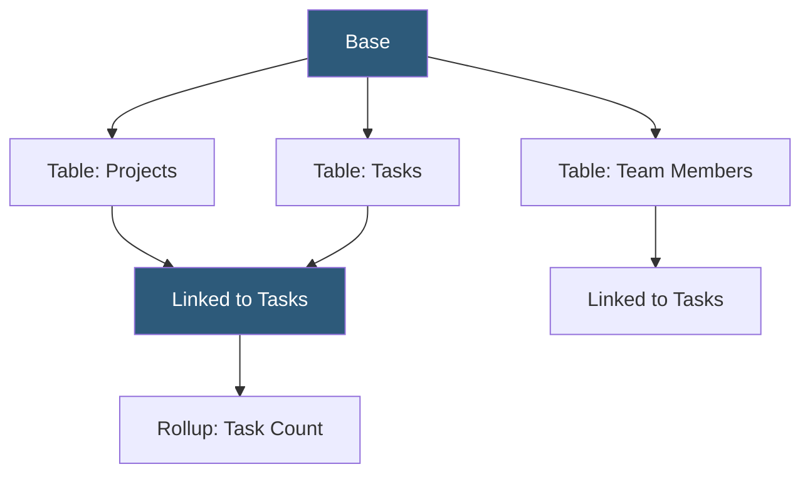

**Category:** Low-Code/No-Code Platforms
**Difficulty:** Beginner
**Reading time:** 6 min read

---

Airtable is a cloud-based database platform that combines the familiarity of a spreadsheet with the structure and relational capability of a database. Teams use it to organize projects, manage content pipelines, track inventory, and build lightweight applications without technical expertise.

- **Base** — An Airtable workspace analogous to a database, containing one or more tables
- **Table** — A grid of records organized into fields, similar to a database table or spreadsheet tab
- **Record** — A single row in a table, representing one entity (a task, contact, product, etc.)
- **Field** — A column in a table with a specific type: text, number, date, checkbox, attachment, link, etc.
- **Linked Record Field** — A field type creating a relationship between records in two tables
- **View** — A saved display of a table filtered, sorted, and grouped in a specific way
- **Formula Field** — A computed field using Airtable's formula language to derive values from other fields
- **Rollup Field** — A field that aggregates values from linked records (sum, count, average)

Airtable's data model is a relational database presented in a spreadsheet-like grid. Each Base contains tables, each table contains records, and records have typed fields. The key differentiator from a spreadsheet is the field type system: instead of every cell being a plain value, fields enforce types and provide specialized editors (date pickers, attachment uploaders, dropdown selectors).

Linked Record fields create relationships between tables. Linking a Tasks table to a Projects table allows assigning tasks to projects and traversing the relationship in views or formulas. The linked field stores record IDs and displays a human-readable label from the linked record.

Rollup and Lookup fields leverage relationships. Rollups aggregate data from linked records — counting tasks per project, summing invoice amounts per client. Lookups pull a field value from a linked record into the current table.

Views are one of Airtable's most powerful features. Grid view is the default spreadsheet. Gallery view renders records as cards with image fields prominently displayed. Kanban view groups records by a single-select field as swimlanes. Calendar view plots records by date. Gantt view renders project timelines. Each view can have its own filters, sorts, and hidden fields, supporting multiple team perspectives on the same data without duplication.

The Airtable API provides REST access to all base data, enabling integrations with external systems. Every base gets a unique API endpoint, and record operations (list, create, update, delete) follow standard REST patterns.

- Editorial content calendars tracking articles from idea to publication
- CRM-lite for managing sales contacts and follow-up tasks
- Product roadmaps with linked epics, features, and releases
- Event planning with linked venues, vendors, and tasks
- Asset management tracking creative files, statuses, and approvals

| Advantage | Disadvantage |
|-----------|--------------|
| Approachable for non-technical users familiar with spreadsheets | Performance degrades with very large datasets (100k+ records) |
| Relational fields enable proper data modeling | Limited query capability compared to SQL databases |
| Multiple view types serve different team workflows | No transactional guarantees or complex relational constraints |
| Strong API enables external integrations | Pricing escalates quickly with users and advanced features |

- [Airtable Automations](airtable-automations.md)
- [Airtable Interfaces](airtable-interfaces.md)
- [Notion Databases](notion-databases.md)

---
*Part of the [Low-Code/No-Code Platforms](index.md) category · [Back to Master Index](../../index.md)*
