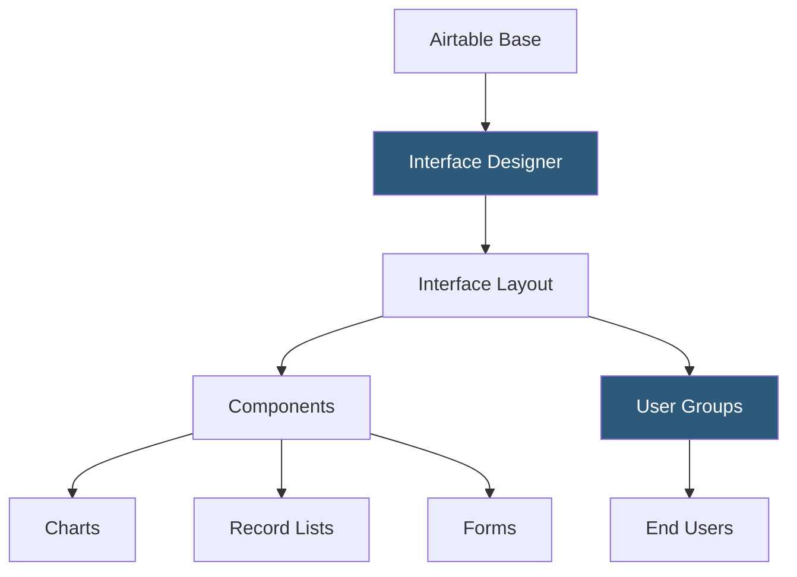

**Category:** Low-Code/No-Code Platforms
**Difficulty:** Beginner
**Reading time:** 5 min read

---

Airtable Interfaces is a no-code app builder that creates custom user-facing portals and dashboards on top of Airtable data. It allows builders to present database data in purpose-built layouts for specific user roles without exposing the raw grid view.

- **Interface** — A custom-built app view created on top of an Airtable base's data
- **Layout** — The visual arrangement of components on an interface page
- **Component** — A UI building block: record summary, list, gallery, chart, button, form, filter bar
- **Record Detail Page** — A full-page view displaying all fields of a selected record
- **Conditional Visibility** — Component display logic based on field values or user roles
- **User Group** — A permission tier defining which interfaces and records specific users can access
- **Interface Designer** — The drag-and-drop builder for creating and arranging interface components
- **Published Interface** — A deployed interface accessible via a shareable URL by invited users

Interfaces sit on top of existing Airtable bases without duplicating data. The Interface Designer provides a drag-and-drop canvas where components are placed and configured to display or interact with base data.

Components pull data from configured views within the base. A list component is connected to a specific table view (with its filters and sorts), displaying only the records that view includes. This means the same filtering logic used in the base's grid views controls what interface users see.

The record list component supports selecting a record to trigger a Detail Page — a full-record view showing all visible fields and optionally allowing edits. Builders configure which fields appear, their order, and whether they're editable per user group.

Charts in Interfaces visualize summary data: bar charts of records by status, donut charts of task completion rates, metrics cards showing counts. These pull from the same underlying data without requiring a separate analytics tool.

Buttons and forms enable write operations. A button can trigger an Airtable Automation, update field values, or open a linked record form. Forms create new records from user input with field validation.

User Groups control access. A base might have a "Client" group seeing only their own records and an "Internal" group seeing all records. Conditional visibility rules show or hide components based on field values, enabling a single interface serving multiple roles.

- Client portals showing only that client's project records
- Team dashboards with charts and lists for operational oversight
- Intake forms with a queue view for processing submissions
- Approval workflows where approvers see a filtered list of pending items
- Vendor portals with read-only order status views

| Advantage | Disadvantage |
|-----------|--------------|
| Creates purpose-built UX without exposing raw Airtable grids | Limited component types compared to full no-code app builders |
| User group permissions protect sensitive data | Not suitable for public-facing apps with anonymous users |
| Zero duplication; interfaces read from existing base views | Complex multi-page flows are difficult to build |
| Non-technical builders can design and deploy interfaces | Interfaces require Airtable plans with Interface Designer access |

- [Airtable Database Platform](airtable-database-platform.md)
- [Airtable Automations](airtable-automations.md)
- [Retool Internal Tools](retool-internal-tools.md)

---
*Part of the [Low-Code/No-Code Platforms](index.md) category · [Back to Master Index](../../index.md)*
