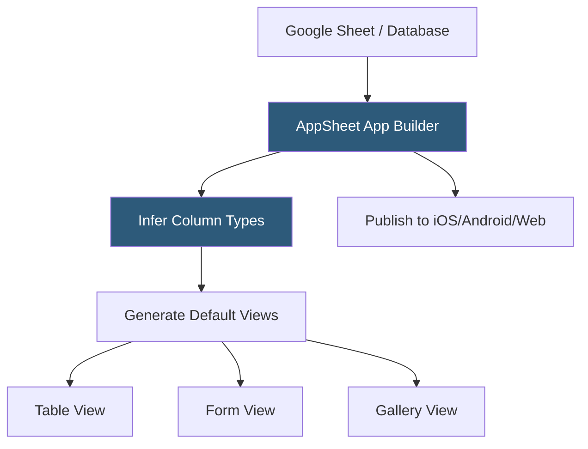

**Category:** Low-Code/No-Code Platforms
**Difficulty:** Beginner
**Reading time:** 5 min read

---

AppSheet is Google's no-code platform for building mobile and web applications directly from spreadsheets and databases. It reads data from Google Sheets, Excel, or cloud databases and generates functional apps with forms, views, and automations without any programming.

- **App** — A fully functional mobile or web application generated from a connected data source
- **Data Source** — The backend where app data is stored: Google Sheets, Excel, BigQuery, Cloud SQL, Salesforce
- **Table** — AppSheet's representation of a spreadsheet or database table, including inferred column types
- **Column Type** — AppSheet's typed classification of each column: Text, Number, Date, Image, Address, Enum, Ref
- **View** — A UI screen in the app: Table, Gallery, Map, Calendar, Chart, Form, or Detail view
- **Action** — A configurable operation triggered by a button: edit row, add row, send email, call webhook
- **Automation** — A triggered workflow running when rows are added, changed, or on a schedule
- **Ref Column** — A column type linking records between two tables, enabling relational navigation

AppSheet connects to a data source (most commonly Google Sheets) and reads the structure automatically. It infers column types from the content: a column named "Email" is typed as Email; one named "Phone" becomes Phone; one with dates is typed as Date. This automatic inference creates the initial app structure with minimal configuration.

Default views are generated from the inferred schema. A table view shows rows in a list. A form view provides an input screen for creating new records. A detail view shows a single record's fields. These starting views are fully configurable — columns shown, order, labels, and display format.

Ref columns create navigation between tables. If a Tasks table has a Ref column pointing to a Projects table, tapping a task in the app navigates to the related project record. Related records are displayed inline on detail views.

Actions add interactivity. A custom button on a record can trigger an email to the record's Email field value, call a webhook with row data, or navigate to another part of the app. Actions can be added to views, individual rows, or automated workflows.

Automations run when conditions are met: a row is added, a field changes to a certain value, or a scheduled time occurs. Automation steps send emails, call external webhooks, update rows, and add new rows. AppSheet's automation system is specifically designed for field-facing operations.

AppSheet natively handles offline use. Apps cache data locally and queue mutations, syncing when connectivity is restored — essential for field workers in construction, agriculture, or retail environments.

- Field inspection apps for construction or maintenance teams
- Inventory counting apps for warehouse floor workers
- Customer visit logging for field sales representatives
- Work order management for facilities teams
- Event registration and check-in apps

| Advantage | Disadvantage |
|-----------|--------------|
| Generates apps from existing spreadsheets immediately | App UI is functional but limited in design customization |
| Offline-first architecture for field use cases | Complex multi-table apps require careful schema design |
| Native Google Workspace integration (Sheets, Drive, BigQuery) | Less powerful formulas than dedicated low-code tools |
| No App Store submission required; apps deploy instantly | Scaling beyond Google Sheets requires database migration |

- [Retool Mobile Apps](retool-mobile-apps.md)
- [PowerApps Low-Code Platform](powerapps-low-code-platform.md)
- [Airtable Database Platform](airtable-database-platform.md)

---
*Part of the [Low-Code/No-Code Platforms](index.md) category · [Back to Master Index](../../index.md)*
