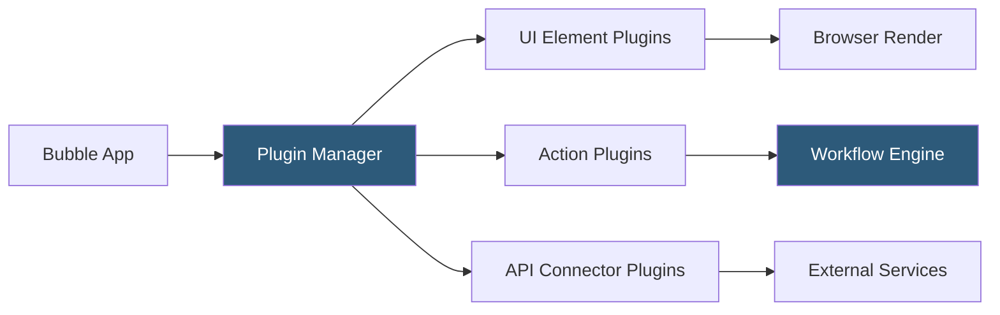

**Category:** Low-Code/No-Code Platforms
**Difficulty:** Intermediate
**Reading time:** 5 min read

---

Bubble's plugin ecosystem extends the platform's native capabilities through community-built and official plugins that add UI elements, third-party integrations, and custom JavaScript functionality. Plugins are installed from the Bubble marketplace and configured within the editor.

- **Plugin Marketplace** — Bubble's directory of installable plugins, both free and paid
- **Element Plugin** — A plugin that adds new visual UI components to the editor's element library
- **Action Plugin** — A plugin that adds new workflow actions for triggering external services
- **Data Source Plugin** — A plugin providing custom data queries or API-backed data retrieval
- **Client-Side Action** — Plugin code that executes in the browser for UI manipulation
- **Server-Side Action** — Plugin code that runs on Bubble's server for secure operations
- **Exposed States** — Data values a plugin exposes to the Bubble editor for use in expressions
- **Plugin Editor** — Bubble's interface for developers to build and publish their own plugins

Plugins in Bubble are packages of JavaScript code wrapped in a configuration layer that makes them accessible to non-developers. When a plugin is installed, it registers its components with the editor: new element types appear in the element picker, new workflow actions appear in the action selector, and new data sources appear in query builders.

Element plugins inject custom HTML, CSS, and JavaScript into the page. They expose configuration properties (like colors, labels, or data sources) that appear as visual fields in the property editor. These plugins also expose states — reactive values that other elements or workflows can reference.

Action plugins execute JavaScript (client-side) or Node.js (server-side) when a workflow step triggers them. Server-side actions are useful for operations requiring API keys that shouldn't be exposed to the browser.

Plugin developers use Bubble's Plugin Editor to define input fields, exposed states, and the JavaScript logic. Plugins can include npm packages bundled at publish time. Published plugins go through a Bubble review process before appearing in the marketplace.

Popular plugin categories include: payment processors (Stripe, PayPal), maps (Google Maps, Mapbox), rich text editors, calendar components, and chart libraries. Many workflow automation plugins enable direct integration with tools like Zapier, Airtable, and Slack.

- Adding Stripe payment forms without custom API integration
- Embedding Google Maps with custom markers from database records
- Rendering charts and graphs from Bubble database queries
- Integrating authentication providers like Google OAuth
- Adding rich text editing capabilities to content creation apps

| Advantage | Disadvantage |
|-----------|--------------|
| Extends platform without coding knowledge | Plugin quality varies; some plugins are unmaintained |
| Large marketplace with thousands of options | Poorly written plugins can degrade app performance |
| Custom plugin development possible for power users | Server-side plugins require understanding JavaScript and async patterns |
| Free plugins cover most common integrations | Some essential plugins require paid subscriptions |

- [Bubble Visual Programming](bubble-visual-programming.md)
- [Bubble API Connector](bubble-api-connector.md)
- [Retool Internal Tools](retool-internal-tools.md)

---
*Part of the [Low-Code/No-Code Platforms](index.md) category · [Back to Master Index](../../index.md)*
