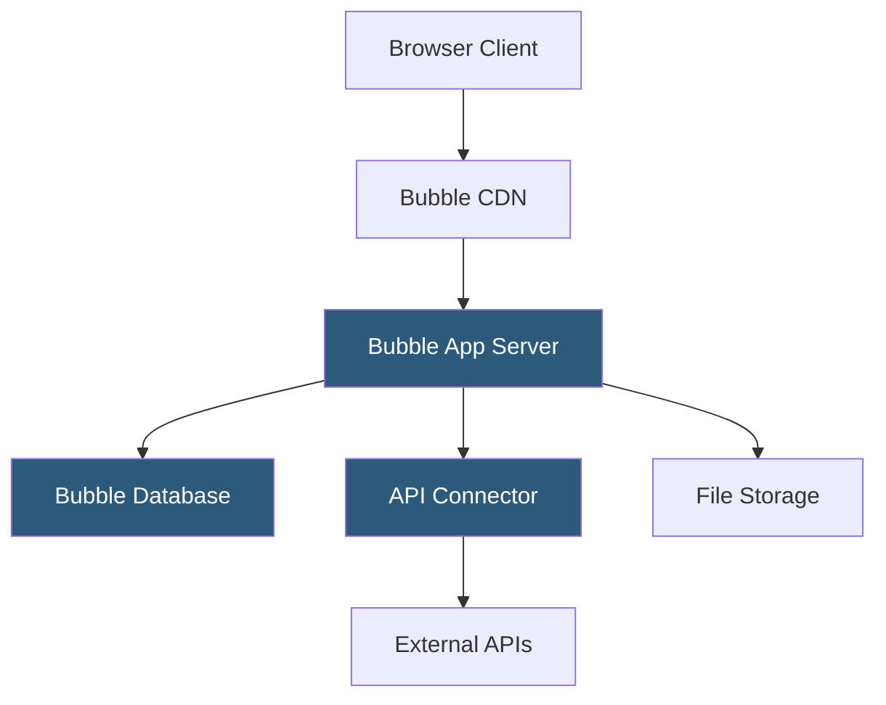

**Category:** Low-Code/No-Code Platforms
**Difficulty:** Beginner
**Reading time:** 6 min read

---

Bubble is a visual programming platform that lets users build fully functional web applications without writing code. It uses a drag-and-drop interface combined with a workflow engine to handle both UI design and business logic.

- **Visual Editor** — A drag-and-drop canvas where UI elements are placed and styled without HTML/CSS
- **Workflow Engine** — Event-triggered logic system that defines what happens when users interact with the app
- **Data Types** — Bubble's built-in database schema where you define custom data structures
- **Dynamic Data** — References to database values or user inputs that update UI elements in real time
- **Repeating Group** — A UI element that iterates over a list of database records to display them
- **Privacy Rules** — Row-level security settings controlling who can read or modify data records
- **API Connector** — Built-in plugin for connecting to external REST APIs without code
- **Responsive Engine** — Layout system managing how elements resize and rearrange across screen sizes

Bubble runs entirely within a managed cloud environment. When a developer builds an app, they interact with the Visual Editor to place elements on pages. Each element can be conditionally shown or hidden, styled dynamically, and bound to data from Bubble's internal database or external APIs.

The Workflow Engine processes user interactions. When a button is clicked, for example, a workflow runs a sequence of actions: creating database records, sending emails, making API calls, or navigating to another page. Workflows are built by chaining action steps, each configurable through dropdown menus and expression fields rather than code.

Bubble's database is a hosted, schemaless relational store. Developers define data types (similar to database tables) and fields, then interact with records through the visual interface. Queries filter and sort records using visual condition builders.

For performance, Bubble uses a combination of server-side rendering and client-side state management. Pages load initial data server-side, and subsequent interactions update state through WebSocket connections, giving apps a responsive feel.

Privacy rules enforce data access control. Rules are defined per data type and evaluated server-side, preventing unauthorized data exposure even if a client-side element is manipulated.

- Startups building MVPs without an engineering team
- Internal business tools and dashboards
- Marketplace and directory applications
- SaaS products with user authentication and subscriptions
- Prototypes to validate product ideas before custom development

| Advantage | Disadvantage |
|-----------|--------------|
| No coding required for full-stack apps | Performance limitations at scale compared to custom code |
| Built-in database, auth, and hosting | Vendor lock-in; difficult to export and self-host |
| Large plugin marketplace | Complex logic can become unwieldy in the workflow editor |
| Rapid iteration and deployment | Limited control over server infrastructure and optimization |

- [Bubble Plugin Ecosystem](bubble-plugin-ecosystem.md)
- [Bubble API Connector](bubble-api-connector.md)
- [Webflow Visual Development](webflow-visual-development.md)

---
*Part of the [Low-Code/No-Code Platforms](index.md) category · [Back to Master Index](../../index.md)*
