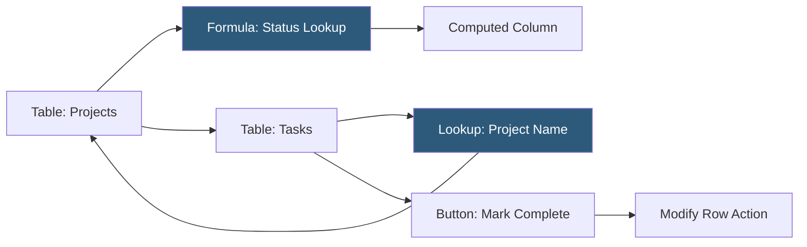

**Category:** Low-Code/No-Code Platforms
**Difficulty:** Intermediate
**Reading time:** 6 min read

---

Coda is a document-database hybrid platform where documents contain live, interactive tables, buttons, and formulas. Unlike Notion's block-based approach, Coda emphasizes powerful formula-driven logic within documents, enabling teams to build lightweight apps inside a doc.

- **Doc** — Coda's primary document unit, containing pages, tables, and cross-referencing formulas
- **Table** — A structured data container within a Coda doc, similar to a database table
- **Column** — A typed field in a table with types including text, number, date, lookup, button, select
- **Formula** — Coda's formula language (similar to Excel but more powerful) for computed columns and cross-table references
- **Button Column** — A column that triggers an action when clicked: modify row, send webhook, call API
- **View** — A filtered or alternative display of a table's data within the same doc or a different page
- **Pack** — An integration plugin connecting Coda to external services (Jira, Salesforce, Slack)
- **Cross-doc** — A feature syncing a table from one Coda doc into another doc as a read source

Coda's differentiator from Notion is its formula system. Coda formulas are spreadsheet-style expressions applied to column values, whole tables, or inline calculations in text. They can reference other tables, filter rows, sum values, and transform data — making Coda tables behave more like database queries.

Lookup columns pull values from related tables. A Tasks table with a "Project" lookup column displays the project name alongside task records. Aggregate functions like `CountIf()`, `Sum()`, and `Filter()` operate on entire table columns.

Button columns add interactivity. Each row in a table can have a button that, when clicked, runs a configured action. Actions range from simple (modify a field in the current row) to complex (call an external API, create a record in another table, send a Slack message). This creates point-and-click workflows embedded directly in a table row.

Views display a table with applied filters, sorts, and column visibility without duplicating the underlying data. Multiple views of the same table serve different teams looking at different subsets.

Packs are Coda's integration layer — each Pack connects Coda to an external service and provides both table sync (pulling data in as a live-syncing table) and actions (buttons that interact with the service). The Jira Pack syncs issues; the GitHub Pack syncs pull requests; the Salesforce Pack syncs CRM records.

- OKR tracking with cascading objectives linked to key results
- Hiring pipeline with candidate tables, interview scheduling buttons, and status views
- Product feedback database with voting buttons and priority rollups
- Client reporting docs combining narrative text with live data tables
- Sprint planning combining task tables with stakeholder communication in one doc

| Advantage | Disadvantage |
|-----------|--------------|
| More powerful formula system than Notion or Airtable | Steeper learning curve for formula-driven features |
| Buttons enable app-like interaction within a document | Performance can be slow with complex cross-table formulas |
| Combines narrative documentation with live data tables | Smaller ecosystem than Notion or Airtable |
| Packs provide native external service integrations | Less familiar to users coming from pure spreadsheet backgrounds |

- [Coda Packs Integrations](coda-packs-integrations.md)
- [Notion Databases](notion-databases.md)
- [Airtable Database Platform](airtable-database-platform.md)

---
*Part of the [Low-Code/No-Code Platforms](index.md) category · [Back to Master Index](../../index.md)*
