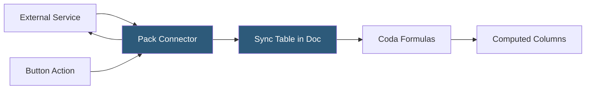

**Category:** Low-Code/No-Code Platforms
**Difficulty:** Intermediate
**Reading time:** 5 min read

---

Coda Packs are integration plugins that connect Coda documents to external services, enabling bidirectional data sync, action buttons triggering external operations, and formula functions calling third-party APIs — all without leaving the Coda doc.

- **Pack** — A named integration connecting Coda to an external service or data source
- **Sync Table** — A table in Coda populated and refreshed automatically from an external service via a Pack
- **Pack Action** — A button action or automation step that calls an external service (create Jira ticket, send Slack message)
- **Pack Formula** — A custom formula function provided by a Pack for use in column formulas
- **Pack Gallery** — Coda's marketplace of available Packs built by Coda and third-party developers
- **Account Connection** — The OAuth or API key authentication linking a Pack to a user's external account
- **Sync Schedule** — The configured frequency at which a Sync Table refreshes from the external service
- **Pack SDK** — The TypeScript SDK Coda provides for developers to build and publish custom Packs

Packs are installed per Coda doc from the Pack Gallery. After installation, an account connection is configured — typically through OAuth, where the user authorizes Coda to access their account on the external service. Multiple accounts can be connected to a single Pack if needed.

Sync Tables are the primary data import mechanism. After adding a Pack's Sync Table, the user configures sync parameters (which project, which filter, which fields). The table populates with rows from the external service and refreshes on a configured schedule (every hour, every day, or manually triggered).

Synced data becomes a normal Coda table, accessible to formulas and views. A Jira Sync Table containing issues can be referenced by a formula column in a separate Projects table to count open issues per project.

Pack Actions are triggered from button columns or automations. A Slack Pack action can post a message when a button is clicked. A Jira Pack action can create an issue when a formula-driven automation detects a new item. These actions accept column values as parameters.

The Pack SDK (TypeScript) enables custom Pack development. Developers define sync tables, actions, and formulas as TypeScript functions that Coda's runtime executes server-side when triggered. Custom Packs can target internal APIs not covered by the public Pack Gallery.

- Syncing Jira sprint issues into a Coda planning doc
- Displaying live GitHub pull request status in a development dashboard
- Sending Slack notifications from Coda button clicks
- Pulling Salesforce opportunity data for sales review docs
- Syncing Google Calendar events as a table for scheduling

| Advantage | Disadvantage |
|-----------|--------------|
| Native integration within the document workflow | Sync schedules mean data is not always real-time |
| Pack SDK allows custom integrations for proprietary systems | Building custom Packs requires TypeScript development skills |
| Both read (sync tables) and write (actions) in one tool | Pack ecosystem smaller than Zapier or Make trigger/action library |
| OAuth-based connections are secure and revocable | Complex Pack configurations can be difficult to maintain |

- [Coda Docs Platform](coda-docs-platform.md)
- [Airtable Automations](airtable-automations.md)
- [Notion API Integration](notion-api-integration.md)

---
*Part of the [Low-Code/No-Code Platforms](index.md) category · [Back to Master Index](../../index.md)*
