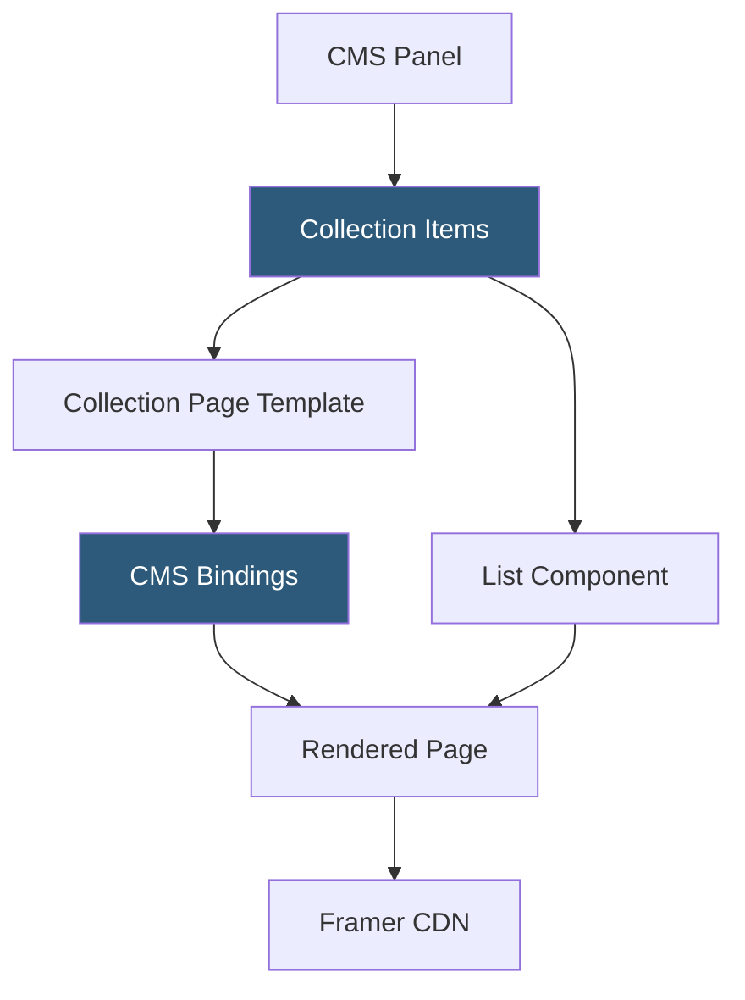

**Category:** Low-Code/No-Code Platforms
**Difficulty:** Beginner
**Reading time:** 5 min read

---

Framer CMS is an integrated content management system within the Framer website builder that enables structured, dynamic content for pages like blogs, team directories, and product listings. Content is managed through a spreadsheet-like editor and rendered through template pages.

- **Collection** — A named content type with defined fields, similar to a database table
- **CMS Field** — A typed data attribute of a collection: text, rich text, image, link, color, or date
- **Collection Page** — A template page whose content is dynamically populated from a CMS collection item
- **CMS Binding** — Connecting a component's prop or text content to a CMS field value
- **CMS Panel** — The spreadsheet-style editor in Framer's sidebar for managing collection items
- **Slug** — An auto-generated URL-safe identifier for each collection item, forming the page URL
- **List Component** — A component that maps over collection items to render a grid or list of cards
- **Localization** — Per-field content overrides for different language/region variants of collection items

Framer CMS collections are defined in the CMS panel within the Framer editor. Designers click "Add Collection," name it, and add fields with their types. The CMS panel then functions like a spreadsheet where rows are items and columns are fields.

Each collection can have a corresponding Collection Page — a design template that renders for every item in the collection. On the template page, any text, image, or component prop can be bound to a CMS field using Framer's binding interface. When the page renders for a specific item (e.g., a blog post), Framer substitutes the bound values with that item's data.

List components allow displaying multiple CMS items on a single page. A component (like a blog card) is selected, and Framer automatically generates N copies of it, each bound to a different collection item. Filters and sort orders are configured through the CMS panel.

Slugs are automatically generated from a designated text field (usually title) and form the URL path for collection pages. Custom slugs can be set manually per item.

Content editors work directly in the CMS panel without entering the visual canvas. For richer content, the rich text field type supports formatted text with headings, links, and images.

- Blog or news sections with regular editorial updates
- Team or contributor directory pages
- Portfolio case studies with consistent structure
- Event listings with date, location, and description fields
- Feature comparison tables managed as CMS data

| Advantage | Disadvantage |
|-----------|--------------|
| Integrated directly in design tool, no separate CMS login | Less powerful than dedicated headless CMS (Contentful, Sanity) |
| Simple spreadsheet editing for non-technical content managers | No advanced content workflows, approvals, or versioning |
| CMS bindings give designers full layout control | API access to CMS is limited compared to Webflow CMS API |
| Fast CDN delivery for all collection pages | Collections are harder to migrate to external CMS later |

- [Framer Website Builder](framer-website-builder.md)
- [Webflow CMS Hosting](webflow-cms-hosting.md)
- [Notion Databases](notion-databases.md)

---
*Part of the [Low-Code/No-Code Platforms](index.md) category · [Back to Master Index](../../index.md)*
