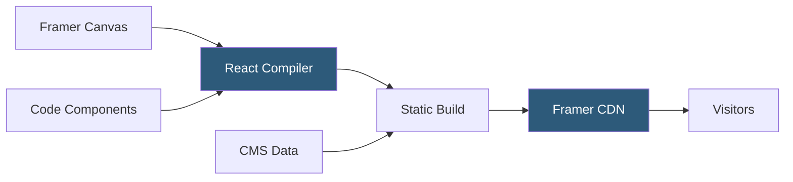

**Category:** Low-Code/No-Code Platforms
**Difficulty:** Beginner
**Reading time:** 5 min read

---

Framer is a design-to-deployment website builder that bridges the gap between Figma-style design tools and production hosting. It allows designers to build visually complex, animated websites and publish them to Framer's CDN with a single click.

- **Canvas** — Framer's infinite design surface where pages and components are created
- **Component** — A reusable, encapsulated UI block that can accept props and contain interactive states
- **Code Component** — A React component written in TypeScript/JSX that integrates directly into the canvas
- **CMS** — Framer's content management system for dynamic pages populated from structured data
- **Variables** — Named design tokens for colors, fonts, and spacing shared across components
- **Breakpoints** — Responsive layout breakpoints where element sizing and positioning adapt
- **Interactions** — Click, hover, and scroll-triggered animations built without code
- **Publishing** — One-click deployment to Framer's global CDN with automatic SSL

Framer compiles the visual canvas into React components. Unlike older website builders that generate static HTML, Framer's output is a React application bundled and served from its CDN. This architecture enables rich interactivity natively, since React handles state and DOM updates efficiently.

Designers create layouts using auto-layout stacks (similar to flexbox) and constraint-based frames. Components are defined with variant states — hover, pressed, selected — and transitions between states are configured visually. Framer's Smart Components system allows complex interactive patterns like accordions, tabs, and animated cards with zero JavaScript.

Code Components are the power-user feature that separates Framer from template builders. Developers write standard React components with TypeScript and Framer Motion, then expose props that appear as configurable fields in the canvas. Designers can use these components visually while developers control the implementation.

The CMS system structures content into collections. Each CMS item generates a dynamic page using the collection template. Content can also be fed into component props on static pages via CMS binding.

Publishing compiles the full site into an optimized React build and deploys it to Framer's edge network. Custom domains are configured through Framer's dashboard with one-click SSL provisioning.

- Agency and freelance designer portfolio sites
- SaaS marketing sites with complex scroll animations
- Product launch pages requiring high-fidelity motion design
- Startup websites where a designer controls the full workflow
- Sites where Figma designs need to ship without developer handoff

| Advantage | Disadvantage |
|-----------|--------------|
| Closest to professional design tool UX | No backend functionality; purely frontend and CMS |
| React-based output supports complex interactions natively | Code Component knowledge requires React/TypeScript skills |
| Figma import for fast design-to-live workflows | Less mature CMS compared to Webflow or dedicated headless CMS |
| Excellent performance scores from optimized React builds | Smaller plugin/integration ecosystem than Webflow |

- [Framer CMS](framer-cms.md)
- [Webflow Visual Development](webflow-visual-development.md)
- [Wix Velo Development](wix-velo-development.md)

---
*Part of the [Low-Code/No-Code Platforms](index.md) category · [Back to Master Index](../../index.md)*
