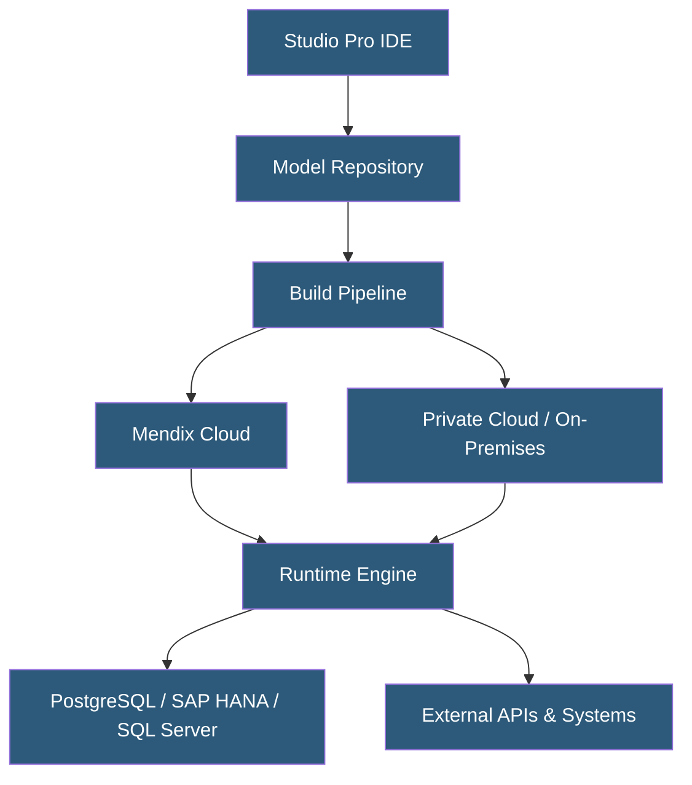

**Category:** Low-Code/No-Code Platforms
**Difficulty:** Intermediate
**Reading time:** 6 min read

---

Mendix is an enterprise-grade low-code platform that enables rapid application development through visual modeling, drag-and-drop components, and built-in DevOps capabilities. It targets complex, large-scale business applications requiring integration with legacy systems and enterprise data sources. Mendix applications run on its cloud or can be deployed on-premises or in private clouds.

- **Domain Model** — Visual data structure editor that defines entities, attributes, and associations without SQL
- **Microflows** — Server-side logic flows that execute business rules, data operations, and integrations using visual flow diagrams
- **Nanoflows** — Client-side logic flows that run in the browser or mobile app without server round-trips
- **Atlas UI** — Mendix's design system providing reusable UI components and design tokens
- **Mendix Studio Pro** — Desktop IDE for complex application development with full model access
- **App Services** — Pre-built connectors and modules available in the Mendix Marketplace
- **Deployment Package** — Compiled, versioned artifact of a Mendix application ready for deployment
- **MxDock** — Local Docker-based runtime for developing and testing Mendix apps offline

Mendix operates on a model-driven architecture where developers work with a visual representation of the application rather than source code. Studio Pro compiles the model into deployable packages using the Mendix Runtime Engine, which interprets the model at execution time.

The platform stores the entire application as a structured model in a version-controlled repository using Team Server, built on Subversion or Git. Multiple developers collaborate through concurrent model editing with conflict detection.

Business logic is expressed through Microflows — visual flow diagrams that chain activities like data retrieval, object creation, external calls, and conditional branching. These compile to optimized Java bytecode running on the JVM. Nanoflows handle UI interactions client-side for responsiveness.

Data persistence uses an object-relational mapping layer that abstracts the underlying database. Mendix automatically generates and migrates the database schema when the domain model changes, eliminating manual migration scripts for most changes.

Deployment targets include Mendix Cloud (multi-tenant SaaS or dedicated), Mendix for Private Cloud (Kubernetes-based on AWS, Azure, GCP, or on-premises), and Mendix Free Cloud for development. The Mendix Operator manages deployments on Kubernetes clusters, handling scaling, health checks, and rolling updates.

- Enterprise digital transformation replacing legacy desktop applications
- Customer portals requiring integration with ERP systems like SAP or Oracle
- Process automation for HR, finance, and operations workflows
- Mobile applications for field service and logistics
- Rapid prototyping and MVP delivery for complex business requirements

| Advantage | Disadvantage |
|-----------|--------------|
| Rapid development of complex enterprise apps | Higher licensing cost vs. pure open-source frameworks |
| Built-in versioning, CI/CD, and deployment tooling | Vendor lock-in; migrating off Mendix is difficult |
| Strong governance, audit trails, and access control | Performance ceiling for extremely high-throughput applications |
| Extensive marketplace of pre-built modules | Custom complex UI requires additional React/JavaScript skills |
| Supports on-premises and private cloud deployment | Learning curve for Studio Pro IDE |

- [OutSystems Enterprise Platform](outsystems-enterprise-platform.md)
- [PowerApps Low-Code Platform](powerapps-low-code-platform.md)
- [AppSheet No-Code Apps](appsheet-no-code-apps.md)

---
*Part of the [Low-Code/No-Code Platforms](index.md) category · [Back to Master Index](../../index.md)*
