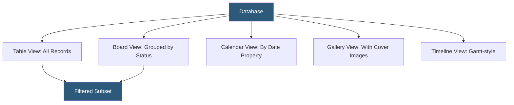

**Category:** Low-Code/No-Code Platforms
**Difficulty:** Beginner
**Reading time:** 5 min read

---

Notion Databases are structured collections of pages with typed properties, functioning as lightweight relational databases within the Notion workspace. They power project management, CRM-like tracking, and content calendars through multiple configurable views.

- **Database Page** — A record within a Notion database, itself a full Notion page with block content
- **Property** — A typed metadata field on each database page: title, text, number, select, date, person, checkbox, relation, rollup, formula
- **View** — A visual presentation of database records: Table, Board, Calendar, Gallery, Timeline, List
- **Filter** — A display condition applied to a view to show only records matching specific criteria
- **Sort** — An ordering rule applied to a view's records by one or more property values
- **Relation Property** — A two-way link between records in two databases
- **Rollup Property** — An aggregated value (count, sum, average) computed from related database records
- **Formula Property** — A computed property using Notion's formula language referencing other properties

Notion Databases extend pages with a property layer. When a page is added to a database, it gains all the database's properties as structured metadata. Editing the page reveals both the block content (freeform writing, attachments, sub-pages) and the property values in a sidebar or at the top of the page.

Property types determine how values are stored and displayed. Select and Multi-Select properties create predefined option lists. Date properties store timestamps with optional time zones. Person properties link to workspace members. File and Media properties attach uploaded files or embedded URLs.

Relations connect two databases bidirectionally. When a relation is defined from Projects to Tasks, each project record gains a linked Tasks property, and each task gains a linked Projects property. Selecting records on either side populates both.

Rollups aggregate across relations. A Projects database with a related Tasks database can show a "Completed Tasks" rollup counting tasks where Status equals "Done." This enables lightweight reporting without external tools.

Views are the primary navigation interface. Table view offers the spreadsheet-style overview. Board view (kanban) groups records by a Select property's options, enabling pipeline and workflow visualization. Calendar view maps records to a date property for scheduling. Timeline view displays overlapping date ranges for sprint or project planning.

Templates define a starting structure for new database records — useful for standardizing how pages are set up, with predefined content blocks and property values.

- Sprint boards with Board view grouping tasks by sprint status
- Content calendars with Calendar view mapped to publish date
- Contact databases with Person properties and relation to deals
- Bug trackers with Status selects and priority ratings
- Recipe or resource libraries browsed as Gallery view

| Advantage | Disadvantage |
|-----------|--------------|
| Multiple view types serve different mental models | Performance degrades with 10,000+ records |
| Relations and rollups enable real relational workflows | No complex queries, joins, or aggregations beyond rollups |
| Each record is a full page with rich content | Formula language is limited compared to Excel or SQL |
| Easy for non-technical users to create and use | Database structure is Notion-proprietary, limiting export portability |

- [Notion Workspace Hosting](notion-workspace-hosting.md)
- [Notion API Integration](notion-api-integration.md)
- [Airtable Database Platform](airtable-database-platform.md)

---
*Part of the [Low-Code/No-Code Platforms](index.md) category · [Back to Master Index](../../index.md)*
