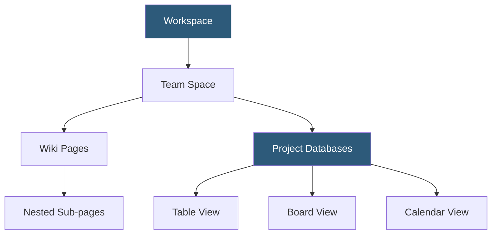

**Category:** Low-Code/No-Code Platforms
**Difficulty:** Beginner
**Reading time:** 5 min read

---

Notion is a connected workspace platform that combines note-taking, wikis, databases, and project management in a single hosted environment. Teams use it as an all-in-one operational hub, replacing separate tools for documentation, task tracking, and knowledge management.

- **Workspace** — The top-level organizational container for all Notion content, tied to a team or account
- **Page** — The fundamental content unit in Notion, containing blocks of content and nested sub-pages
- **Block** — A single content element: paragraph, heading, image, code block, table, database, etc.
- **Database** — A structured collection of pages with typed properties, viewable as table, board, calendar, or gallery
- **Property** — A typed attribute on a database item: text, number, date, select, relation, formula
- **Template** — A reusable page or database structure that can be duplicated to create new instances
- **Notion AI** — An integrated AI assistant for drafting, summarizing, and transforming content within pages
- **Guest Access** — Sharing individual pages or workspaces with external collaborators without full membership

Notion's architecture centers on Pages and Blocks. Every page is a document containing an ordered list of blocks. Blocks can be simple content (text, images) or structural (databases, linked database views, synced blocks). Pages can be nested infinitely, creating a hierarchical structure that mirrors a company's organizational knowledge.

Databases are a special block type that transforms a collection of sub-pages into a structured dataset. Each sub-page in a database is a record, and database properties are typed metadata on those records. The same database can be displayed as a table (spreadsheet-style), board (kanban), calendar, gallery, or timeline — each view having its own filters and sorts.

Relations and rollups enable cross-database data linking similar to Airtable. A Tasks database can relate to a Projects database; a rollup shows the count of related tasks per project.

Notion AI is natively available in the editor. Users invoke it to write summaries, translate content, improve writing, or generate outlines based on selected content or prompts. Answers can be inserted directly into the page.

Public pages are published via Notion's built-in sharing, generating a read-only public URL. Custom domain mapping (via third-party services or Notion's native domain feature) allows public Notion pages to serve as simple websites or documentation portals.

- Company wikis and internal documentation repositories
- Product roadmaps combining database and document views
- Meeting notes with action item databases linked to projects
- Engineering documentation with code blocks and architecture diagrams
- Lightweight CRM or pipeline tracking using database boards

| Advantage | Disadvantage |
|-----------|--------------|
| All-in-one reduces tool sprawl | Slow performance with large databases or complex pages |
| Flexible structure adapts to many use cases | Block-based editor can be awkward for dense data entry |
| Strong collaboration with comments and mentions | Not suitable as a production database (no transactions, limited API) |
| Notion AI integrates directly into the writing workflow | Public pages limited; complex websites need dedicated platforms |

- [Notion API Integration](notion-api-integration.md)
- [Notion Databases](notion-databases.md)
- [Airtable Database Platform](airtable-database-platform.md)

---
*Part of the [Low-Code/No-Code Platforms](index.md) category · [Back to Master Index](../../index.md)*
