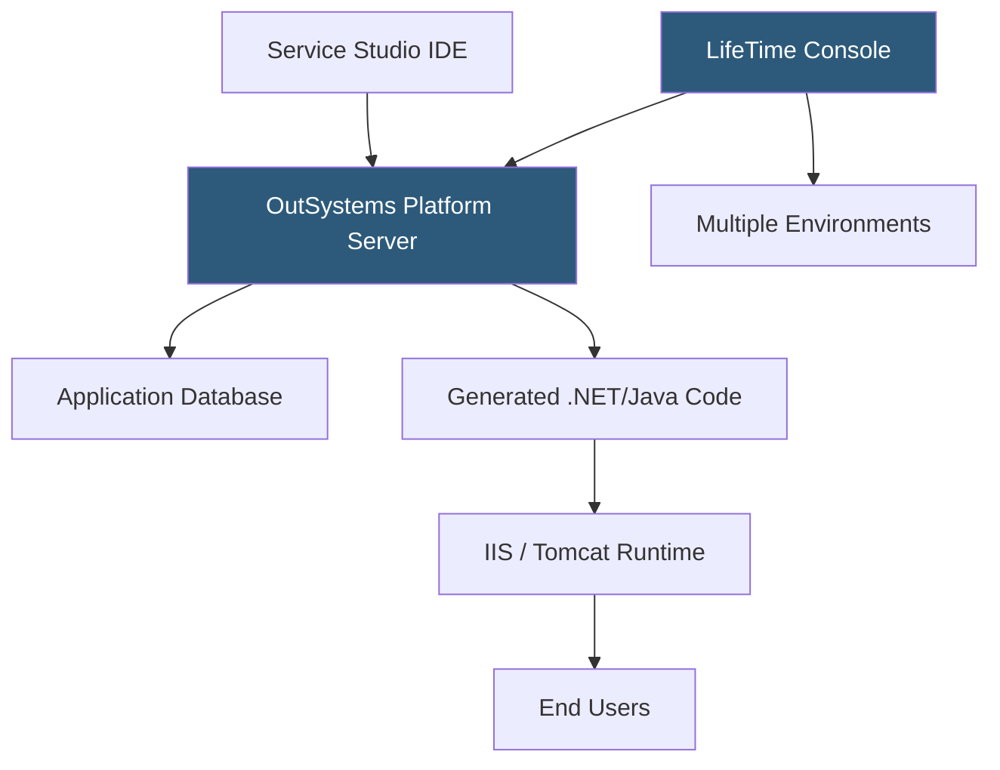

**Category:** Low-Code/No-Code Platforms
**Difficulty:** Advanced
**Reading time:** 7 min read

---

OutSystems is an enterprise low-code platform for building, deploying, and managing complex business applications at scale. It targets large organizations needing rapid application development with enterprise-grade security, integration, and lifecycle management.

- **Service Studio** — OutSystems' visual IDE for building full-stack applications with data models, UI, and logic
- **Integration Studio** — A tool for creating extensions that wrap external code libraries or APIs
- **LifeTime** — The centralized DevOps console managing deployments, environments, and security policies
- **OutSystems Forge** — A community marketplace of reusable components, accelerators, and connectors
- **O11 (OutSystems 11)** — The on-premises and cloud deployment model with full lifecycle management
- **OutSystems Developer Cloud (ODC)** — The next-generation cloud-native platform built on Kubernetes
- **Aggregates** — OutSystems' visual query builder for fetching and filtering data from the database
- **REST API Consumption** — Built-in tooling for introspecting and consuming external REST APIs visually

OutSystems compiles the visual application model into standard code — .NET for the traditional platform, modern web standards for ODC. This distinguishes it from interpreted low-code platforms: the generated application runs as compiled code with performance characteristics similar to hand-written applications.

Service Studio is the developer-facing IDE. Developers design data models (entities), build server-side logic (actions with visual flowcharts), define REST APIs, and create reactive web UI with components bound to data queries called Aggregates. Everything is visual but maps directly to structured programming concepts.

Aggregates provide a visual SQL-like query builder. Developers drag entities into the aggregate canvas, define join conditions visually, add filter criteria, and set sort orders. OutSystems compiles these into optimized SQL executed against the application database.

The LifeTime management console handles the full application lifecycle: deploying specific application versions across development, test, QA, and production environments; managing access control for developers; and auditing who deployed what when. This structure supports enterprise change management processes.

Integration is a first-class capability. Service Actions expose OutSystems logic as services consumed by other apps. REST API consumption introspects an external API's Swagger spec and generates typed client methods. The Integration Studio handles legacy scenarios requiring custom .NET or Java extension code.

OutSystems Forge provides thousands of reusable components: UI frameworks, authentication modules, payment integrations, PDF generators, and more — reducing rebuild of common functionality.

- Core banking and insurance claims processing applications
- Enterprise HR portals replacing legacy mainframe interfaces
- Supply chain visibility and exception management tools
- Healthcare patient portals with regulatory compliance requirements
- Government service delivery platforms requiring accessibility compliance

| Advantage | Disadvantage |
|-----------|--------------|
| Compiled output provides near-native application performance | Very high licensing cost compared to other low-code tools |
| Full enterprise lifecycle management with LifeTime | Significant learning curve for Service Studio IDE |
| Generated code can be inspected for security audits | Vendor lock-in is very deep; migration requires full rebuild |
| Large Forge ecosystem reduces custom development needs | Requires OutSystems-skilled developers, limiting talent pool |

- [Mendix Application Platform](mendix-application-platform.md)
- [PowerApps Low-Code Platform](powerapps-low-code-platform.md)
- [Retool Internal Tools](retool-internal-tools.md)

---
*Part of the [Low-Code/No-Code Platforms](index.md) category · [Back to Master Index](../../index.md)*
