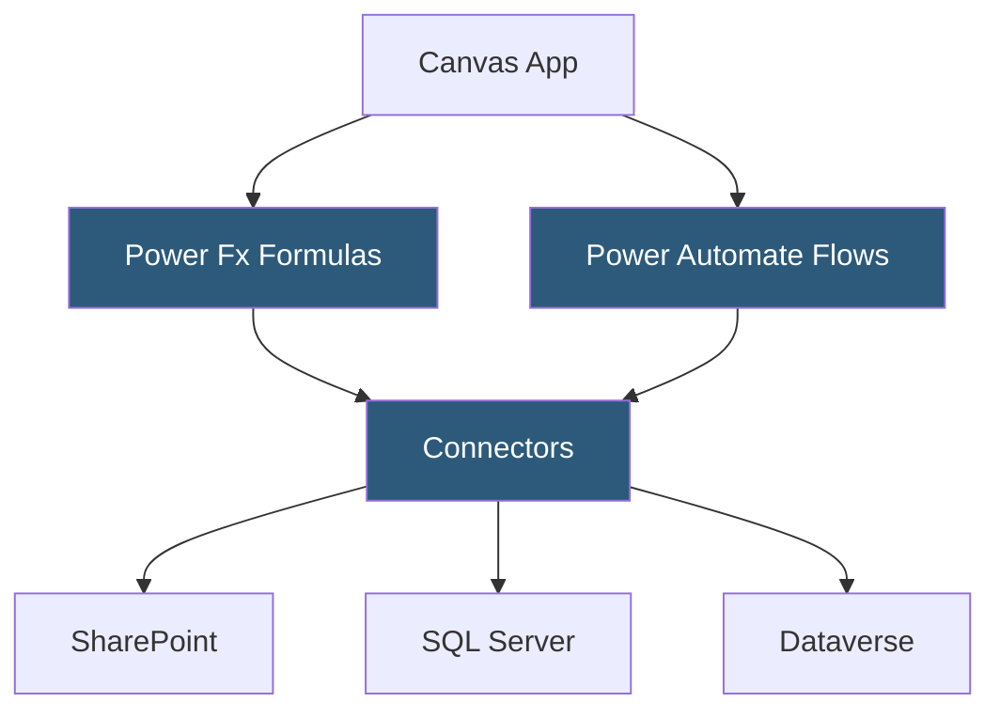

**Category:** Low-Code/No-Code Platforms
**Difficulty:** Intermediate
**Reading time:** 6 min read

---

Microsoft PowerApps is a low-code application development platform within the Microsoft Power Platform that enables business users and developers to build custom apps connecting to hundreds of data sources. It integrates deeply with Microsoft 365, Dynamics 365, and Azure services.

- **Canvas App** — A freely designed app where the developer controls layout and connects to any data source
- **Model-Driven App** — An app automatically generated from Dataverse data schema with standardized UX patterns
- **Dataverse** — Microsoft's cloud data platform (formerly Common Data Service) used as the backend for model-driven apps
- **Power Fx** — PowerApps' Excel-like formula language for logic, data queries, and UI behavior
- **Connector** — A pre-built integration to an external service (SharePoint, SQL Server, Salesforce, Teams)
- **Environment** — An isolated container for apps, flows, and data with its own access controls
- **Power Automate** — The companion automation platform integrated with PowerApps for workflow execution
- **Dataverse for Teams** — A simplified Dataverse deployment embedded within Microsoft Teams

PowerApps offers two app types for different use cases. Canvas apps provide full design freedom: the developer places controls (text inputs, galleries, buttons, forms) on a phone or tablet canvas and binds them to data sources using Power Fx formulas. Model-driven apps are generated from Dataverse entity definitions — the app structure follows the data schema automatically.

Power Fx is central to Canvas app development. It's an expression language similar to Excel formulas. `Filter(Employees, Department = "Engineering")` retrieves records from a SharePoint list or Dataverse table. `Patch(Employees, {Name: TextInput1.Text})` creates or updates a record. This makes logic accessible to anyone familiar with spreadsheet formulas.

Connectors abstract data source connections. Over 900 connectors are available, covering Microsoft services (SharePoint, Teams, Outlook, Dynamics), databases (SQL Server, PostgreSQL, MySQL), and SaaS apps (Salesforce, Jira, ServiceNow). Standard connectors are included in basic licensing; premium connectors require higher-tier plans.

Power Automate integration is seamless. Buttons in a PowerApp can trigger Power Automate flows — multi-step automated workflows handling complex logic, approvals, and external integrations. Data from the app is passed to the flow as trigger inputs.

Security is enterprise-grade. Apps respect Azure Active Directory (Entra ID) for authentication. Data access in Dataverse follows role-based security. Environments isolate development, test, and production apps.

- Expense report submission apps for Microsoft 365 organizations
- Field inspection apps for employees using Microsoft devices
- Custom SharePoint workflow apps replacing InfoPath forms
- Approval request apps integrated with Teams and Outlook
- Inventory management connecting to SQL Server databases

| Advantage | Disadvantage |
|-----------|--------------|
| Deep Microsoft 365 integration for organizations already using it | Premium connector licensing can be expensive for enterprise rollout |
| 900+ connectors covering most enterprise data sources | Power Fx has limitations for complex backend logic |
| Model-driven apps reduce design work for Dataverse data | Canvas app performance can be slow with large datasets |
| Enterprise security through Azure AD and DLP policies | Lock-in to Microsoft ecosystem; difficult to migrate apps externally |

- [AppSheet No-Code Apps](appsheet-no-code-apps.md)
- [OutSystems Enterprise Platform](outsystems-enterprise-platform.md)
- [Retool Internal Tools](retool-internal-tools.md)

---
*Part of the [Low-Code/No-Code Platforms](index.md) category · [Back to Master Index](../../index.md)*
