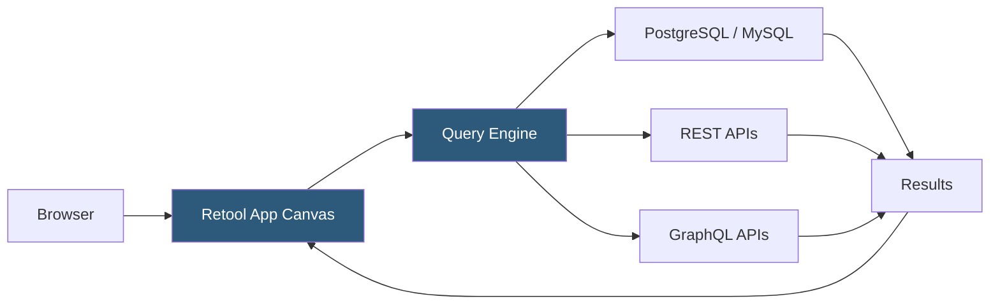

**Category:** Low-Code/No-Code Platforms
**Difficulty:** Intermediate
**Reading time:** 6 min read

---

Retool is a low-code platform for building internal business tools — admin panels, dashboards, and operational UIs — by connecting directly to databases and APIs. It targets developers who need to build tools quickly without building from scratch but still want code-level control.

- **Component** — A pre-built UI element (table, form, button, chart) dragged onto the canvas
- **Resource** — A configured data source connection: PostgreSQL, MySQL, REST API, GraphQL, Redis, S3
- **Query** — A data operation (SQL query, API call) defined in the query editor and bound to components
- **Transformer** — A JavaScript function applied to query results for data transformation before display
- **Event Handler** — Logic triggered by user interactions (button click, row select) that runs queries or actions
- **Retool DB** — A hosted PostgreSQL database built into Retool for apps that don't have their own database
- **Permissions** — Role-based access control defining which users can view or use each app
- **Self-hosted Retool** — A deployment option where Retool runs on customer infrastructure for data security

Retool apps are built on a drag-and-drop canvas where UI components are placed and connected to data sources called Resources. Resources are configured once (connection string, API key, base URL) and reused across all apps in the organization.

Queries are the binding layer. A SQL query is written in the query editor, referencing component values (like an input field's text) using `{{ inputName.value }}` interpolation. The query runs when triggered by an event or on component mount, and its results are stored as a JavaScript object accessible by component data properties.

Components bind to query results using the same `{{ }}` syntax. A Table component's data property might be set to `{{ myQuery.data }}`, which renders the query result rows automatically. A Select component's options might come from `{{ categoriesQuery.data.map(row => row.name) }}`.

Event handlers define interactivity. A button's onClick can run a mutation query, show a notification, and trigger another query to refresh displayed data. This creates complete CRUD workflows.

Transformers are optional JavaScript blocks that run after a query returns, allowing manipulation of results before they reach components. Common uses: reshaping nested JSON, calculating derived fields, or filtering client-side.

Self-hosted Retool runs in Docker containers, keeping query traffic within a company's VPC. Queries go directly from Retool's servers to the database, never through Retool's cloud — important for regulated industries.

- Customer support admin panels for viewing and updating customer records
- Operations dashboards displaying real-time database metrics
- Order management tools for fulfillment teams
- Data review tools for QA and data validation workflows
- Developer tooling for internal database management

| Advantage | Disadvantage |
|-----------|--------------|
| Fastest path from database to working internal tool | Significant per-seat pricing for larger teams |
| SQL and JavaScript access for developer flexibility | Retool apps have limited customization in appearance |
| Self-hosted option for data security compliance | Complex apps can become hard to maintain over time |
| 100+ pre-built integrations covering most data sources | Primarily suited for internal tools, not customer-facing UIs |

- [Retool Workflows](retool-workflows.md)
- [Retool Mobile Apps](retool-mobile-apps.md)
- [Airtable Interfaces](airtable-interfaces.md)

---
*Part of the [Low-Code/No-Code Platforms](index.md) category · [Back to Master Index](../../index.md)*
