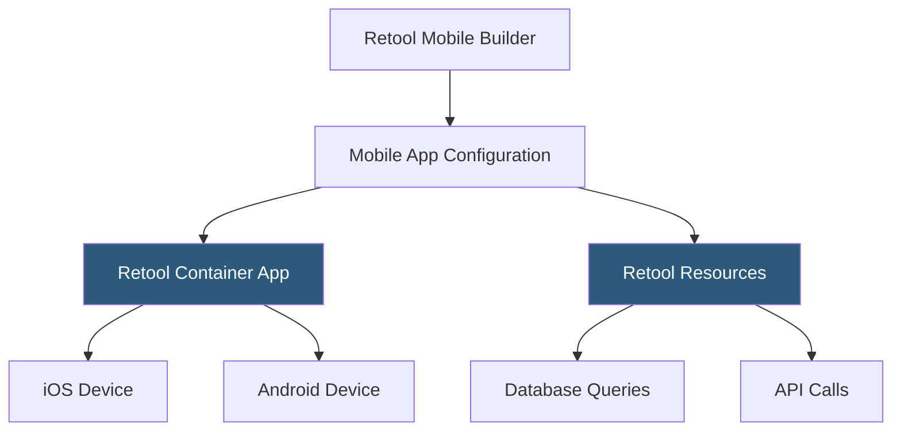

**Category:** Low-Code/No-Code Platforms
**Difficulty:** Intermediate
**Reading time:** 5 min read

---

Retool Mobile extends the Retool platform to native iOS and Android app development, allowing teams to build mobile internal tools using the same resources and queries powering their web apps. Apps are deployed through Retool's mobile app container without App Store submissions.

- **Retool Mobile App** — A native mobile app project built in Retool's mobile-specific canvas
- **Mobile Canvas** — A phone-frame canvas with mobile-optimized components for touch interfaces
- **Mobile Component** — Touch-optimized UI elements like lists, cards, camera inputs, and QR scanners
- **Container App** — Retool's published iOS/Android shell app that loads built mobile apps
- **Offline Mode** — The capability for mobile apps to cache data and function without connectivity
- **Push Notifications** — Server-initiated notifications delivered to devices using Retool's notification API
- **Camera Integration** — Built-in component for capturing photos or scanning barcodes and QR codes
- **Geolocation** — Device GPS access available through a dedicated component for location-aware apps

Retool Mobile apps are built in a separate mobile canvas optimized for phone screens. The canvas displays a device frame, and components snapped to it are mobile-native: scrollable lists, bottom sheets, tab bars, and touch-friendly input controls.

The same Resources defined in a Retool organization power mobile apps. SQL queries, API calls, and transformers work identically. This means teams building both web and mobile internal tools share data access configuration without duplication.

Deployment bypasses the App Store. Retool publishes a container app (a blank native shell) to the App Store and Play Store. Organizations configure which Retool apps load in the container, and users install the container app from the store. Updating a Retool mobile app is instant — no App Store review cycle required.

Offline mode enables field workers in low-connectivity environments. Apps can sync data when connected and queue mutations for submission when the connection is restored. This is critical for warehouse, field service, and logistics use cases.

Device hardware integrations are provided through dedicated components. The Camera component captures photos that can be uploaded to S3 or attached to database records. The Barcode Scanner component reads product barcodes or QR codes, feeding scanned values into queries. Geolocation provides latitude/longitude coordinates for location-aware queries.

- Warehouse inventory scanning using barcode reader component
- Field service inspection apps with photo capture and notes
- Delivery driver apps for confirming pickups and drop-offs
- Retail floor apps for checking inventory levels
- Healthcare check-in apps for patient data capture

| Advantage | Disadvantage |
|-----------|--------------|
| Same resources as web Retool apps eliminate duplication | Limited aesthetic customization compared to custom native apps |
| No App Store review cycle for app updates | Container app model means users must install Retool's shell first |
| Device hardware access (camera, GPS, barcode) built-in | Performance limited compared to fully native apps |
| Offline mode for field use cases | Enterprise pricing makes it costly for large mobile teams |

- [Retool Internal Tools](retool-internal-tools.md)
- [Retool Workflows](retool-workflows.md)
- [AppSheet No-Code Apps](appsheet-no-code-apps.md)

---
*Part of the [Low-Code/No-Code Platforms](index.md) category · [Back to Master Index](../../index.md)*
