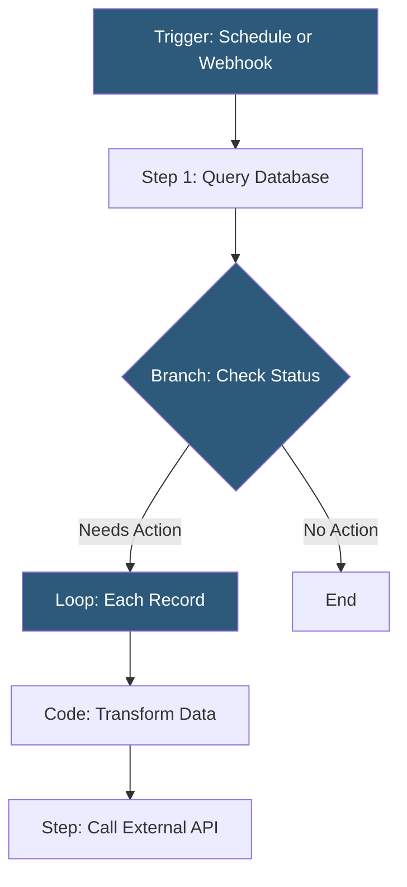

**Category:** Low-Code/No-Code Platforms
**Difficulty:** Intermediate
**Reading time:** 5 min read

---

Retool Workflows is a backend automation product within the Retool platform that runs scheduled or triggered jobs connecting to databases and APIs. It functions as a low-code alternative to custom cron jobs or serverless functions for operational automation.

- **Workflow** — A named automation consisting of a trigger and a directed acyclic graph of steps
- **Trigger** — The event starting a workflow: schedule (cron), webhook, Retool app action, or manual run
- **Step** — A unit of work in a workflow: query, code block, loop, branch, or external service call
- **Code Step** — A JavaScript execution block for data transformation or conditional logic
- **Loop Step** — An iterator that runs a sequence of steps for each item in an array
- **Branch Step** — A conditional fork routing execution down different paths based on logic
- **Resource Query** — A step that queries a connected resource (database, API) defined in Retool
- **Run History** — Logs of past workflow executions including input, output, duration, and errors

Retool Workflows are built on the same canvas-and-editor model as Retool apps, but oriented around execution flow rather than UI components. Steps are connected with arrows forming a directed graph. Execution follows paths through branches and loops.

The trigger defines when the workflow runs. Scheduled triggers use cron syntax for time-based execution. Webhook triggers create a unique URL that, when called with a POST request, starts the workflow, passing the request body as input data.

Resource Query steps execute SQL queries or API calls against Retool's configured resources. Results flow downstream as JavaScript objects referenced by subsequent steps using `{{ stepName.data }}` syntax.

Code steps are full JavaScript execution blocks. They receive upstream data, perform computations or data manipulation, and return results. Common uses: filtering arrays, formatting strings, calculating totals, or implementing conditional logic too complex for branch steps.

Loop steps iterate over arrays, executing a child graph of steps for each element. This enables processing collections of records — sending an email for each order, updating each row in a database, or calling an API for each user.

Run History provides observability: every execution logs the start time, trigger source, step-by-step inputs and outputs, execution duration, and error traces. Failed steps highlight their error messages for debugging.

- Nightly database cleanup jobs deleting expired records
- Webhook receiver processing payment notifications from Stripe
- Scheduled report generation emailing summaries to stakeholders
- Syncing data between two databases on a recurring basis
- Automating customer notifications based on order status changes

| Advantage | Disadvantage |
|-----------|--------------|
| Same resources and connections as Retool apps | Less powerful than dedicated orchestration tools (Temporal, Airflow) |
| Visual DAG editor makes flow readable and maintainable | Execution history retention limits on lower plans |
| JavaScript code steps handle complex transformation logic | Not ideal for very high-frequency workflows (sub-minute) |
| Webhook triggers enable event-driven automation | Error handling and retry logic require explicit configuration |

- [Retool Internal Tools](retool-internal-tools.md)
- [Retool Mobile Apps](retool-mobile-apps.md)
- [Airtable Automations](airtable-automations.md)

---
*Part of the [Low-Code/No-Code Platforms](index.md) category · [Back to Master Index](../../index.md)*
