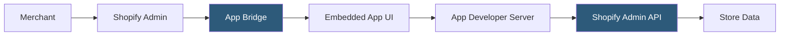

**Category:** Low-Code/No-Code Platforms
**Difficulty:** Beginner
**Reading time:** 5 min read

---

The Shopify App Store is the largest ecommerce app marketplace with over 10,000 applications covering every aspect of running an online store. Apps extend Shopify with marketing automation, fulfillment, customer service, and analytics capabilities, installable without coding.

- **Shopify App Store** — The marketplace for discovering and installing Shopify apps
- **Public App** — An app available to all Shopify merchants, listed in the App Store
- **Custom App** — A private app built for a specific store, not listed publicly
- **Embedded App** — An app that renders its UI within the Shopify Admin using App Bridge
- **App Bridge** — Shopify's JavaScript SDK for embedding app UIs seamlessly into the admin
- **Admin API** — The GraphQL/REST API apps use to read and write store data
- **Storefront API** — A public-facing API used by apps and headless frontends for browse/cart data
- **App Billing API** — Shopify's system for charging app subscription fees through Shopify's payment infrastructure

Shopify apps are OAuth-authorized web applications hosted by the app developer. When a merchant installs an app, an OAuth handshake grants the app scopes — permissions to access specific data types like orders, products, customers, or inventory. The app receives a permanent access token used for subsequent API calls.

Embedded apps use Shopify's App Bridge SDK to render their UI inside an iframe within the Shopify Admin. App Bridge provides methods for redirecting within the admin, displaying toast notifications, and triggering admin modals — creating a seamless experience where apps look native to Shopify.

The Admin API (GraphQL and REST) is the primary data access layer. Apps query and mutate store data: retrieving orders for processing, creating discount codes, updating inventory, or managing customer tags. GraphQL is the recommended API for new development.

The Storefront API serves customer-facing operations: browsing products, managing carts, and processing checkouts. It's used by headless storefronts (Next.js, Vue) and apps that embed functionality on the storefront itself via Script Tags.

App billing is handled through Shopify's Billing API. Apps define subscription plans and usage charges; Shopify displays these to merchants during installation and handles payment. This unifies billing so merchants pay app fees through Shopify alongside their store subscription.

- Email marketing automation with Klaviyo
- Reviews and UGC collection with Judge.me or Okendo
- Loyalty programs with Smile.io or Yotpo
- Subscription billing with Recharge or Bold Subscriptions
- Advanced analytics with Triple Whale or Northbeam

| Advantage | Disadvantage |
|-----------|--------------|
| Largest ecommerce app ecosystem available | App quality varies widely; some apps degrade storefront speed |
| Unified billing and simple installation | Popular apps can be expensive ($100-500+/month each) |
| Shopify's review process filters malicious apps | Multiple apps can conflict, requiring careful selection |
| Embedded App Bridge creates seamless admin UX | Heavy reliance on third-party apps for basic features creates fragility |

- [Shopify Plus Hosting](shopify-plus-hosting.md)
- [Squarespace Extensions](squarespace-extensions.md)
- [Wix App Market](wix-app-market.md)

---
*Part of the [Low-Code/No-Code Platforms](index.md) category · [Back to Master Index](../../index.md)*
