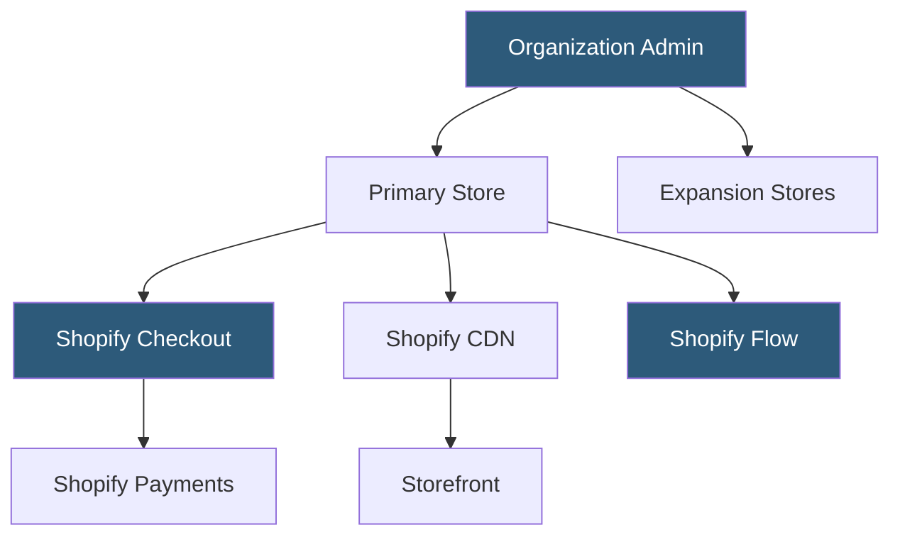

**Category:** Low-Code/No-Code Platforms
**Difficulty:** Intermediate
**Reading time:** 6 min read

---

Shopify Plus is Shopify's enterprise tier offering dedicated infrastructure, advanced customization capabilities, and exclusive features for high-volume merchants. It maintains Shopify's managed hosting model while removing platform limitations that affect standard plans.

- **Merchant Success Manager** — A dedicated Shopify account manager assigned to each Plus merchant
- **Shopify POS Pro** — Advanced point-of-sale features included with Shopify Plus
- **Launchpad** — A Plus-exclusive automation tool for scheduling flash sales, product launches, and campaigns
- **Script Editor** — A Plus-exclusive tool for writing Ruby scripts that modify cart and checkout behavior
- **Checkout Extensibility** — The modern API-based system replacing Script Editor for checkout customization
- **Expansion Stores** — Up to 9 additional stores included with a Plus plan for international or B2B markets
- **Shopify Flow** — A visual workflow automation tool for automating operational tasks
- **Organization Admin** — A centralized management console for overseeing all stores under a Plus account

Shopify Plus operates on Shopify's shared infrastructure but with significantly higher resource allocations. Plus stores receive higher API rate limits (2x standard), allowing faster data sync with ERPs, PLMs, and warehouse systems. Infrastructure scales automatically during traffic spikes — Shopify's platform handles Black Friday volumes without merchant configuration.

Checkout customization is the primary technical differentiator. Script Editor (legacy) allowed Ruby code to manipulate line items, discounts, and shipping options. Checkout Extensibility (current) provides a React-based extension framework with defined extension points in the checkout flow, compliant with upcoming headless commerce standards.

Launchpad enables scheduling: a campaign start time can be configured to automatically update prices, enable/disable products, apply discount codes, and switch themes at a precise moment. This eliminates manual coordination for large launch events.

Shopify Flow provides a visual automation builder with triggers (order created, inventory low, customer tagged) and actions (tag order, send webhook, pause fulfillment). This replaces many manual operational workflows.

The Organization Admin provides cross-store visibility: reporting, staff accounts, and settings can be managed from a single interface across all expansion stores, critical for brands operating in multiple regions with different storefronts.

- D2C brands processing over $1M annual revenue on Shopify
- International brands needing multiple regional storefronts
- B2B manufacturers offering wholesale ordering portals
- Flash sale and limited-drop brands needing Launchpad scheduling
- Enterprises requiring Shopify to integrate with SAP, NetSuite, or Salesforce

| Advantage | Disadvantage |
|-----------|--------------|
| Fully managed infrastructure scaling automatically | High base cost ($2,000+/month) unsuitable for smaller merchants |
| Dedicated account management and priority support | Still limited compared to fully custom platforms for complex requirements |
| Checkout customization without full storefront rebuilds | Checkout Extensibility migration from Script Editor required |
| 9 expansion stores for international/B2B operations | Shopify's ecosystem creates significant switching costs |

- [Shopify App Ecosystem](shopify-app-ecosystem.md)
- [Webflow Ecommerce](webflow-ecommerce.md)
- [Multi-Vendor Marketplace Platforms](multi-vendor-marketplace-platforms.md)

---
*Part of the [Low-Code/No-Code Platforms](index.md) category · [Back to Master Index](../../index.md)*
