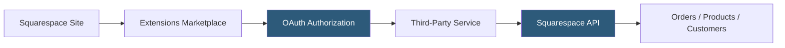

**Category:** Low-Code/No-Code Platforms
**Difficulty:** Beginner
**Reading time:** 5 min read

---

Squarespace Extensions is the platform's app marketplace for connecting third-party services to Squarespace websites and stores. Extensions focus primarily on ecommerce integrations — shipping, accounting, inventory, and marketing tools — rather than frontend UI additions.

- **Extension** — A third-party integration authorized to connect to a Squarespace site via OAuth
- **Extensions Marketplace** — The in-dashboard directory of available integrations, organized by category
- **OAuth Authorization** — The authentication mechanism used to grant extensions access to site data
- **Commerce Extensions** — Integrations specifically for Squarespace Commerce stores
- **Sync** — Bidirectional data exchange between Squarespace and the connected extension
- **Squarespace Commerce API** — The API layer that extensions use to access orders, products, and customers
- **Native Integration** — First-party connections to services like Google Analytics, Mailchimp, and Instagram
- **Zapier Connection** — An extension connecting Squarespace to thousands of apps via Zapier workflows

Extensions connect to Squarespace through an OAuth 2.0 authorization flow. When a site owner selects an extension and clicks "Add," they are redirected to the extension provider's authorization page, where they grant specific permissions to the Squarespace site data. Once authorized, the extension appears as connected in the dashboard.

Most commerce extensions work through polling or webhooks. Shipping extensions (ShipStation, ShipBob) poll for new orders and sync fulfillment status back. Accounting extensions (QuickBooks, Xero) pull order and revenue data for bookkeeping. Inventory extensions sync product stock levels bidirectionally.

Unlike Wix's App Market, Squarespace Extensions primarily serve backend and operational use cases rather than adding frontend functionality. They do not add visual components to the canvas. The integration is data-oriented: moving orders, customers, products, and financial records between Squarespace and business systems.

Native integrations — Google Analytics, Instagram feed, Mailchimp, Google Workspace — are built into Squarespace settings and don't appear in the Extensions Marketplace. They are configured directly in the platform's panel settings.

The Squarespace Developer Platform allows third-party developers to build and submit new extensions, accessing order, product, inventory, and customer data through documented REST APIs.

- Syncing Squarespace orders to ShipStation for multi-carrier fulfillment
- Connecting QuickBooks for automatic revenue reconciliation
- Integrating Printful for print-on-demand product fulfillment
- Linking Mailchimp for email marketing list sync from customer checkouts
- Connecting loyalty programs like Smile.io to the store checkout

| Advantage | Disadvantage |
|-----------|--------------|
| OAuth-based connection is secure and revocable | Extension catalog is small compared to Shopify App Store |
| Extensions handle operational workflows without custom code | Primarily commerce-focused; limited frontend extensions |
| Native integrations cover most analytics and marketing needs | Less developer ecosystem breadth than competing platforms |
| Centralized management in Squarespace dashboard | Some critical integrations require Squarespace Commerce plan |

- [Squarespace Hosting](squarespace-hosting.md)
- [Wix App Market](wix-app-market.md)
- [Shopify App Ecosystem](shopify-app-ecosystem.md)

---
*Part of the [Low-Code/No-Code Platforms](index.md) category · [Back to Master Index](../../index.md)*
