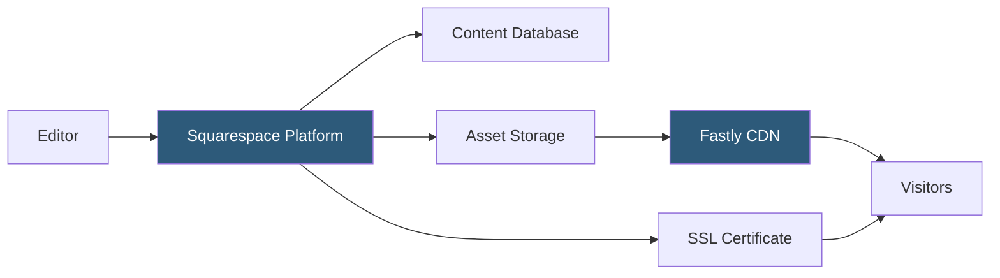

**Category:** Low-Code/No-Code Platforms
**Difficulty:** Beginner
**Reading time:** 5 min read

---

Squarespace is an all-in-one website building and hosting platform known for its polished design templates and integrated commerce, blogging, and scheduling tools. It targets creative professionals, small businesses, and entrepreneurs who prioritize aesthetics over customization depth.

- **Template** — A full-site design system defining layout, typography, and color palette as a starting point
- **Pages Panel** — The site structure manager where pages, folders, and navigation are organized
- **Sections** — Pre-built content blocks (hero, gallery, testimonials) stacked to compose pages
- **Style Editor** — A visual panel for adjusting global fonts, colors, and spacing within a template's bounds
- **Fluid Engine** — Squarespace 7.1's grid-based layout engine allowing more flexible section customization
- **Squarespace Domains** — Domain registration and DNS management integrated directly in the platform
- **Built-in CDN** — Squarespace serves assets through a global CDN (Fastly) included with all plans
- **Squarespace Circle** — A partner program for professional designers offering dev-mode access and client billing

Squarespace is a fully managed SaaS platform. Unlike WordPress where hosting is a separate concern, Squarespace bundles hosting, CDN, SSL, and domain management into a single subscription. There is no server to configure or software to update.

Content is stored in Squarespace's database and served dynamically. Pages are rendered server-side using Squarespace's proprietary template system. Squarespace 7.1 (the current version) uses a sections-based approach where pages are assembled from pre-built content sections that can be reordered and customized.

The Fluid Engine within sections provides a CSS grid layout system that allows dragging and resizing content blocks within a section's grid. This is more flexible than earlier Squarespace versions, which had rigid section templates.

Squarespace's CDN (Fastly) serves images, CSS, JavaScript, and other static assets from edge nodes close to visitors. Images are automatically resized and converted to WebP format for performance. SSL certificates are provisioned automatically via Let's Encrypt when custom domains are connected.

Developer access is available through Squarespace's Developer Platform, which exposes JSON-T templates and custom CSS injection. Circle members get access to developer mode for deeper template customization.

- Portfolio websites for photographers, designers, and artists
- Restaurant websites with menus and reservations
- Small business websites with service descriptions and contact forms
- Personal blogs with clean typographic layouts
- Professional service providers needing a polished online presence

| Advantage | Disadvantage |
|-----------|--------------|
| Professional templates with minimal design effort | Limited customization depth compared to WordPress or Webflow |
| Fully managed hosting, SSL, and CDN included | Switching platforms requires full site rebuild |
| Strong commerce and scheduling features built-in | No plugin ecosystem of comparable breadth to WordPress |
| Excellent mobile responsiveness out of the box | Code injection and custom development have significant limitations |

- [Squarespace Extensions](squarespace-extensions.md)
- [Wix App Market](wix-app-market.md)
- [Webflow Visual Development](webflow-visual-development.md)

---
*Part of the [Low-Code/No-Code Platforms](index.md) category · [Back to Master Index](../../index.md)*
