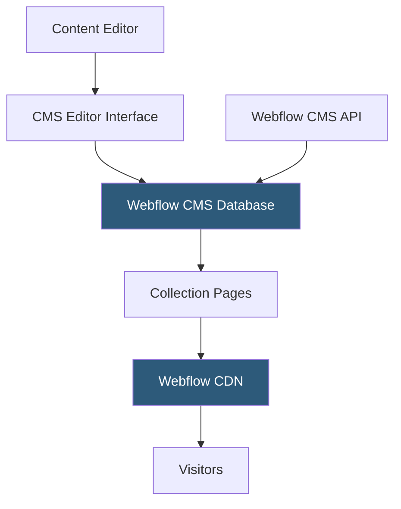

**Category:** Low-Code/No-Code Platforms
**Difficulty:** Intermediate
**Reading time:** 5 min read

---

Webflow CMS is a structured content management system built directly into the Webflow platform, enabling non-technical editors to manage content while designers control presentation. Content is hosted on Webflow's infrastructure with CDN-backed delivery.

- **Collection** — A named content type (e.g., Blog Posts, Team Members) with defined fields
- **Collection Fields** — Typed data fields per collection: text, rich text, image, reference, switch, color, etc.
- **Reference Field** — A relationship field linking one collection item to another collection
- **Multi-Reference Field** — A one-to-many relationship field linking to multiple items in another collection
- **Collection Page** — A template page that Webflow renders dynamically for each item in a collection
- **CMS Editor** — A simplified editing interface for content managers separate from the Designer
- **Publishing** — The action of pushing CMS content changes from draft to live state
- **CMS API** — Webflow's REST API for reading and writing CMS content programmatically

Webflow CMS organizes content into Collections, each acting like a database table. Designers define the structure — what fields each collection has and their types. Collection Pages use these fields as dynamic data sources: a blog post template might reference the title, body, author reference, and featured image fields.

When a CMS item is created or updated through the editor, Webflow regenerates the static HTML for that collection page and pushes it to the CDN. This static generation approach means fast page loads without server-side rendering on every request.

The CMS Editor provides a clean, simplified interface for content managers. They see only the fields defined for the collection, with rich text editors, image uploaders, and dropdowns — no access to the Designer canvas. This separation makes it safe to hand editing to non-technical team members.

Reference and Multi-Reference fields create relational data. An author collection can be referenced from blog posts; a products collection can reference categories. These relationships are traversable in the Designer's dynamic data expressions.

The CMS API enables headless use cases. Developers can fetch collection data via REST and render it in custom frontends (Next.js, Vue, etc.) while using Webflow as the content backend. This is popular for teams wanting Webflow's editing experience without its hosting constraints.

- Blog and news sites with regular content updates by editors
- Team/staff directory pages managed by HR teams
- Product catalog pages where marketing updates descriptions
- Event listings with date, location, and description fields
- Portfolio sites where new projects are added without designer involvement

| Advantage | Disadvantage |
|-----------|--------------|
| Editors work in a simple UI without touching design | CMS items limited per plan (2,000 on most plans) |
| Static generation means fast CDN delivery | No real-time or user-generated content without workarounds |
| CMS API enables headless architectures | API rate limits affect high-frequency content syncs |
| Relational fields handle complex content structures | Deeper relations (3+ levels) aren't natively traversable |

- [Webflow Visual Development](webflow-visual-development.md)
- [Webflow Ecommerce](webflow-ecommerce.md)
- [Webflow Logic](webflow-logic.md)

---
*Part of the [Low-Code/No-Code Platforms](index.md) category · [Back to Master Index](../../index.md)*
