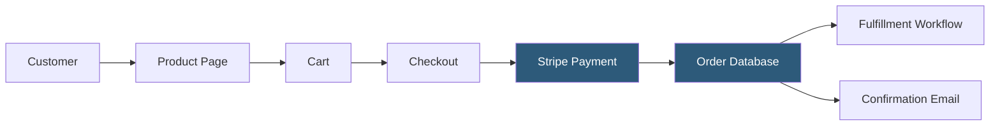

**Category:** Low-Code/No-Code Platforms
**Difficulty:** Intermediate
**Reading time:** 6 min read

---

Webflow Ecommerce integrates a product catalog, cart, and checkout system directly into the Webflow Designer, allowing custom-designed online stores without the template constraints of platforms like Shopify. It is best suited for design-forward brands with moderate product catalogs.

- **Product Collection** — A built-in CMS collection type for products with predefined commerce fields
- **SKU** — A product variant combining attributes like size and color, each with its own price and inventory
- **Cart** — A persistent, customizable cart component styled within the Webflow Designer
- **Checkout** — A multi-step checkout page with shipping, billing, and payment fields, fully styleable
- **Order Management** — A dashboard for viewing, fulfilling, and managing orders
- **Stripe Integration** — Webflow's payment backend; Stripe processes all transactions
- **Tax Calculation** — Automated tax calculation via integration with TaxJar or manual tax rules
- **Abandoned Cart Recovery** — Automated email sequences triggered when carts are left incomplete

Webflow Ecommerce builds on the CMS infrastructure. Products are a special collection type with additional commerce-specific fields: price, inventory, SKUs, and product images. Product variants are managed through SKUs — each unique combination of variant options creates a SKU record with its own price and stock level.

The cart component is a native Webflow element that can be styled like any other element on the page. It persists across pages via browser local storage, and cart state updates happen through Webflow's JavaScript runtime. Designers can control the cart drawer animation, item layout, and total display.

Checkout is a locked page with configurable sections. Designers can style every visual element but cannot add custom JavaScript within the checkout flow for PCI compliance reasons. Stripe Elements handles card input in an iframe.

Order management occurs within Webflow's dashboard. When an order is placed, it appears in the Orders panel with customer details, line items, and fulfillment status. Webflow sends automated transactional emails (order confirmation, shipping notifications) using its built-in email system.

For shipping, Webflow supports flat-rate, weight-based, and free shipping rules. Real-time carrier rates require third-party integrations. Tax is calculated using TaxJar for US-based stores or manual rate configuration.

- Design-forward boutique brands needing full visual control
- Limited-run product launches where checkout speed matters less
- Portfolio-driven stores for creatives (art prints, merchandise)
- Small catalogs (under 1,000 SKUs) requiring a premium look
- Brands migrating from Squarespace wanting more design control

| Advantage | Disadvantage |
|-----------|--------------|
| Complete visual control over every commerce element | Limited app ecosystem compared to Shopify |
| Clean integration with Webflow CMS content and blog | Transaction fees on lower-tier plans |
| No Liquid templating — full designer freedom | Fewer advanced commerce features (bundles, subscriptions) |
| Fast CDN-hosted product pages | Not ideal for large catalogs or high-volume merchants |

- [Webflow Visual Development](webflow-visual-development.md)
- [Webflow CMS Hosting](webflow-cms-hosting.md)
- [Shopify Plus Hosting](shopify-plus-hosting.md)

---
*Part of the [Low-Code/No-Code Platforms](index.md) category · [Back to Master Index](../../index.md)*
