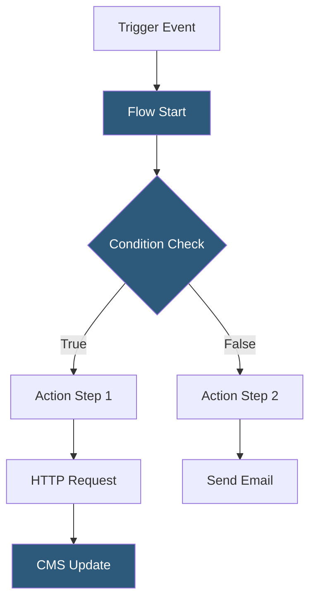

**Category:** Low-Code/No-Code Platforms
**Difficulty:** Intermediate
**Reading time:** 5 min read

---

Webflow Logic is a visual workflow automation tool embedded in the Webflow platform, allowing designers and builders to create multi-step automations triggered by form submissions, CMS changes, or scheduled events — without leaving the Webflow environment.

- **Flow** — A named automation consisting of a trigger and a sequence of action steps
- **Trigger** — The event that starts a flow: form submission, CMS item creation/update, or scheduled time
- **Action** — A step in a flow that performs an operation: send email, update CMS, call HTTP endpoint
- **Condition** — A branching logic block that routes a flow down different paths based on data values
- **Variables** — Named values created within a flow to store and pass data between steps
- **HTTP Request** — An action step for calling external APIs or webhooks from within a flow
- **CMS Action** — An action that creates, updates, or deletes items in a Webflow CMS collection
- **Form Submission Trigger** — The most common trigger, firing when a Webflow native form is submitted

Webflow Logic flows are built in a visual canvas with trigger nodes and action nodes connected by arrows. Each node is configured through a panel on the right side of the canvas — selecting trigger types, mapping data fields, and defining conditions.

Form submission triggers pass all submitted form field values as variables into the flow. These variables are referenced downstream in action steps using a picker interface. If a form has a "Email" field, that value can be referenced in the "Send to" field of an email action.

Condition nodes evaluate boolean expressions against flow variables, branching the execution path. For example, a form might have a "Plan" dropdown; a condition node routes premium users to one email sequence and free users to another.

HTTP Request action steps enable integration with external services. The step accepts a URL, method, headers, and a JSON body builder where flow variables are interpolated. The response body is available as a variable for subsequent steps.

Email actions use Webflow's transactional email sender, allowing variable interpolation in subject and body. For richer email experiences, the HTTP action can POST to SendGrid, Mailchimp, or similar services.

CMS actions enable form-to-database workflows: a contact form submission can create a CMS item in a "Leads" collection, making submission data available for review in the CMS Editor.

- Auto-responding to form submissions with personalized emails
- Creating CMS records from form data for lead tracking
- Routing form submissions to different team inboxes based on field values
- Triggering webhooks to Zapier or Make when content is published
- Scheduling periodic CMS updates or content archiving

| Advantage | Disadvantage |
|-----------|--------------|
| Native to Webflow, no third-party automation tool needed | Less powerful than dedicated tools like Zapier or Make |
| Visual flow builder lowers automation barrier | Limited trigger types compared to Zapier's 6,000+ app triggers |
| HTTP action connects to any external webhook or API | Error handling and retry logic are minimal |
| Directly manipulates Webflow CMS without API setup | Complex multi-branch flows become difficult to manage visually |

- [Webflow CMS Hosting](webflow-cms-hosting.md)
- [Webflow Visual Development](webflow-visual-development.md)
- [Airtable Automations](airtable-automations.md)

---
*Part of the [Low-Code/No-Code Platforms](index.md) category · [Back to Master Index](../../index.md)*
