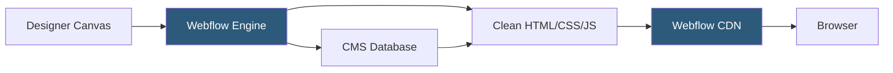

**Category:** Low-Code/No-Code Platforms
**Difficulty:** Beginner
**Reading time:** 6 min read

---

Webflow is a visual web development platform that generates clean HTML, CSS, and JavaScript from a design-centric canvas. Unlike template builders, Webflow exposes the full CSS box model and enables pixel-perfect designs without code while producing production-quality output.

- **Designer** — Webflow's visual canvas where layout, typography, and interactions are built
- **Style Panel** — The right-side panel exposing CSS properties (flexbox, grid, spacing) as visual controls
- **Interactions** — Timeline-based animation and scroll-triggered effects configured without JavaScript
- **Class System** — CSS class-based styling where changes to a class propagate to all elements using it
- **Symbol** — A reusable UI component (like a header or card) that updates globally when edited
- **Collection** — A CMS data type in Webflow, similar to a database table for structured content
- **Collection List** — A UI element that dynamically renders items from a CMS collection
- **Staging vs Production** — Webflow's two-stage publishing model separating preview from live sites

Webflow operates on a direct CSS model. When a designer moves an element, sets padding, or creates a flexbox layout, Webflow writes the equivalent CSS in the background. This output is semantically structured HTML with well-named classes, not generated soup — developers can hand off the code and continue in a text editor if needed.

The class system mirrors how professional CSS is written. Global styles are set on body and heading tags. Component-specific styles are added as classes. Combining classes enables variants without class explosion, similar to a utility-first approach but visually driven.

Interactions are powered by a JavaScript runtime that reads timeline configurations created in Webflow's Interactions panel. Scroll-triggered animations, hover effects, and page load transitions are all defined through visual timelines without writing JavaScript.

Publishing pushes static assets (for non-CMS pages) or server-rendered pages (for CMS collection pages) to Webflow's global CDN, powered by Fastly. Webflow handles SSL, CDN configuration, and edge caching automatically.

Custom code can be injected into the `<head>` or before `</body>` at the page or site level, enabling integrations with analytics tools, chat widgets, or custom JavaScript that Webflow's visual tools can't handle natively.

- Marketing websites and landing pages requiring design precision
- Portfolio sites for agencies, designers, and photographers
- Content-rich blogs and editorial sites using Webflow CMS
- SaaS product marketing pages with animations
- Localized websites using CMS multi-language setups

| Advantage | Disadvantage |
|-----------|--------------|
| Production-quality code output, not template slop | Steeper learning curve than Wix or Squarespace |
| Full CSS control without writing CSS | Webflow hosting required for CMS; export lacks dynamic features |
| Clean, exportable HTML/CSS | E-commerce features less mature than Shopify |
| Powerful animation system with no JavaScript | Monthly costs add up for large teams or many sites |

- [Webflow CMS Hosting](webflow-cms-hosting.md)
- [Webflow Ecommerce](webflow-ecommerce.md)
- [Framer Website Builder](framer-website-builder.md)

---
*Part of the [Low-Code/No-Code Platforms](index.md) category · [Back to Master Index](../../index.md)*
