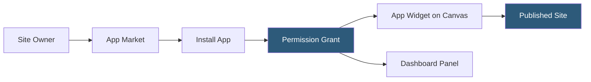

**Category:** Low-Code/No-Code Platforms
**Difficulty:** Beginner
**Reading time:** 5 min read

---

The Wix App Market is an integrated marketplace of over 500 applications that extend Wix websites with additional functionality. Apps range from ecommerce and booking tools to marketing integrations and business management services, installable with a few clicks from the Wix dashboard.

- **App Market** — Wix's curated directory of first-party and third-party applications
- **Wix Apps** — First-party applications developed by Wix (Wix Bookings, Wix Stores, Wix Events)
- **Third-Party Apps** — Applications built by external developers using the Wix App Platform SDK
- **Wix App Platform** — The API framework enabling developers to build apps that embed within Wix sites
- **App Widget** — A UI component installed by an app that appears on the Wix site canvas
- **Dashboard Panel** — The management interface an app adds to the Wix site's dashboard
- **Permissions** — The data access rights an app requests on installation (contacts, orders, content)
- **Recurring Billing** — App subscription fees billed through Wix alongside the site plan

The Wix App Market is accessible from within the Wix Editor and the Wix Dashboard. Apps are organized by category: Marketing & CRM, Booking & Events, Ecommerce, Communication, and more.

When an app is installed, Wix's App Platform framework handles authentication via OAuth, establishing a connection between the app developer's servers and the Wix site. The app gains access to site data (contacts, products, orders) based on the permissions the site owner grants during installation.

Apps manifest on the site in two ways: widgets and dashboard panels. Widgets are visual components placed on the canvas, like a booking calendar, review widget, or live chat button. Dashboard panels appear in the site's backend management area, providing the app's operational interface (e.g., appointment management, CRM inbox).

First-party Wix apps — Wix Bookings, Wix Stores, Wix Events — are deeply integrated and share data with the Wix CRM. Third-party apps communicate with Wix via the App Platform API, sending and receiving data through webhooks and REST calls.

Billing for paid apps is unified through Wix's billing system. Site owners see a single invoice covering their Wix plan and installed app subscriptions, simplifying vendor management.

- Adding appointment booking to service businesses
- Installing live chat support through Tidio or Intercom
- Connecting email marketing through Mailchimp or Klaviyo
- Adding customer reviews via Trustpilot or Judge.me
- Integrating loyalty programs or referral tracking

| Advantage | Disadvantage |
|-----------|--------------|
| One-click installation without developer setup | App quality varies; marketplace lacks strict vetting |
| Unified billing across apps and Wix plan | Some powerful apps only available on higher-tier Wix plans |
| Deep integration with Wix CRM and contact database | Third-party apps can slow site performance if poorly optimized |
| Large selection covering most small business needs | Less flexible than custom integrations built with code |

- [Wix Velo Development](wix-velo-development.md)
- [Squarespace Extensions](squarespace-extensions.md)
- [Bubble Plugin Ecosystem](bubble-plugin-ecosystem.md)

---
*Part of the [Low-Code/No-Code Platforms](index.md) category · [Back to Master Index](../../index.md)*
