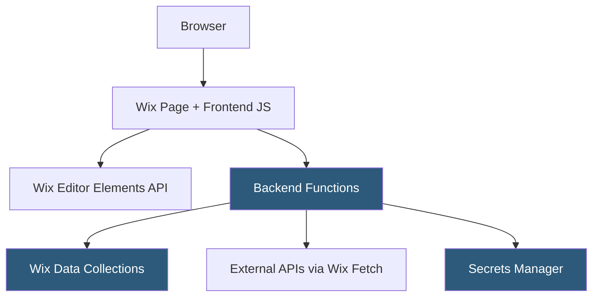

**Category:** Low-Code/No-Code Platforms
**Difficulty:** Intermediate
**Reading time:** 6 min read

---

Wix Velo (formerly Corvid) is Wix's full-stack development platform that allows developers to write JavaScript code directly within the Wix Editor, accessing site elements, data collections, and backend APIs. It bridges the gap between Wix's no-code simplicity and custom development needs.

- **Frontend Code** — JavaScript running in the browser that manipulates page elements and responds to events
- **Backend Code** — Server-side JavaScript (Node.js) running in Wix's secure backend infrastructure
- **Wix Data** — Velo's database API for reading and writing to Wix content collections
- **Wix Fetch** — A server-side HTTP client for calling external APIs from backend code
- **Secrets Manager** — A secure vault for storing API keys and credentials used by backend functions
- **HTTP Functions** — Backend endpoints exposed as public webhooks or APIs accessible from outside Wix
- **Routers** — Custom URL routing logic that dynamically generates pages from data
- **Events** — Hooks triggered by Wix platform events: form submissions, order placements, member logins

Velo is enabled per Wix site through the Editor. Once enabled, a code panel appears alongside the design canvas, providing a JavaScript editor with IntelliSense powered by Wix's typed APIs.

Frontend code files are attached to pages or run as globals across all pages. The `$w()` selector function accesses elements by ID, enabling direct manipulation: `$w('#myButton').onClick(() => { ... })`. Frontend code runs in the browser and has access to the Wix client-side APIs for navigation, lightboxes, and forms.

Backend code lives in a `backend/` directory and runs on Wix's Node.js servers. Backend functions are defined with `export function myFunction(params) {}` and called from frontend code using `import { myFunction } from 'backend/myModule'`. Wix automatically serializes and transfers data between frontend and backend via a secure RPC mechanism.

Wix Data collections are schema-defined databases accessible through the `wix-data` API. CRUD operations use `wix-data.query()`, `insert()`, `update()`, and `remove()`. Access permissions are set per collection for different user roles.

HTTP Functions create public API endpoints: `export function get_myEndpoint(request) {}` becomes a public URL, useful for receiving webhooks from Stripe, Mailchimp, or other services.

- Custom member portals with role-based content visibility
- Dynamic pages generated from database queries (real estate listings, job boards)
- Receiving and processing webhooks from payment processors
- Building custom API integrations not available in the App Market
- Automating database operations triggered by form submissions

| Advantage | Disadvantage |
|-----------|--------------|
| Full JavaScript access without leaving Wix Editor | Wix-specific APIs create vendor lock-in |
| Secure backend functions with secret management | Node.js version and npm package support is limited |
| Wix Data provides an easy-to-use managed database | Performance of backend functions can be inconsistent |
| HTTP Functions enable webhook receiving | Debugging experience is inferior to dedicated IDEs |

- [Wix App Market](wix-app-market.md)
- [Bubble Visual Programming](bubble-visual-programming.md)
- [Retool Internal Tools](retool-internal-tools.md)

---
*Part of the [Low-Code/No-Code Platforms](index.md) category · [Back to Master Index](../../index.md)*
