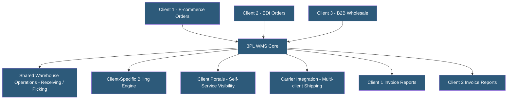

**Category:** Manufacturing & Supply Chain
**Difficulty:** Intermediate
**Reading time:** 6 min read

---

Third-party logistics (3PL) warehouse management involves software purpose-built for logistics service providers managing multiple clients in shared or dedicated warehouse facilities. 3PL WMS platforms add multi-client billing, client portal visibility, and contract-specific workflows on top of standard WMS functionality. Selecting the right 3PL WMS is critical for profitability since billing accuracy, client transparency, and operational scalability directly affect margins.

- **Multi-client WMS** — WMS architecture supporting multiple customers in a single warehouse with complete data isolation between clients
- **Activity-Based Billing** — 3PL billing model charging for each warehouse activity (receipt, putaway, pick, label) rather than flat monthly storage fees
- **Client Portal** — Web interface giving 3PL customers real-time visibility into their inventory and order status without accessing the full WMS
- **Value-Added Services (VAS)** — Additional 3PL services beyond basic storage and shipping: kitting, labeling, quality inspection, returns processing
- **Inbound/Outbound Freight Management** — 3PL management of carrier bookings, rate negotiation, and billing on behalf of clients
- **Cubic Capacity Billing** — Charging clients for actual cube space occupied rather than pallet positions, enabling denser storage utilization
- **EDI Connectivity** — Electronic Data Interchange integration with clients' ERP and e-commerce platforms for automated order and inventory data exchange
- **Client Onboarding** — Process of configuring WMS for a new client including product master setup, billing rules, and integration testing

3PL WMS platforms extend standard warehouse management with multi-client capabilities. Each client has their own product master, inventory ownership records, and order management while sharing the physical warehouse space and labor pool. Strict data partitioning ensures client A cannot see client B's inventory, pricing, or order data.

Billing is the most complex 3PL-specific capability. Activity-based billing captures every warehouse touch — receipt, putaway, pick, pack, manifest, label, VAS activity — and assigns costs to the responsible client account. Monthly invoices are generated automatically from activity logs, with detailed line-item support for client disputes. Billing configuration is highly flexible: different rates by product type, order profile, or volume tier.

Client portals provide real-time inventory visibility, inbound shipment tracking, order status, and invoice access. Modern portals integrate with client e-commerce platforms to allow direct order injection, reducing email and phone order entry. Self-service portals reduce 3PL staff time on routine inquiries.

Integration management is substantial in 3PL environments. Each client may use different e-commerce platforms (Shopify, NetSuite, SAP), EDI standards (X12, EDIFACT), and carrier preferences. The WMS must maintain separate integration configurations per client while sharing the underlying infrastructure.

Leading 3PL WMS solutions include 3PL Central (Extensiv), Deposco, Softeon, and Infoplus. Selection criteria include number of clients, order volume, WMS feature depth, and integration ecosystem.

- 3PL providers managing 5–100 e-commerce and wholesale clients in shared facilities
- Fulfillment centers offering kitting, subscription box assembly, and returns processing
- Cold chain 3PLs managing regulated temperature-controlled storage with enhanced traceability
- 3PLs supporting Amazon FBM or seller-fulfilled prime programs requiring carrier compliance
- Logistics companies differentiating through client portal transparency and self-service

| Advantage | Disadvantage |
|-----------|--------------|
| Multi-client billing accuracy protects 3PL margins | Complex configuration per client increases implementation effort |
| Client portals reduce customer service inquiries | Each new client integration requires testing and setup time |
| Activity-based billing aligns revenue to actual work performed | Disputes over billing require detailed activity log review |
| Shared labor pool improves utilization across client peaks | Client data isolation requires careful access control configuration |
| Scales from startup 3PLs to large-scale fulfillment networks | WMS licensing cost per client can erode margin for small accounts |

- [Warehouse Management Systems](warehouse-management-systems-wms.md)
- [WMS Cloud Hosting Providers](wms-cloud-hosting-providers.md)
- [Transportation Management Systems](transportation-management-systems-tms.md)

---
*Part of the [Manufacturing & Supply Chain](index.md) category · [Back to Master Index](../../index.md)*
