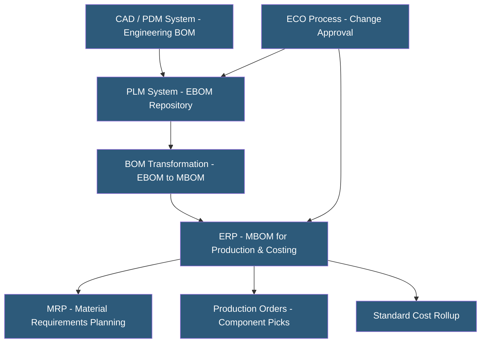

**Category:** Manufacturing & Supply Chain
**Difficulty:** Intermediate
**Reading time:** 6 min read

---

A Bill of Materials (BOM) is the hierarchical recipe defining every component, sub-assembly, raw material, and quantity required to produce a finished product. BOM management encompasses creating, maintaining, and controlling these records across engineering, manufacturing, and procurement systems. Accurate BOMs are the foundation of MRP, product costing, and production execution — errors propagate directly into incorrect material orders, cost estimates, and production failures.

- **Engineering BOM (EBOM)** — BOM maintained by engineering reflecting design intent; may include provisional or design-phase components
- **Manufacturing BOM (MBOM)** — BOM transformed for production use, reflecting how a product is actually assembled on the factory floor
- **Service BOM** — Parts list optimized for aftermarket service and spare parts management
- **BOM Level** — Hierarchy depth; Level 0 is the finished product, Level 1 is direct components, Level 2+ are sub-assembly components
- **Phantom Assembly** — Sub-assembly that exists in the BOM structure but is not physically kitted or tracked separately — components flow through directly
- **Effectivity Dates** — BOM version dates controlling when component changes take effect (date-effective vs. revision-effective)
- **ECO (Engineering Change Order)** — Formal process for approving and implementing changes to product BOMs and drawings
- **Where-Used Analysis** — Identifying all products that use a specific component — critical for evaluating the impact of component changes

BOMs originate in engineering as design specifications. In companies with PLM systems (Windchill, Teamcenter, Arena), the EBOM is maintained alongside CAD files, reflecting design intent. As products move from design to production, the EBOM is transformed into an MBOM reflecting manufacturing process requirements — adding manufacturing steps, phantom assemblies for production flow, and production-specific component designations.

The MBOM transfers to the ERP system where it drives MRP calculations, production order material picks, and standard cost rollups. The ERP BOM is the operational record used daily for manufacturing. Keeping EBOM and MBOM synchronized after product changes is a significant challenge in organizations without PLM-ERP integration.

BOM accuracy is critical — a single incorrect quantity in a multi-level BOM propagates errors throughout MRP, creating either excess or insufficient material orders. BOM audits physically compare production builds against BOM specifications to identify discrepancies.

Engineering Change Orders control how BOMs evolve. When engineering modifies a component (for cost reduction, quality improvement, or obsolescence), the ECO process documents the change, assesses impact on existing inventory and production orders, gets stakeholder approvals, and activates the change at a specific date or revision level. Effectivity management determines whether the change applies to orders shipped after a date or after a specific lot number is consumed.

Where-used analysis identifies all BOMs containing a specific component. When a component is discontinued or has a quality alert, where-used analysis reveals the production impact scope before decisions are made.

- Manufacturers maintaining engineering and manufacturing BOM synchronization across PLM and ERP
- Companies managing frequent ECO cycles requiring formal change control processes
- Electronics manufacturers tracking component substitutions and obsolescence impacts
- Aerospace and defense manufacturers requiring complete configuration documentation
- Companies implementing standard costing needing accurate multi-level BOM cost rollups

| Advantage | Disadvantage |
|-----------|--------------|
| Accurate BOMs are the foundation of correct MRP and cost calculations | BOM maintenance requires dedicated data stewardship to prevent drift |
| ECO workflows control risk of uncontrolled changes impacting production | PLM-ERP integration to synchronize EBOM and MBOM is complex |
| Where-used analysis enables impact assessment before approving changes | Multi-level BOM errors compound through all levels creating large material variances |
| Effectivity date management enables planned cutover without emergency replanning | Organizations without PLM may manage EBOM in spreadsheets, creating version control risks |
| Phantom assembly modeling improves MRP performance on complex products | Legacy ERP BOM structures may not support modern configurable BOM requirements |

- [Product Lifecycle Management](product-lifecycle-management-plm.md)
- [Manufacturing ERP Hosting](manufacturing-erp-hosting.md)
- [Production Scheduling Systems](production-scheduling-systems.md)

---
*Part of the [Manufacturing & Supply Chain](index.md) category · [Back to Master Index](../../index.md)*
