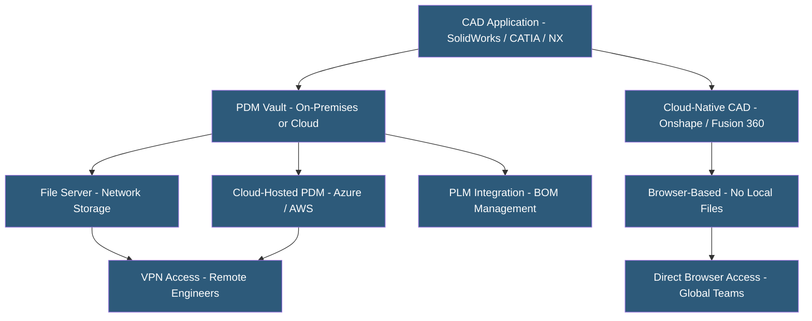

**Category:** Manufacturing & Supply Chain
**Difficulty:** Intermediate
**Reading time:** 5 min read

---

CAD (Computer-Aided Design) file hosting manages the storage, versioning, sharing, and access control for engineering drawings and 3D models. Unlike general document storage, CAD hosting must handle large binary files (assemblies exceeding gigabytes), maintain associative links between parts and assemblies, and integrate with CAD applications for check-in/check-out workflows. Cloud CAD hosting options range from PDM vault hosting to CAD-native cloud platforms.

- **PDM Vault** — Central repository for CAD files with version control, check-in/check-out locking, and metadata management
- **Check-In / Check-Out** — Workflow locking a file for exclusive editing by one user while others access the previous released version
- **Assembly References** — Links between assembly files and their component part files; broken references cause missing geometry errors
- **File Format** — Native CAD formats (SLDPRT, .CATPART, .IPT) are application-specific; neutral formats (STEP, IGES, PARASOLID) enable exchange
- **STEP (Standard for Exchange of Product Data)** — ISO 10303 neutral 3D model format for exchanging geometry between different CAD systems
- **Revision Control** — Managing numbered or lettered design revisions with associated drawings and release status
- **Concurrent Engineering** — Multiple engineers working on different components of an assembly simultaneously with controlled integration
- **Large File Sync** — Efficient differential transfer of CAD file updates over networks; full-file transfer of GB-scale assemblies is impractical

Traditional CAD hosting uses a PDM vault — a server storing CAD files with a database tracking versions, metadata, and user permissions. SolidWorks PDM, Autodesk Vault, and PTC Windchill PDMLink are the dominant products. The PDM client software integrates with the CAD application, intercepting file saves to perform check-in operations that create new vault versions.

When a user wants to edit a file, they check it out — the vault marks the file locked, preventing others from modifying it. The user works locally on their checked-out copy, then checks back in when complete, creating a new vault version. Other users refresh to see the latest. This serialized workflow prevents overwriting colleagues' work but limits concurrent modification.

Cloud-hosted PDM vaults run the same server software on cloud infrastructure (Azure, AWS) rather than on-premises hardware. Remote engineers connect via VPN and work against the cloud vault. Large assembly syncs over VPN can be slow due to CAD file sizes — a large aircraft assembly may require gigabytes of data.

Cloud-native CAD platforms (Onshape, Autodesk Fusion 360, PTC Creo+) take a different approach: there are no local files. All geometry is stored server-side; the browser or thin client renders geometry streamed from the cloud. Concurrent editing is possible because all users work against the same server-side model simultaneously, similar to Google Docs. This eliminates file synchronization entirely but requires fast internet connectivity.

Export-controlled designs (ITAR/EAR) require careful cloud provider evaluation — data residency, access controls, and subcontractor agreements must comply with US export regulations.

- Engineering teams with remote or global design staff needing shared CAD access
- Companies moving from on-premises file servers to cloud-hosted PDM vaults
- Startups evaluating cloud-native CAD to avoid PDM infrastructure investment
- Aerospace and defense manufacturers managing ITAR-controlled designs with strict access controls
- Manufacturers sharing CAD models with suppliers and contract manufacturers in neutral formats

| Advantage | Disadvantage |
|-----------|--------------|
| Version control prevents design data loss and enables rollback | Traditional PDM over VPN is slow for large assemblies; WAN optimization needed |
| Check-in/check-out prevents conflicting parallel edits | Cloud-native CAD requires reliable high-speed internet for all engineers |
| Cloud hosting eliminates on-premises server hardware maintenance | ITAR/EAR restrictions limit cloud provider options for export-controlled work |
| PDM integration with PLM enables BOM synchronization | CAD file format dependencies create lock-in to specific application ecosystems |
| Access controls protect IP from unauthorized supplier access | Migration between PDM systems requires extensive file and metadata mapping |

- [Product Lifecycle Management](product-lifecycle-management-plm.md)
- [Engineering Change Management](engineering-change-management.md)
- [Bills of Materials (BOM) Management](bills-of-materials-bom-management.md)

---
*Part of the [Manufacturing & Supply Chain](index.md) category · [Back to Master Index](../../index.md)*
