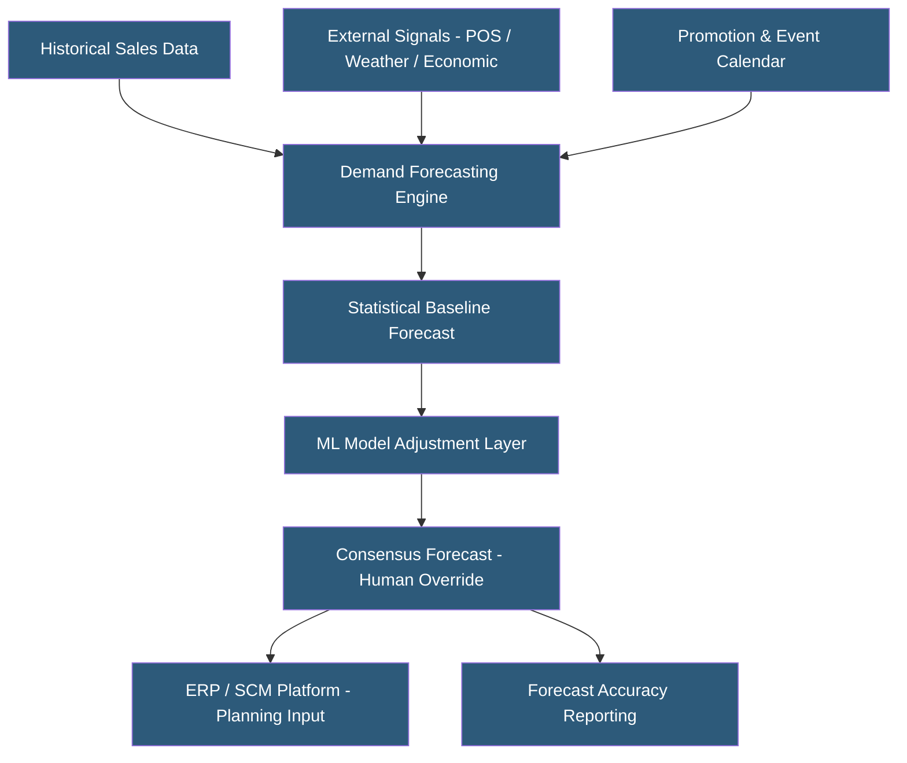

**Category:** Manufacturing & Supply Chain
**Difficulty:** Intermediate
**Reading time:** 6 min read

---

Demand forecasting systems predict future customer demand to guide production planning, inventory positioning, and procurement decisions. They range from statistical time-series models embedded in ERP systems to advanced AI/ML platforms consuming hundreds of demand signals. Forecast accuracy directly impacts inventory levels, service rates, and working capital — a 10% improvement in forecast accuracy can reduce safety stock by 20–30% while maintaining the same service level.

- **MAPE (Mean Absolute Percentage Error)** — Most common forecast accuracy metric measuring average percentage deviation between forecast and actual demand
- **Statistical Forecasting** — Time-series methods (ARIMA, Exponential Smoothing, Holt-Winters) that extrapolate historical demand patterns
- **Machine Learning Forecasting** — Gradient boosted trees, neural networks, and ensemble methods incorporating external features alongside historical demand
- **Demand Sensing** — Short-term (1–4 week) forecast correction using point-of-sale, shipment, and market data
- **Causal Forecasting** — Models incorporating explanatory variables (promotions, pricing, weather, economic indicators) to predict demand drivers
- **New Product Introduction (NPI)** — Forecasting for products with no history, relying on analogous product references and market research
- **Intermittent Demand** — Sporadic, lumpy demand patterns (spare parts, slow-moving SKUs) requiring specialized forecasting methods (Croston, SBA)
- **Forecast Bias** — Systematic over- or under-forecasting indicating model miscalibration or organizational gaming of the forecast process

Demand forecasting begins with data collection — historical sales (by SKU, customer, location), promotional calendars, market data, and external signals. Data quality is foundational; inconsistent historical data caused by stockouts, promotions, and one-time orders must be cleansed and enriched before modeling.

Statistical forecasting algorithms analyze historical demand series to identify trend, seasonality, and cyclical patterns. Exponential smoothing methods weight recent observations more heavily than older data. ARIMA models identify autocorrelation patterns for stationary time series. These methods perform well for stable, high-volume SKUs but struggle with intermittent, irregular, or new products.

Machine learning models (XGBoost, LightGBM, deep learning) improve on statistical methods by incorporating hundreds of features: day-of-week effects, holidays, competitor pricing, social media sentiment, weather, and economic indicators. They excel at capturing nonlinear relationships between demand drivers. The tradeoff is interpretability — explaining why the model increased forecast by 15% is harder than explaining a trend extrapolation.

Demand sensing uses high-frequency data (daily or weekly POS sell-through, shipment confirmations) to adjust near-term forecasts within the planning frozen zone. Even small forecast improvements in the 0–4 week horizon reduce costly emergency orders and write-offs.

Consensus forecasting workflows present the statistical baseline to sales, marketing, and finance teams who apply business knowledge — known promotions, product launches, and market intelligence — through collaborative override processes.

Cloud-hosted forecasting platforms (Kinaxis, Blue Yonder, o9, Anaplan, Forecast Pro) offer scalability for millions of SKU-location combinations that overwhelm spreadsheet-based approaches.

- Consumer packaged goods companies managing thousands of SKUs across global distribution networks
- Retailers preventing stockouts of fast-moving products while minimizing markdowns on slow movers
- Manufacturers using forecasts to drive long-lead-time material procurement
- Pharmaceutical companies ensuring continuous supply of essential medications
- Spare parts distributors using intermittent demand methods for low-velocity service parts

| Advantage | Disadvantage |
|-----------|--------------|
| Improved accuracy reduces safety stock and carrying costs | Implementation requires significant data preparation investment |
| ML models capture complex demand patterns missed by statistics | Black-box ML models reduce planner trust and adoption |
| Demand sensing reduces reactive firefighting in short-term planning | External data subscriptions add ongoing costs |
| Cloud scalability handles millions of SKU-location combinations | Forecast accuracy plateaus without continuous model tuning |
| Automated exception management focuses planner attention on outliers | Organizational consensus process is often the binding constraint, not model quality |

- [Supply Chain Management Platforms](supply-chain-management-platforms.md)
- [Inventory Optimization Platforms](inventory-optimization-platforms.md)
- [Manufacturing ERP Hosting](manufacturing-erp-hosting.md)

---
*Part of the [Manufacturing & Supply Chain](index.md) category · [Back to Master Index](../../index.md)*
