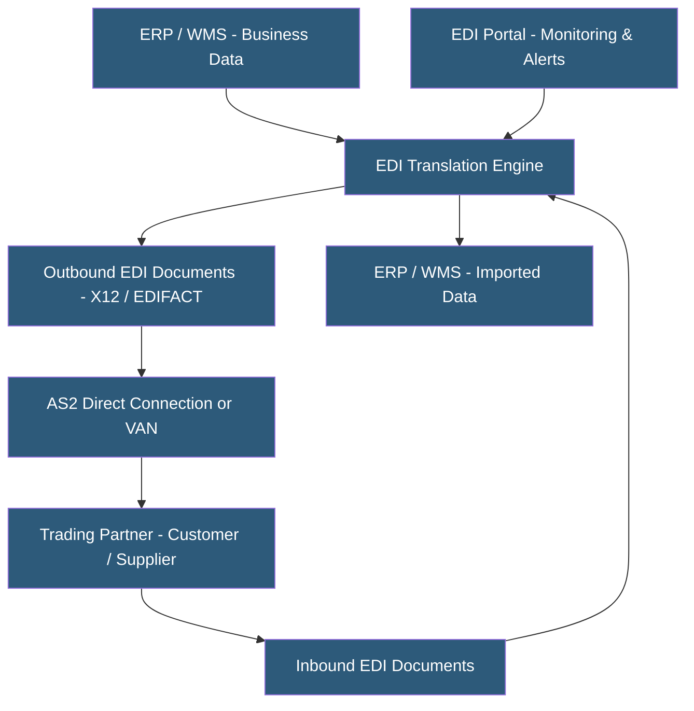

**Category:** Manufacturing & Supply Chain
**Difficulty:** Intermediate
**Reading time:** 6 min read

---

Electronic Data Interchange (EDI) is the computer-to-computer exchange of standard business documents — purchase orders, invoices, advance ship notices, inventory feeds — between trading partners using defined message formats. EDI hosting services manage the translation, routing, and communication infrastructure required to exchange EDI documents, eliminating manual data entry and improving transaction speed. Cloud-hosted EDI-as-a-Service has replaced on-premises value-added networks (VANs) for most mid-market companies.

- **X12** — American EDI standard (used in US) with transaction sets numbered by function: 850 (purchase order), 856 (ASN), 810 (invoice)
- **EDIFACT** — International EDI standard (UN/EDIFACT) used primarily in Europe and globally
- **VAN (Value-Added Network)** — EDI intermediary providing store-and-forward mailbox services between trading partners
- **AS2 (Applicability Statement 2)** — Direct peer-to-peer EDI transport over HTTPS with digital signatures and encryption
- **Translation** — Converting EDI flat-file format to/from ERP data structures (XML, JSON, database records)
- **Mapping** — Defining the transformation rules between EDI fields and internal application fields for a specific trading partner
- **Trading Partner** — Any external organization (customer, supplier, carrier) exchanging EDI documents
- **EDI Compliance** — Meeting a trading partner's specific EDI requirements, often mandatory for supplier approval

EDI hosting services provide the middleware between a company's internal systems and its trading partners. The core components are translation (converting ERP data to/from EDI format), communication (sending and receiving EDI files), and mapping (defining partner-specific field transformations).

When a customer sends an 850 purchase order via EDI, the hosted EDI platform receives the file through the agreed transport (AS2, SFTP, VAN mailbox), parses the X12 or EDIFACT format, validates the document against the agreed specification, maps fields to the internal data structure, and pushes the order into the ERP system. Response documents (997 functional acknowledgment, 855 order acknowledgment) are generated and returned automatically.

Each trading partner has unique requirements: field formats, segment usage, code values, and timing requirements. The translation layer uses partner-specific maps that define how EDI fields correspond to internal application fields. Managing hundreds of trading partners requires significant mapping maintenance as partners issue compliance updates.

Modern EDI-as-a-Service platforms (SPS Commerce, TrueCommerce, DiCentral, OpenText Trading Grid) provide pre-built maps for major retailers (Walmart, Target, Amazon, Home Depot), eliminating the time to build from scratch. Onboarding a new major retailer can take 2–6 weeks including testing.

Cloud EDI platforms provide 24/7 monitoring dashboards, transaction acknowledgment tracking, error alerting, and resend capabilities. Integration with ERP systems uses REST APIs, SFTP file drops, or database connections depending on the ERP.

- Suppliers to major retailers (Walmart, Target, Amazon) mandating EDI compliance
- Automotive tier suppliers exchanging scheduling releases and shipment notifications with OEMs
- Grocery and CPG companies managing EDI with hundreds of retail and distributor trading partners
- Third-party logistics providers processing customer EDI orders on behalf of clients
- Companies replacing manual order processing with automated EDI to reduce errors and labor

| Advantage | Disadvantage |
|-----------|--------------|
| Eliminates manual order entry reducing errors and labor costs | Initial trading partner onboarding is time-consuming and technical |
| Pre-built retail maps accelerate major trading partner enablement | Partner-specific compliance requirements create ongoing maintenance burden |
| Cloud hosting removes on-premises VAN software management | EDI errors require specialized knowledge to diagnose and resolve |
| Real-time document monitoring improves exception management | VAN transaction fees accumulate at high trading partner volumes |
| Automated functional acknowledgments reduce reconciliation effort | Migrating between EDI providers is complex with extensive partner retesting |

- [Supplier Portal Hosting](supplier-portal-hosting.md)
- [Supply Chain Management Platforms](supply-chain-management-platforms.md)
- [Transportation Management Systems](transportation-management-systems-tms.md)

---
*Part of the [Manufacturing & Supply Chain](index.md) category · [Back to Master Index](../../index.md)*
