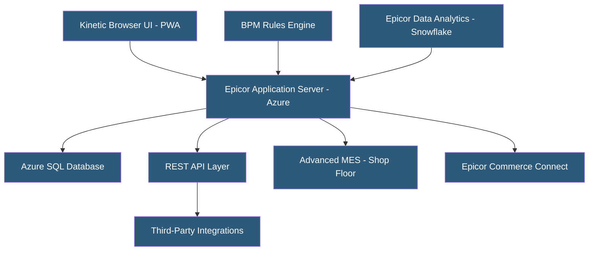

**Category:** Manufacturing & Supply Chain
**Difficulty:** Intermediate
**Reading time:** 6 min read

---

Epicor Kinetic (formerly Epicor ERP) is a cloud-native ERP targeting mid-market manufacturers in job shop, make-to-order, and mixed-mode environments. It offers browser-based progressive web app interfaces, REST APIs, and containerized deployment on Azure. Epicor's strength lies in job costing, project manufacturing, and complex discrete production for industries like fabricated metals, industrial machinery, and electronics manufacturing services.

- **Kinetic Framework** — Epicor's browser-based UI architecture replacing legacy WinForms with React-based progressive web apps
- **Job Engineering** — Epicor module for building detailed job structures with operations, materials, and subcontracting
- **Advanced MES** — Shop floor data collection and production management module with touchscreen terminals
- **Project Manufacturing** — Extended job management linking production jobs to project milestones and billing
- **Epicor EWA (Epicor Web Access)** — Remote access layer enabling browser-based access to legacy Epicor screens
- **BAQ (Business Activity Query)** — Epicor's custom report and dashboard builder using visual SQL query designer
- **BPM (Business Process Management)** — Epicor's rule engine for triggering custom logic on database events
- **Epicor iScala** — Separate Epicor ERP product targeting distribution and light manufacturing

Epicor Kinetic runs on Azure infrastructure as a dedicated-tenant cloud deployment. Unlike pure multi-tenant SaaS ERPs, Epicor offers both SaaS (multi-tenant) and private cloud (dedicated) hosting options, giving manufacturers flexibility in data isolation and customization depth.

The application uses a service-oriented architecture where the Epicor Application Server exposes business logic via REST APIs, consumed by the Kinetic browser UI and third-party integrations. The BAQ tool enables non-technical users to build custom queries joining any Epicor database tables, generating dashboards and reports without developer involvement.

Job management is a core Epicor strength. Engineers create detailed job structures with multi-level operations, materials with quantity-per specifications, subcontract operations with vendor lead times, and estimated setup and run times per operation. As jobs progress through the shop, operators clock time and report quantities using Advanced MES terminals, building actual-vs.-estimated cost comparisons in real time.

BPM provides event-driven customization — rules trigger on record saves, status changes, or time-based conditions. For example, a BPM rule can automatically email a buyer when purchased components fall below reorder points, or block job completion when quality inspection records are missing.

Epicor Data Analytics integrates with Snowflake to provide a modern analytics layer outside the transactional database, supporting large-scale historical analysis without impacting ERP performance.

- Job shops and contract manufacturers needing detailed job costing and scheduling
- Fabricated metals and sheet metal manufacturers with complex routing and tooling
- Electronics manufacturing services (EMS) requiring BOM revisions and ECO management
- Mid-market manufacturers needing cloud ERP without SAP/Oracle costs
- Companies requiring project-based billing linked to production jobs

| Advantage | Disadvantage |
|-----------|--------------|
| Strong job costing and actual cost tracking | Kinetic UI migration still in progress for some modules |
| Flexible cloud deployment (SaaS or private cloud) | Less global brand recognition vs. SAP/Oracle/Microsoft |
| BPM enables powerful event-driven customizations | Deep customizations complicate upgrade paths |
| Browser-based PWA eliminates client software deployment | Analytics historically required third-party tools |
| Good fit for mid-market without enterprise complexity | Implementation quality varies significantly by partner |

- [Manufacturing ERP Hosting](manufacturing-erp-hosting.md)
- [Production Scheduling Systems](production-scheduling-systems.md)
- [MES (Manufacturing Execution System) Hosting](mes-manufacturing-execution-system-hosting.md)

---
*Part of the [Manufacturing & Supply Chain](index.md) category · [Back to Master Index](../../index.md)*
