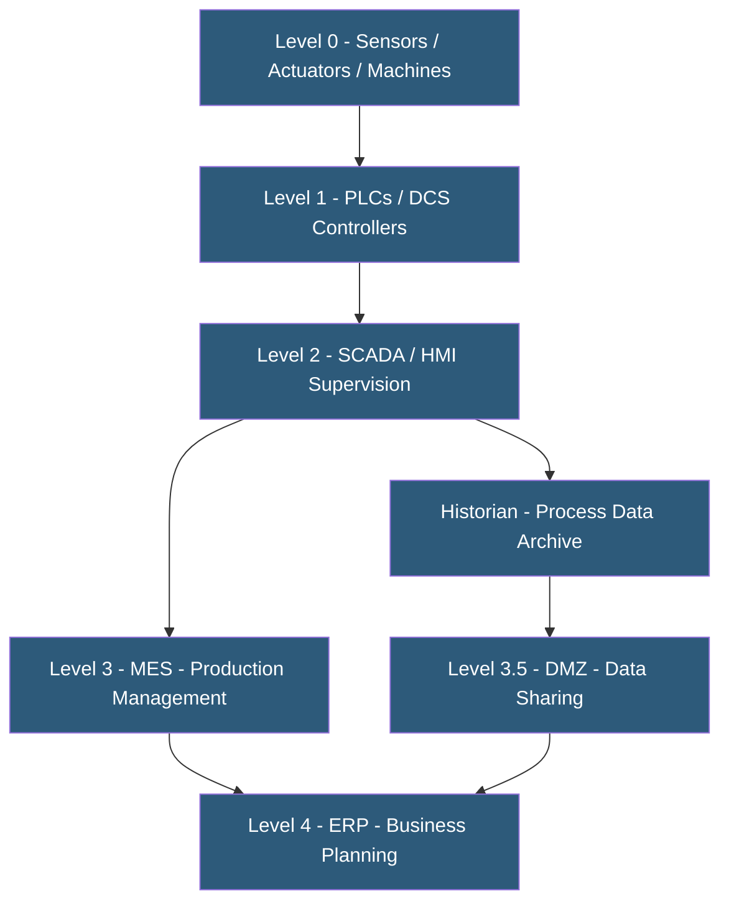

**Category:** Manufacturing & Supply Chain
**Difficulty:** Advanced
**Reading time:** 7 min read

---

Factory automation systems encompass the hardware, software, and networks that control, coordinate, and optimize physical manufacturing processes with minimal human intervention. From PLCs managing individual machines to SCADA systems supervising entire production lines, automation systems form the operational technology (OT) layer that modern manufacturing intelligence platforms build upon. Hosting and connectivity strategies for automation systems must balance performance, reliability, and security in ways that differ fundamentally from IT systems.

- **PLC (Programmable Logic Controller)** — Industrial computer executing ladder logic or function block programs to control machines and processes
- **SCADA (Supervisory Control and Data Acquisition)** — Software providing real-time supervisory control and visualization of industrial processes
- **HMI (Human-Machine Interface)** — Touchscreen or panel display at a machine allowing operators to monitor and control automated processes
- **DCS (Distributed Control System)** — Process control architecture distributing control logic across field-mounted controllers, used in continuous process industries
- **Industrial Ethernet** — Deterministic networking standards (PROFINET, EtherNet/IP) providing real-time control with guaranteed timing
- **Safety PLC / SIS** — Safety Instrumented System executing safety logic independently from process control, providing certified functional safety
- **SCADA Historian** — Time-series database embedded in or connected to SCADA for archiving process data (OSISoft PI, Wonderware)
- **Purdue Model** — ISA-95-aligned reference model for industrial network architecture defining control hierarchy layers

The Purdue Model (ISA-95) organizes factory automation into five hierarchical layers. Level 0 consists of physical sensors and actuators — temperature probes, pressure transducers, motors, valves. Level 1 PLCs read sensor inputs and calculate output commands based on programmed logic, executing control cycles in milliseconds. Level 2 SCADA systems supervise multiple PLCs, providing operators with process visualization, alarm management, and trend displays.

PLCs are programmed using IEC 61131-3 languages: ladder diagram (graphical circuit representation), structured text (C-like language), or function block diagram. Safety-critical processes use certified Safety PLCs executing SIL-rated safety functions independently from process logic, ensuring machine stops are guaranteed even during process controller failures.

Industrial Ethernet networks provide deterministic communication between PLCs and sensors, guaranteeing data delivery within microseconds. PROFINET and EtherNet/IP are the dominant protocols in discrete manufacturing; FOUNDATION Fieldbus and HART are standard in process industries. These OT networks are logically or physically separated from corporate IT networks.

SCADA systems run on Windows-based servers (on-premises or virtualized) within the OT network. SCADA virtualization — running SCADA on VMware or Hyper-V on redundant servers — has become standard practice for critical applications, enabling failover without hardware replacement. Cloud SCADA is emerging but rare in industries where sub-second control response is required.

Remote access to automation systems for vendor troubleshooting uses secure jump servers and vendor-managed access solutions (Secomea, Ewon, Tosibox) that provide encrypted tunnels to specific PLCs without exposing the OT network to the internet.

- Automotive assembly plants coordinating hundreds of robots and conveyor systems
- Chemical plants managing continuous process control for temperature, pressure, and flow regulation
- Packaging lines coordinating filling, capping, labeling, and case packing at high speed
- Pharmaceutical facilities maintaining validated automated batch processes with 21 CFR Part 11 compliance
- Power utilities managing distributed generation and grid infrastructure

| Advantage | Disadvantage |
|-----------|--------------|
| Automated control eliminates human error in repetitive, high-speed processes | High capital cost for automation hardware and integration engineering |
| PLC redundancy enables hot-standby failover without production interruption | Legacy automation systems may use proprietary protocols limiting connectivity |
| Deterministic industrial networks guarantee timing for safety-critical control | OT cybersecurity is increasingly challenging as systems gain network connectivity |
| SCADA virtualization reduces hardware and improves disaster recovery | Automation change management requires certified controls engineers |
| Remote access solutions reduce vendor travel costs for troubleshooting | Automation downtime during programming changes requires planned windows |

- [Industrial IoT Platforms](industrial-iot-platforms.md)
- [IoT Sensor Data Hosting](iot-sensor-data-hosting.md)
- [MES (Manufacturing Execution System) Hosting](mes-manufacturing-execution-system-hosting.md)

---
*Part of the [Manufacturing & Supply Chain](index.md) category · [Back to Master Index](../../index.md)*
