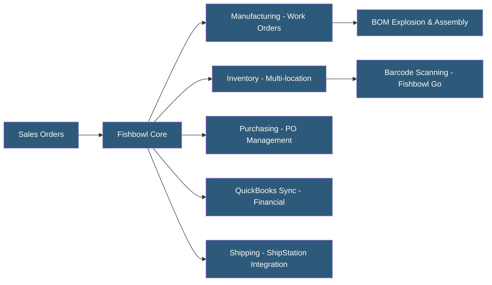

**Category:** Manufacturing & Supply Chain
**Difficulty:** Beginner
**Reading time:** 5 min read

---

Fishbowl is an inventory management and light manufacturing platform designed to extend QuickBooks with production and warehouse management capabilities. It serves small to mid-sized product companies that outgrow QuickBooks inventory functionality but are not ready for a full ERP migration. Fishbowl offers both desktop (on-premises) and Fishbowl Online (cloud) versions, with strong integration into the QuickBooks ecosystem.

- **QuickBooks Integration** — Bi-directional sync between Fishbowl and QuickBooks Online or Desktop for financial transactions
- **Work Order** — Fishbowl's manufacturing job record tracking components, assembly, and finished goods production
- **Bill of Materials** — Component list defining what raw materials are consumed to produce a finished assembly
- **Multi-location Inventory** — Tracking stock across multiple warehouses, storage locations, and bins
- **Receiving** — Fishbowl workflow for processing vendor shipments and updating inventory with PO matching
- **Cycle Count** — Scheduled inventory verification process counting specific product groups without full shutdown
- **Barcode Scanning** — Mobile device integration for warehouse receiving, picking, and inventory movements
- **Fishbowl Go** — Mobile companion app for warehouse operations including scanning and inventory lookups

Fishbowl operates as a client-server application (desktop version) or cloud-hosted SaaS (Fishbowl Online). The on-premises version uses a Firebird embedded database accessed by a Java-based thick client, installed on each workstation. The cloud version runs on AWS with a browser-based interface.

When a work order is created, Fishbowl performs a BOM explosion to identify required components. It checks current inventory availability and reserves (commits) stock to the work order. Assembly technicians pick components using barcode scanners, consuming inventory in Fishbowl. Upon work order completion, the finished goods quantity is added to inventory.

The QuickBooks integration is Fishbowl's primary differentiator. Financial transactions (invoices, bills, inventory valuation adjustments) are synchronized to QuickBooks automatically or on demand. This allows businesses to keep their accounting team working in QuickBooks while operations teams use Fishbowl for inventory and production management.

Purchase orders in Fishbowl trigger vendor communications, and received goods update inventory immediately. The system supports multiple locations (bins, aisles, warehouses) with FIFO or LIFO costing methods. Lot and serial number tracking is available for traceability requirements.

Fishbowl's manufacturing capabilities are intentionally simple — suited for straightforward assembly operations with one or two BOM levels. Complex multi-level manufacturing with routing, work centers, and detailed scheduling requires a more capable system. The platform excels when inventory management is the primary need and manufacturing is secondary.

- Product companies using QuickBooks needing better inventory tracking and basic assembly
- Small electronics assemblers managing component inventory and kitting
- Consumer goods companies tracking raw materials, WIP, and finished goods across warehouses
- Wholesale distributors needing multi-location inventory with barcode scanning
- Companies evaluating ERP transition but wanting incremental improvement over QuickBooks

| Advantage | Disadvantage |
|-----------|--------------|
| Deep QuickBooks integration preserves accounting workflows | Desktop version requires local installation and server maintenance |
| Affordable step-up from QuickBooks for growing businesses | Limited manufacturing depth for complex routing or process manufacturing |
| Barcode scanning support for warehouse operations | Reporting capabilities lag modern cloud-native platforms |
| Multi-location inventory with bin-level tracking | Not suitable as a standalone ERP; requires QuickBooks for financials |
| Fishbowl Go mobile app improves warehouse efficiency | Customer support quality varies; implementation can require consultants |

- [Katana Manufacturing Software](katana-manufacturing-software.md)
- [MRPeasy Production Planning](mrpeasy-production-planning.md)
- [Warehouse Management Systems](warehouse-management-systems-wms.md)

---
*Part of the [Manufacturing & Supply Chain](index.md) category · [Back to Master Index](../../index.md)*
