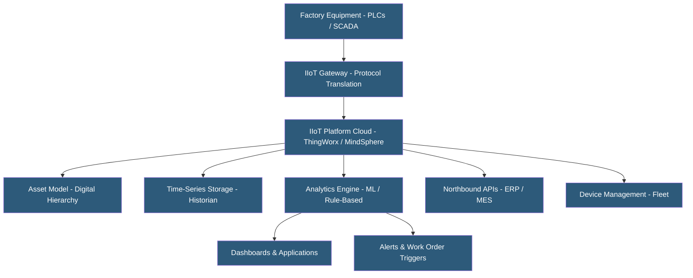

**Category:** Manufacturing & Supply Chain
**Difficulty:** Advanced
**Reading time:** 7 min read

---

Industrial IoT (IIoT) platforms provide integrated infrastructure for connecting factory equipment, collecting operational data, building analytics applications, and managing large device fleets. They differ from general IoT platforms by emphasizing operational technology (OT) protocol support, cybersecurity for industrial networks, and pre-built manufacturing analytics. Leading IIoT platforms include PTC ThingWorx, Siemens MindSphere (now Siemens Xcelerator), GE Predix, and cloud hyperscaler offerings extended with industrial connectors.

- **OT/IT Convergence** — Connecting operational technology (PLCs, SCADA, sensors) to information technology (cloud, analytics, ERP) networks
- **IIoT Gateway** — Hardware or software bridge translating industrial protocols (OPC-UA, Modbus, EtherNet/IP) to cloud-compatible formats
- **Asset Model** — Digital representation of physical equipment hierarchy (plant → production line → machine → component) with associated sensor data
- **Device Management** — Platform capability for provisioning, configuring, monitoring, and updating connected devices at scale
- **OPC-UA Server** — Standard server providing structured, typed access to equipment data with security built in
- **Industrial Data Historian** — Time-series database specialized for OT data, common in process industries (OSISoft PI, Aspentech)
- **Northbound API** — Interface exposing IIoT platform data to enterprise applications (ERP, MES, BI tools)
- **Air Gap** — Physical network separation between OT and IT networks to prevent cyber threats; creates data sharing challenges

IIoT platforms address the fundamental challenge of connecting decades-old industrial equipment running proprietary protocols to modern cloud analytics infrastructure. IIoT gateways deploy in the OT network, communicating with PLCs via industrial protocols and translating data to cloud-standard formats (MQTT, AMQP, REST) for cloud transmission.

The asset model is central to IIoT platforms. It defines the hierarchical relationships between physical assets — enterprise > site > production area > machine > component — and associates sensor tags with specific assets. This model enables queries like "show me all CNC spindle temperature readings across all facilities" rather than requiring knowledge of specific tag addresses for each machine.

OT/IT network segmentation is a critical security consideration. Industrial networks (OT) must be isolated from corporate networks (IT) and the internet to prevent cyber attacks on critical infrastructure. IIoT architectures use demilitarized zones (DMZ), data diodes (one-way data flow hardware), and jump servers to transfer data from OT to cloud without exposing the OT network to inbound traffic.

Platform-specific analytics tools build on the time-series data to create manufacturing applications. PTC ThingWorx offers a rapid application builder for creating maintenance dashboards and alert workflows without coding. Siemens MindSphere/Xcelerator provides industry-specific apps for energy management, predictive maintenance, and production performance.

Device management handles the operational complexity of large IIoT deployments: provisioning new gateways, pushing firmware updates, monitoring connectivity health, and detecting offline devices. Edge orchestration platforms (AWS Greengrass, Azure IoT Edge) manage containerized analytics applications deployed to factory gateways.

- Process manufacturers connecting distributed equipment across multiple plants to central analytics
- Discrete manufacturers implementing OEE monitoring across production lines
- Energy-intensive manufacturers optimizing utility consumption through granular machine-level metering
- Elevator and equipment OEMs monitoring customer-installed equipment fleets for proactive service
- Smart factories implementing digital twin programs linking physical and virtual plant models

| Advantage | Disadvantage |
|-----------|--------------|
| Unified data model connects disparate industrial equipment in one platform | OT/IT integration complexity and cybersecurity requirements are substantial |
| Pre-built industrial apps accelerate value realization vs. custom development | Industrial protocol diversity requires gateway expertise and integration effort |
| Device management scales IIoT operations to thousands of connected assets | Legacy equipment without digital outputs requires retrofitting with sensors |
| Northbound APIs integrate IIoT data with enterprise systems | Platform lock-in is significant with proprietary asset models and data formats |
| Asset model provides context for cross-plant benchmarking | Total cost of ownership is high; ROI requires sustained use case development |

- [IoT Sensor Data Hosting](iot-sensor-data-hosting.md)
- [Predictive Maintenance Platforms](predictive-maintenance-platforms.md)
- [Factory Automation Systems](factory-automation-systems.md)

---
*Part of the [Manufacturing & Supply Chain](index.md) category · [Back to Master Index](../../index.md)*
