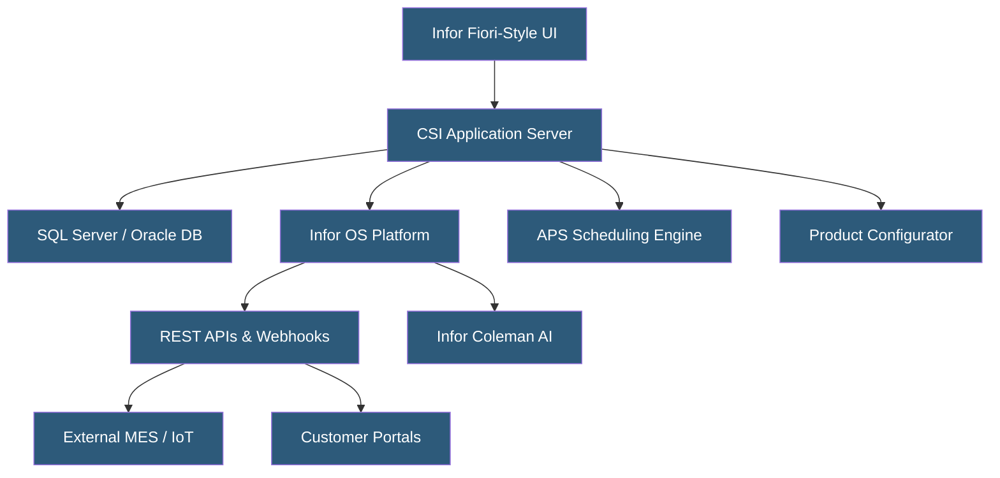

**Category:** Manufacturing & Supply Chain
**Difficulty:** Intermediate
**Reading time:** 6 min read

---

Infor CloudSuite Industrial (CSI), formerly SyteLine, is a cloud ERP designed specifically for complex discrete and mixed-mode manufacturers including industrial machinery, aerospace, defense, and high-tech electronics. It runs on Infor's multi-tenant cloud built on AWS, featuring deep manufacturing capabilities, configurable workflows, and the Infor OS integration platform. CSI is particularly strong in engineer-to-order and configure-to-order manufacturing scenarios.

- **Mixed-Mode Manufacturing** — Support for multiple production strategies (make-to-stock, make-to-order, engineer-to-order) within the same ERP instance
- **APS (Advanced Planning and Scheduling)** — Constraint-based scheduling engine optimizing production sequences against finite capacity
- **Engineer-to-Order (ETO)** — Manufacturing mode where products are custom-designed per customer specifications
- **Configurator** — Rules-based product configuration engine generating BOMs and routings dynamically from customer-selected options
- **Infor OS** — Integration and extensibility platform providing APIs, workflows, and the Infor Ming.le social business layer
- **IDM (Infor Document Management)** — Document storage and workflow system for engineering drawings and quality records
- **Infor Coleman AI** — AI assistant embedded in CSI for demand forecasting and anomaly detection
- **Multi-Site** — CSI capability managing multiple factories with inter-plant transfers and consolidated planning

Infor CloudSuite Industrial is deployed on Infor's multi-tenant cloud running on AWS. Each customer operates in a logically isolated environment sharing underlying compute and database infrastructure, with Infor managing upgrades, security patches, and infrastructure scaling.

The application server tier handles business logic for production planning, order management, and financial processing. The database tier uses SQL Server or Oracle depending on deployment history. Infor OS provides the integration backbone, exposing REST APIs and event-driven webhooks for connecting to external systems.

APS differentiates CSI from simpler ERPs by offering constraint-based scheduling. Rather than infinite-capacity MRP, APS considers machine availability, tooling constraints, operator certifications, and setup time matrices to generate realistic production schedules. It supports sequencing rules to minimize changeovers and optimize throughput.

The product configurator handles complex engineer-to-order scenarios by capturing customer specifications through guided questionnaires and automatically generating multi-level BOMs, routings, and cost estimates. This eliminates manual configuration errors and accelerates quoting for complex products.

Infor Coleman AI analyzes historical demand patterns and external signals to improve forecast accuracy and flag anomalies in production data. The AI layer is embedded in standard workflow dashboards rather than requiring separate analytics tooling.

- Industrial equipment manufacturers with complex product configurations
- Aerospace and defense contractors managing serialized parts and compliance traceability
- Electronics manufacturers needing tight engineering change management
- Multi-plant manufacturers requiring consolidated planning and inter-plant logistics
- Companies with high engineer-to-order volume needing automated quoting and BOM generation

| Advantage | Disadvantage |
|-----------|--------------|
| Industry-specific functionality reduces customization needs | Less global partner ecosystem than SAP or Oracle |
| Strong APS for finite-capacity scheduling | UI modernization is still in progress for legacy screens |
| Deep ETO and configure-to-order capabilities | Implementation requires specialized Infor partner expertise |
| Multi-tenant cloud reduces infrastructure management burden | API ecosystem less mature than newer cloud-native platforms |
| Infor OS enables modern integration patterns | Pricing less transparent than competitors |

- [Manufacturing ERP Hosting](manufacturing-erp-hosting.md)
- [Production Scheduling Systems](production-scheduling-systems.md)
- [SAP S/4HANA Cloud for Manufacturing](sap-s4hana-cloud-for-manufacturing.md)

---
*Part of the [Manufacturing & Supply Chain](index.md) category · [Back to Master Index](../../index.md)*
