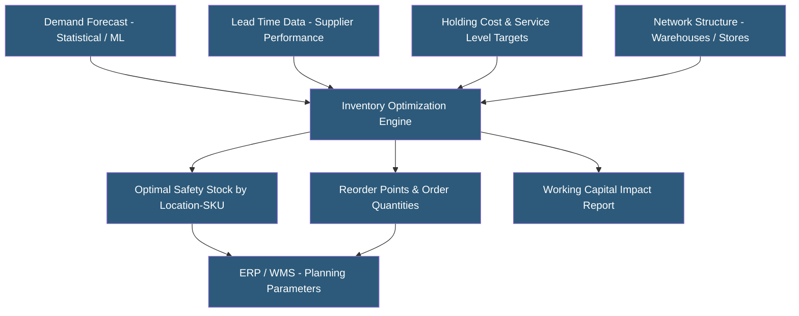

**Category:** Manufacturing & Supply Chain
**Difficulty:** Intermediate
**Reading time:** 6 min read

---

Inventory optimization platforms calculate the right amount of inventory to hold at each location in a supply network to achieve target service levels at minimum cost. They go beyond simple reorder point and EOQ calculations by modeling demand variability, lead time uncertainty, and multi-echelon network interactions simultaneously. These platforms help companies avoid the choice between overstocking (high working capital) and understocking (lost sales and expediting costs).

- **Safety Stock** — Buffer inventory held to protect against demand variability and supply uncertainty
- **Cycle Stock** — Inventory consumed between replenishment orders, determined by order frequency and batch size
- **Service Level** — Target probability of fulfilling customer orders from available stock (e.g., 95% fill rate)
- **Multi-echelon Optimization** — Simultaneously optimizing inventory at all supply chain tiers (factory, DC, store) rather than each node independently
- **Lead Time Variability** — Uncertainty in supplier delivery times that increases required safety stock
- **ABC-XYZ Classification** — Segmenting inventory by value (A/B/C) and demand variability (X/Y/Z) to apply differentiated policies
- **Replenishment Policy** — Rules governing when and how much to order (continuous review, periodic review, min-max)
- **Inventory Turnover** — Ratio of annual cost of goods sold to average inventory value; higher turnover indicates leaner inventory management

Inventory optimization platforms receive demand forecasts and historical demand data, supplier lead time distributions, holding costs, and service level targets as inputs. They apply statistical or optimization models to calculate the minimum safety stock required to achieve target service levels given the demand and supply variability at each location.

The classic safety stock formula (z-score × demand standard deviation × lead time) is the starting point, but dedicated platforms extend this significantly. Multi-echelon optimization recognizes that safety stock at a central DC can "pool" variability across multiple downstream locations, reducing total system inventory by exploiting risk pooling — centralizing buffer stock rather than duplicating it at every location.

ABC-XYZ segmentation classifies SKUs by annual dollar value (A = top 80%, B = next 15%, C = bottom 5%) and demand regularity (X = stable, Y = variable, Z = sporadic). Different inventory policies apply to each segment: high-service-level tight controls for A-X items, more lenient targets and periodic review for C-Z items. This avoids applying uniform policies that waste capital on unimportant items or risk stockouts on critical ones.

Platforms calculate the efficient frontier — the Pareto-optimal tradeoff curve between service level and total inventory investment. This allows supply chain leaders to see exactly what service level improvement costs in additional inventory, enabling data-driven service level target setting.

Leading platforms include Anaplan, Slimstock, Inventory Planner, netstock, and Blue Yonder Luminate Planning.

- Retailers with thousands of SKUs across hundreds of stores needing systematic inventory positioning
- Distributors with long supplier lead times and high lead time variability requiring buffers
- Manufacturers managing raw material and finished goods inventory across multiple DCs
- Companies doing post-merger supply chain rationalization to reduce duplicate inventory
- Businesses with high seasonal demand needing build-up inventory strategies

| Advantage | Disadvantage |
|-----------|--------------|
| Quantifies the cost of each service level target enabling fact-based decisions | Optimization quality depends heavily on forecast accuracy as input |
| Multi-echelon methods reduce total system inventory vs. siloed optimization | Complex models require data preparation and ongoing maintenance |
| Risk pooling analysis identifies centralization opportunities | Recommendations require ERP parameter updates to take effect |
| Systematic SKU segmentation replaces ad-hoc inventory policies | Black-box optimization outputs can be difficult to explain to finance |
| Identifies slow-moving and excess stock for disposal | Requires accurate holding cost and service level target data |

- [Supply Chain Management Platforms](supply-chain-management-platforms.md)
- [Demand Forecasting Systems](demand-forecasting-systems.md)
- [Warehouse Management Systems](warehouse-management-systems-wms.md)

---
*Part of the [Manufacturing & Supply Chain](index.md) category · [Back to Master Index](../../index.md)*
