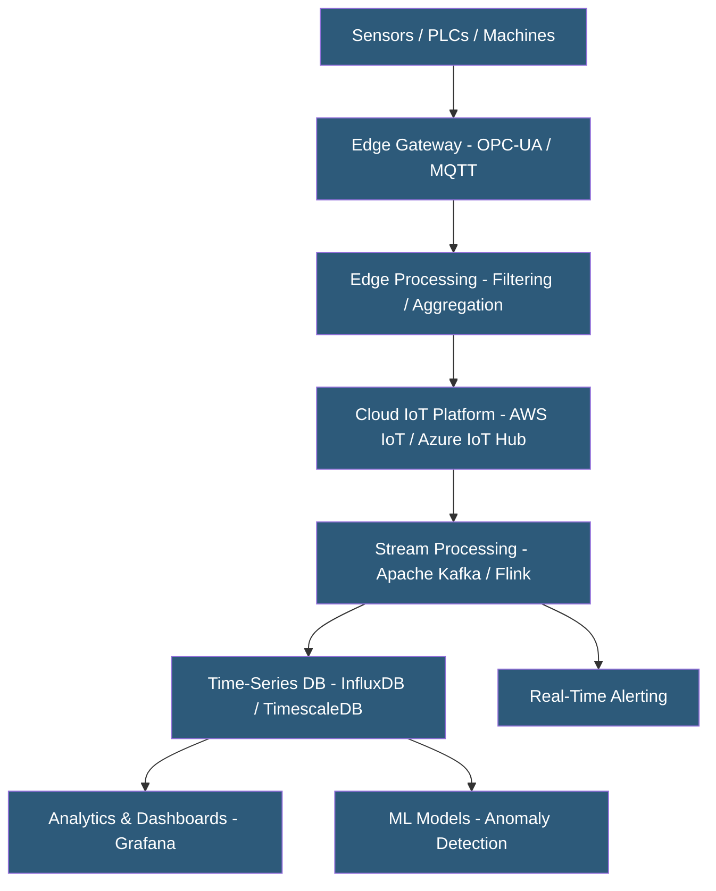

**Category:** Manufacturing & Supply Chain
**Difficulty:** Advanced
**Reading time:** 6 min read

---

IoT sensor data hosting manages the ingestion, storage, processing, and analysis of high-volume time-series data from factory sensors, connected machines, and environmental monitors. Industrial IoT generates data at rates and volumes far exceeding traditional manufacturing databases, requiring specialized time-series databases, stream processing engines, and edge computing architectures. Cloud hyperscalers and specialized IoT platforms provide managed services that abstract the infrastructure complexity.

- **Time-Series Database** — Database optimized for storing and querying data points indexed by timestamp; handles high write throughput and time-range queries efficiently
- **MQTT (Message Queuing Telemetry Transport)** — Lightweight publish-subscribe protocol used by IoT devices for low-bandwidth, unreliable network conditions
- **Stream Processing** — Real-time analysis of data as it arrives, enabling immediate anomaly detection and alerting without batch processing delays
- **Edge Computing** — Processing sensor data locally at the factory edge before transmitting aggregated or filtered data to the cloud
- **Data Retention Policy** — Rules governing how long raw sensor data is stored vs. aggregated summaries retained long-term
- **OPC-UA** — Open standard for secure machine-to-machine communication in industrial environments
- **Digital Twin** — Real-time virtual model of physical equipment or process updated with live sensor data
- **Time-Series Compression** — Algorithms reducing storage requirements for repetitive sensor data without significant accuracy loss

Industrial IoT data flows from sensors and machine PLCs through edge gateways that perform protocol translation (OPC-UA, Modbus, PROFINET to MQTT or AMQP), local filtering, and aggregation. Raw vibration data sampled at 25kHz generates 200MB per sensor per hour — edge processing reduces this to statistical features (RMS, peak, kurtosis) transmitted to the cloud at kilobytes per second, while triggering full waveform capture only during anomalous events.

Cloud IoT platforms (AWS IoT Core, Azure IoT Hub, GCP IoT Core) handle device authentication (X.509 certificates or symmetric keys), connection management for millions of concurrent device connections, and message routing to downstream processing services. Device management capabilities handle firmware updates, configuration changes, and connection monitoring across large device fleets.

Stream processing engines (Kafka Streams, Apache Flink, AWS Kinesis) process incoming sensor data in real time — detecting threshold violations, computing rolling averages, and triggering conditional alerts without waiting for batch processing windows. A temperature exceedance alert can trigger within seconds of the threshold crossing.

Time-series databases (InfluxDB, TimescaleDB, QuestDB) are optimized for sensor data write patterns — thousands of data points per second — and time-range query patterns — "show me machine A temperature for the last 30 days." They apply automatic compression to repetitive values and support downsampling — aggregating high-frequency raw data into hourly or daily summaries after configurable retention periods to manage storage costs.

Data retention strategies balance analytical value against storage cost: raw data at full resolution for 30 days, 1-minute aggregates for 1 year, hourly aggregates permanently.

- Factories deploying condition monitoring sensors on critical equipment
- Process plants monitoring continuous production parameters (temperature, pressure, flow rate, pH)
- Energy managers tracking power consumption per machine for cost allocation and efficiency improvement
- Cold chain operators monitoring temperature compliance across refrigerated warehouses and transport
- Smart building operators collecting HVAC, lighting, and occupancy sensor data

| Advantage | Disadvantage |
|-----------|--------------|
| Real-time sensor data enables proactive response to process deviations | High sensor data volume creates significant storage and ingestion infrastructure costs |
| Time-series databases handle write throughput impractical for traditional relational databases | Industrial protocol diversity (OPC-UA, Modbus, PROFINET) requires gateway expertise |
| Edge processing reduces bandwidth and cloud costs for high-frequency signals | Sensor calibration drift degrades data quality without regular maintenance |
| Cloud scalability accommodates adding thousands of sensors without infrastructure replanning | Data security for OT/IT network integration requires careful segmentation |
| Managed cloud IoT platforms reduce infrastructure management burden | Long-term data retention costs accumulate; requires active governance |

- [Industrial IoT Platforms](industrial-iot-platforms.md)
- [Predictive Maintenance Platforms](predictive-maintenance-platforms.md)
- [OEE (Overall Equipment Effectiveness) Tracking](oee-overall-equipment-effectiveness-tracking.md)

---
*Part of the [Manufacturing & Supply Chain](index.md) category · [Back to Master Index](../../index.md)*
