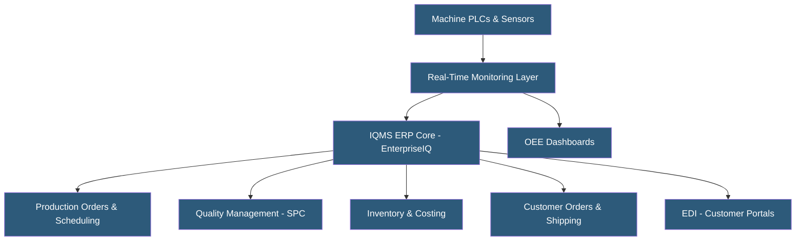

**Category:** Manufacturing & Supply Chain
**Difficulty:** Intermediate
**Reading time:** 6 min read

---

IQMS (now Delmia Apriso, part of Dassault Systèmes) was a manufacturing ERP and MES platform specifically designed for repetitive and process manufacturers, particularly plastics injection molding, extrusion, and rubber industries. Its strength was real-time machine monitoring integrated directly with production orders, enabling OEE tracking and predictive maintenance within the ERP itself. Dassault has merged IQMS functionality into its broader manufacturing operations management portfolio.

- **Real-Time Production Monitoring** — Direct machine connectivity tracking cycle times, downtime, and output rates against work orders
- **OEE (Overall Equipment Effectiveness)** — Metric combining availability, performance, and quality to measure machine productivity
- **Repetitive Manufacturing** — Production mode for high-volume, continuous production of standardized products
- **Delmia Apriso** — Dassault's MES/MOM platform incorporating IQMS capabilities after acquisition
- **EnterpriseIQ** — IQMS's original ERP product name, known for tight MES-ERP integration
- **Statistical Process Control (SPC)** — Quality management technique using control charts to monitor process variation
- **Machine PLC Integration** — Direct communication with programmable logic controllers for automatic data collection
- **Cavity Tracking** — Plastics-specific capability tracking production by individual mold cavities for quality analysis

IQMS differentiated itself by integrating machine monitoring directly within the ERP application rather than requiring a separate MES system. The real-time monitoring layer collects data from machine PLCs via serial, OPC, or TCP/IP connections, automatically updating production orders with actual cycle counts, downtime events, and output quantities.

This direct integration meant that when a machine stopped unexpectedly, the ERP immediately flagged affected production orders as behind schedule and triggered alerts to production supervisors. Cycle time deviations triggered quality holds requiring inspection before shipping.

For plastics manufacturers, cavity-level tracking was a key capability. Each mold cavity had its own production history, allowing manufacturers to identify underperforming cavities requiring maintenance before they produced defective parts, reducing scrap rates and warranty costs.

The SPC module captured in-process quality measurements and plotted control charts in real time. Out-of-control signals automatically created quality holds or nonconformance records, integrating quality data directly with production cost analysis.

Scheduling used a finite scheduling engine that considered machine capabilities, tooling availability, and material availability simultaneously, generating realistic production schedules. Labor tracking recorded operator time against production orders for accurate direct labor costing.

After Dassault Systèmes acquired IQMS in 2019, the functionality migrated into Delmia Apriso, a platform-based MES/MOM solution running on Dassault's 3DEXPERIENCE platform with modern cloud deployment options.

- Plastics injection molders needing cavity-level production tracking and quality management
- Extrusion and thermoforming manufacturers with continuous process monitoring requirements
- Repetitive manufacturers seeking OEE improvement through integrated machine monitoring
- Automotive tier suppliers requiring IATF 16949 compliance and SPC documentation
- Companies wanting ERP and MES in a single vendor solution

| Advantage | Disadvantage |
|-----------|--------------|
| Tight ERP-MES integration eliminates synchronization issues | Limited to repetitive and process manufacturing industries |
| Real-time machine data improves scheduling accuracy | Narrower ERP functionality vs. SAP or Dynamics for complex discrete |
| Industry-specific features for plastics and rubber | Migration complexity after Dassault acquisition |
| OEE tracking without separate MES platform costs | Smaller partner ecosystem than major ERP vendors |
| SPC integrated with production costing | Legacy client-server architecture in older versions |

- [Manufacturing ERP Hosting](manufacturing-erp-hosting.md)
- [MES (Manufacturing Execution System) Hosting](mes-manufacturing-execution-system-hosting.md)
- [OEE (Overall Equipment Effectiveness) Tracking](oee-overall-equipment-effectiveness-tracking.md)

---
*Part of the [Manufacturing & Supply Chain](index.md) category · [Back to Master Index](../../index.md)*
