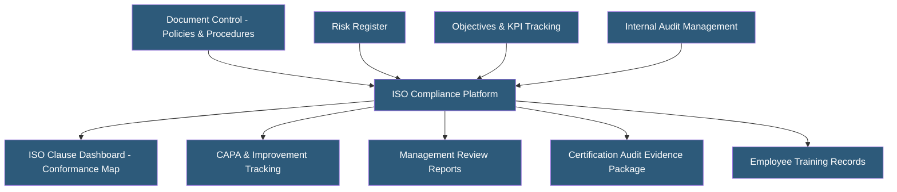

**Category:** Manufacturing & Supply Chain
**Difficulty:** Intermediate
**Reading time:** 6 min read

---

ISO compliance management platforms provide structured tools for implementing, maintaining, and demonstrating conformance to ISO standards including ISO 9001 (quality), ISO 14001 (environmental), ISO 45001 (health and safety), and ISO 27001 (information security). These SaaS platforms replace manual spreadsheets and filing systems with integrated document control, audit management, risk tracking, and objective management modules aligned to ISO clause structures.

- **ISO 9001:2015** — International quality management standard based on seven quality management principles including customer focus and process approach
- **ISO Clause Mapping** — Organizing QMS documents, processes, and evidence to specific ISO standard clauses for audit readiness
- **Continual Improvement** — ISO 9001 core requirement for systematically identifying and implementing process improvements
- **Context of the Organization** — ISO 9001 clause requiring companies to identify internal/external factors and interested parties affecting the QMS
- **Risk-Based Thinking** — ISO 9001:2015 approach replacing preventive action with proactive risk identification and treatment
- **Internal Audit** — Systematic review of QMS processes by trained internal auditors to verify conformance and effectiveness
- **Management Review** — Formal meeting of leadership reviewing QMS performance data and making strategic decisions
- **Certification Body** — Third-party accredited organization conducting ISO certification audits (e.g., Bureau Veritas, SGS, DNV)

ISO compliance platforms structure their functionality around the Plan-Do-Check-Act (PDCA) cycle and specific ISO clause requirements. The platform organizes all quality system content by ISO clause number, providing dashboards showing which clauses have adequate documentation, active objectives, and recent audit evidence.

Document control stores all mandatory and supporting procedures with version control and approval workflows. When ISO 9001 requires a documented procedure (e.g., control of nonconforming outputs, management review), the platform links the procedure directly to the relevant clause, making conformance evidence immediately accessible during audits.

Risk management tools align to ISO 9001's risk-based thinking requirements. Organizations enter business process risks, assess likelihood and severity, define treatment plans, and track residual risk. Environmental and health/safety versions align to ISO 14001 and 45001 environmental aspect/impact registers and hazard/risk assessments.

Objectives and KPI management tracks quality objectives set during management review, linking them to department owners, measurement methods, and targets. Monthly data entry updates progress dashboards that feed directly into management review reports.

Internal audit scheduling generates audit plans, assigns auditors, creates checklists mapped to ISO clauses, captures audit findings, and tracks finding closure with evidence. This audit trail is essential evidence for certification body audits.

Popular platforms include Qualio, Navex IQS, iAuditor, EtQ Reliance, and Arena QMS. Many ERP vendors (SAP, Infor) embed ISO compliance modules within their manufacturing platforms.

- Manufacturers seeking initial ISO 9001 certification to qualify for OEM supplier requirements
- Organizations maintaining multiple ISO certifications (9001 + 14001 + 45001) in an integrated management system
- Companies managing annual surveillance audits efficiently with organized evidence
- Multi-site organizations ensuring consistent quality system documentation across facilities
- Companies transitioning from paper-based quality systems to digital compliance management

| Advantage | Disadvantage |
|-----------|--------------|
| Clause-mapped structure accelerates audit preparation | Platform cost may not be justified for simple single-standard certifications |
| Centralizes all compliance evidence for external audits | Data migration from existing paper or spreadsheet systems is labor-intensive |
| Automated reminders for audit schedules and objective reviews | Risk of platform compliance theater without genuine process improvement culture |
| Multi-standard management reduces duplicate documentation | Customization to industry-specific standards may require additional configuration |
| Real-time conformance dashboards identify gaps proactively | Staff training needed to use the platform consistently and correctly |

- [Quality Management System (QMS) Hosting](quality-management-system-qms-hosting.md)
- [Six Sigma Project Management Hosting](six-sigma-project-management-hosting.md)
- [Manufacturing ERP Hosting](manufacturing-erp-hosting.md)

---
*Part of the [Manufacturing & Supply Chain](index.md) category · [Back to Master Index](../../index.md)*
