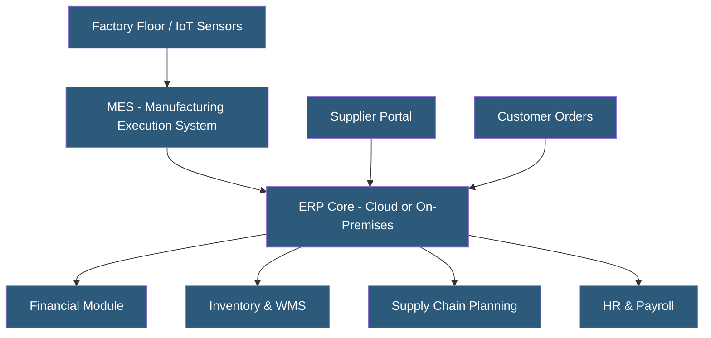

**Category:** Manufacturing & Supply Chain
**Difficulty:** Intermediate
**Reading time:** 6 min read

---

Manufacturing ERP hosting involves deploying enterprise resource planning software on cloud, on-premises, or hybrid infrastructure to integrate production planning, inventory, finance, and supply chain operations. Modern cloud-hosted ERPs reduce hardware overhead and enable real-time visibility across the shop floor and supply network. Choosing the right hosting model depends on data sovereignty requirements, integration complexity, and operational scale.

- **ERP (Enterprise Resource Planning)** — Integrated software suite managing manufacturing, finance, HR, procurement, and logistics in a single system
- **Multi-tenancy** — Cloud model where multiple customers share infrastructure with logical data isolation
- **Dedicated hosting** — Single-tenant cloud deployment providing dedicated compute and storage resources
- **On-premises ERP** — Software installed and operated on company-owned servers within the facility
- **Hybrid deployment** — Combination of on-premises core ERP with cloud-based extensions or analytics
- **Disaster recovery (DR)** — Replication and failover infrastructure ensuring business continuity during outages
- **Middleware integration** — Software layer connecting ERP to MES, WMS, and IoT systems via APIs or message queues
- **Total cost of ownership (TCO)** — Full cost including licensing, infrastructure, IT staff, maintenance, and upgrades

Manufacturing ERP systems are typically deployed as multi-tier applications: a database tier (PostgreSQL, SQL Server, Oracle, or HANA), an application server tier running business logic, and a web/API tier serving user interfaces and external integrations.

Cloud-hosted ERPs use managed databases with automated backups, point-in-time recovery, and geo-replication. The application tier runs on auto-scaling compute clusters, allowing capacity to expand during month-end processing or production peaks. SaaS vendors like SAP, Oracle, and Infor manage upgrades, patches, and infrastructure, shifting operational burden from IT teams to the vendor.

On-premises deployments give manufacturers control over data residency, network isolation, and integration with proprietary shop floor equipment. They require dedicated IT teams for patching, capacity planning, and hardware lifecycle management.

Integration is critical in manufacturing ERP. Real-time data flows connect the ERP to MES systems via OPC-UA or REST APIs, to WMS platforms for inventory synchronization, and to external EDI networks for supplier orders. Message brokers like MuleSoft, Dell Boomi, or custom middleware handle transformation and routing.

Security includes role-based access control, field-level encryption for sensitive financial data, and audit logging for compliance with SOX, ISO 9001, and industry-specific regulations.

- Discrete manufacturing (electronics, automotive) requiring tight BOM and production order management
- Process manufacturing (chemicals, food) needing batch tracking and regulatory compliance
- Multi-plant enterprises requiring consolidated financial reporting across facilities
- Contract manufacturers requiring customer-specific pricing and traceability
- Companies replacing aging on-premises ERP with cloud to reduce IT overhead

| Advantage | Disadvantage |
|-----------|--------------|
| Reduced hardware and IT infrastructure costs (cloud) | Ongoing subscription costs can exceed on-premises over time |
| Automatic updates and vendor-managed security | Customization may be limited in SaaS models |
| Scalability for seasonal or growth-driven demand spikes | Internet dependency creates risk for shop-floor operations |
| Built-in DR and high availability in cloud offerings | Data migration from legacy ERP is expensive and time-consuming |
| Accessible from any location for remote management | Compliance requirements may restrict cloud options |

- [SAP S/4HANA Cloud for Manufacturing](sap-s4hana-cloud-for-manufacturing.md)
- [Production Scheduling Systems](production-scheduling-systems.md)
- [MES (Manufacturing Execution System) Hosting](mes-manufacturing-execution-system-hosting.md)

---
*Part of the [Manufacturing & Supply Chain](index.md) category · [Back to Master Index](../../index.md)*
