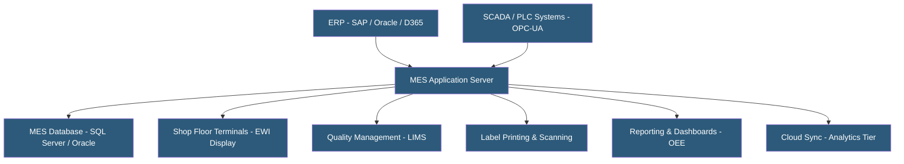

**Category:** Manufacturing & Supply Chain
**Difficulty:** Intermediate
**Reading time:** 6 min read

---

A Manufacturing Execution System (MES) bridges the gap between ERP business planning and shop floor machinery, managing real-time production execution, quality control, and traceability. MES platforms can be hosted on-premises (close to factory networks), in private clouds, or increasingly as cloud-hosted SaaS. Hosting architecture choices significantly impact latency tolerance, network resilience, and integration with industrial control systems.

- **ISA-95** — International standard defining the data models and functional hierarchy between enterprise, MES, and control systems
- **SCADA Integration** — Connectivity between MES and Supervisory Control and Data Acquisition systems for real-time machine data
- **OPC-UA** — Open Platform Communications Unified Architecture standard for secure, reliable machine data exchange
- **Electronic Work Instructions (EWI)** — Digital step-by-step guides replacing paper traveler cards for assembly and quality operations
- **Genealogy / Traceability** — Complete record of which materials, machines, operators, and parameters produced a specific unit or batch
- **LIMS Integration** — Connection to Laboratory Information Management Systems for quality test results feeding production records
- **Downtime Tracking** — Capturing machine stop events with reasons for OEE calculation and root cause analysis
- **Paperless Manufacturing** — Eliminating paper-based travelers, travelers, and quality forms by digitizing all shop floor records

MES operates in the ISA-95 Level 3 layer — above SCADA/PLC control systems (Level 2) and below ERP (Level 4). This position means MES must simultaneously interface down to real-time machine data and up to batch-oriented ERP transactions.

On-premises MES deployments place application and database servers in the factory network or data center, minimizing latency for shop floor terminals and PLC communications. OPC-UA servers collect machine data at millisecond polling intervals, feeding production counters, downtime events, and quality parameters to the MES. This direct connectivity is challenging to replicate over public internet connections.

Cloud-hosted MES (SAP Digital Manufacturing, Rockwell Plex, Delmia Apriso Cloud) use edge computing intermediaries — small on-premises gateways collecting machine data locally and buffering it before transmission to the cloud. This hybrid approach provides cloud scalability and management benefits while tolerating WAN connectivity disruptions.

Electronic work instructions deliver step-by-step assembly, inspection, and test instructions to touchscreen terminals at workstations. As operators complete each step, they record serial numbers, measurements, and scan barcodes. These records create the production genealogy linking finished goods to every component, machine, operator, and parameter involved.

Traceability data volume is substantial — a single production batch may generate thousands of records. MES databases use time-series optimized schemas and archiving strategies to maintain performance over years of data accumulation.

Integration with ERP uses standard interfaces: work order downloads, goods receipt confirmations, quality inspection results. ISA-88 and B2MML (Business to Manufacturing Markup Language) XML schemas standardize these exchanges.

- Pharmaceutical manufacturers requiring FDA 21 CFR Part 11 electronic batch records
- Automotive suppliers managing IATF 16949 traceability and quality documentation
- Electronics manufacturers tracking serialized assemblies for warranty analysis
- Food processors managing allergen control and batch recall capability
- Semiconductor fabs executing complex multi-step process flows with real-time equipment integration

| Advantage | Disadvantage |
|-----------|--------------|
| Real-time visibility into production status and quality | Significant implementation cost and timeline (6–18 months typical) |
| Paperless records improve compliance and audit readiness | On-premises hosting requires dedicated factory IT infrastructure |
| OEE tracking identifies hidden capacity and waste | Machine integration complexity varies widely by equipment age |
| Complete genealogy enables targeted product recalls | Cloud MES introduces latency dependencies for real-time operations |
| Electronic work instructions reduce operator errors | Change management with shop floor workforce is challenging |

- [Manufacturing ERP Hosting](manufacturing-erp-hosting.md)
- [Shop Floor Data Collection](shop-floor-data-collection.md)
- [OEE (Overall Equipment Effectiveness) Tracking](oee-overall-equipment-effectiveness-tracking.md)

---
*Part of the [Manufacturing & Supply Chain](index.md) category · [Back to Master Index](../../index.md)*
