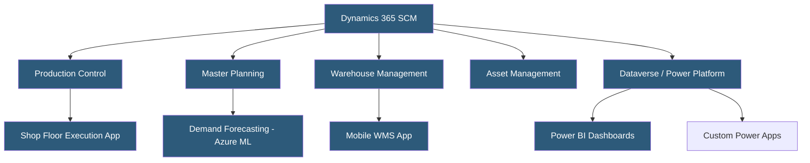

**Category:** Manufacturing & Supply Chain
**Difficulty:** Intermediate
**Reading time:** 6 min read

---

Microsoft Dynamics 365 Supply Chain Management (SCM) provides comprehensive manufacturing capabilities including production control, master planning, warehouse management, and asset management. It integrates natively with other Dynamics 365 apps, Microsoft 365, and Azure services. The platform supports discrete, process, and lean manufacturing modes, making it suitable for a wide range of manufacturing industries.

- **Production Order** — Manufacturing job in Dynamics 365 tracking materials, operations, and costs for discrete manufacturing
- **Batch Order** — Production record used in process manufacturing for formula-based products with co/by-products
- **Master Planning** — Module that generates planned orders (production and purchase) based on demand forecasts and safety stock
- **Route** — Sequence of operations defining the manufacturing process with work centers and time standards
- **Resource Group** — Collection of machines or workstations sharing the same scheduling capacity
- **Dataverse** — Microsoft's unified data platform connecting Dynamics 365 apps with Power Platform
- **Power Platform** — Low-code tools (Power Apps, Power Automate, Power BI) extending Dynamics 365 functionality
- **Lean Manufacturing** — Kanban-based production mode in Dynamics 365 for pull-based, waste-reducing workflows

Dynamics 365 SCM runs on Microsoft Azure as a cloud-hosted application using a dedicated database per customer. The Finance and Operations apps (including SCM) are deployed on Azure SQL Database with Lifecycle Services (LCS) managing deployments, updates, and environment management.

Production control handles the full manufacturing lifecycle from production order creation through release, picking, reporting, and ending. The system explodes BOMs to calculate component requirements, schedules operations against resource calendars and capacity, and generates production route cards for shop floor workers.

Master planning uses Planning Optimization — a cloud-based microservice running outside the main Dynamics 365 environment for faster MRP runs. It processes demand from sales orders, forecasts, and safety stock to generate planned orders, which production planners review and firm into production orders.

The Shop Floor Execution interface provides a touch-optimized UI for operators to report job starts, completions, and scrap on the factory floor. It integrates with time and attendance systems for labor cost allocation.

Azure integration enables advanced scenarios: Demand forecasting uses Azure Machine Learning models trained on historical sales data. IoT intelligence connects sensors to production orders for real-time OEE tracking. Mixed Reality guides assembly workers using HoloLens with overlaid Dynamics 365 data.

X++ (Dynamics 365's development language) and the Extension model allow customizations without modifying base code, supporting upgrade compatibility.

- Manufacturers already using Microsoft 365 or Azure wanting tight platform integration
- Discrete manufacturers needing support for complex BOM structures and multi-level routing
- Process manufacturers requiring formula management, catch weight, and batch attributes
- Companies needing lean manufacturing and traditional discrete production in the same platform
- Enterprises requiring comprehensive asset and maintenance management alongside production

| Advantage | Disadvantage |
|-----------|--------------|
| Deep integration with Microsoft 365, Teams, and Azure | Complex licensing model; costs can escalate with add-ons |
| Supports discrete, process, and lean manufacturing modes | Steep learning curve for configuration and X++ development |
| Strong Power Platform extensibility for custom apps | Implementation timelines can be lengthy for large enterprises |
| Planning Optimization enables fast large-scale MRP runs | Cloud-only deployment; on-premises is end-of-life |
| Rich WMS and TMS capabilities in the same platform | UI complexity can challenge shop floor workers |

- [Manufacturing ERP Hosting](manufacturing-erp-hosting.md)
- [SAP S/4HANA Cloud for Manufacturing](sap-s4hana-cloud-for-manufacturing.md)
- [Warehouse Management Systems](warehouse-management-systems-wms.md)

---
*Part of the [Manufacturing & Supply Chain](index.md) category · [Back to Master Index](../../index.md)*
