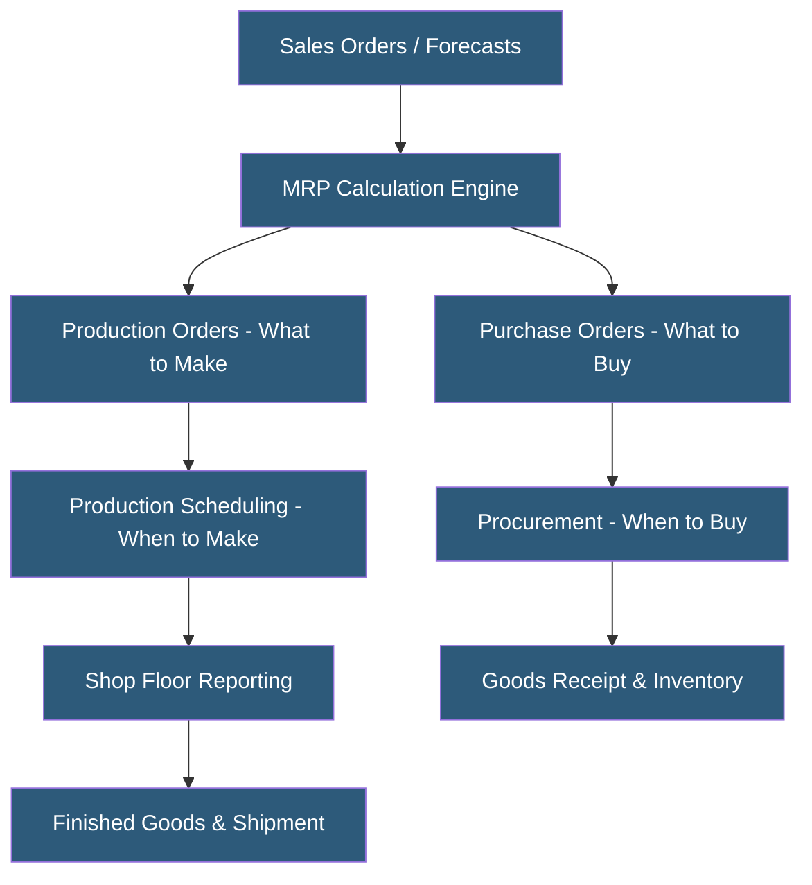

**Category:** Manufacturing & Supply Chain
**Difficulty:** Beginner
**Reading time:** 5 min read

---

MRPeasy is a cloud-based MRP (Material Requirements Planning) and production management system targeting very small manufacturers (10–200 employees) who need structured production planning without enterprise ERP complexity or cost. It provides core MRP functionality, production scheduling, inventory management, and procurement in a self-service SaaS package. MRPeasy is designed for non-technical users who need to graduate from spreadsheets.

- **MRP (Material Requirements Planning)** — Calculation engine determining what materials to buy and when based on production demand and current stock levels
- **Production Plan** — Schedule of manufacturing orders generated from sales orders and forecasts
- **Bill of Materials (BOM)** — List of components and quantities required to produce one unit of a finished product
- **Work Order** — Production job record tracking materials, operations, and progress for a manufacturing run
- **Reorder Point** — Stock level threshold triggering automatic purchase order generation
- **Lead Time** — Time from purchase order placement to material receipt, used by MRP for procurement planning
- **Multi-level BOM** — BOM containing sub-assemblies that themselves have their own BOMs, creating a nested product structure
- **CRM Integration** — MRPeasy's connection to sales pipelines for demand-driven production planning

MRPeasy runs as a pure SaaS application hosted on cloud infrastructure, accessible through any web browser. Setup follows a structured onboarding wizard: users define products, build BOMs, add suppliers with lead times, and set opening inventory balances. The system is typically operational within days.

The MRP engine runs on demand (not as a continuous background process). When triggered, it explodes all open sales orders and forecasts through multi-level BOMs to calculate gross requirements for every material. Netting against available inventory and existing purchase orders produces net requirements, which MRPeasy converts into suggested production orders and purchase orders with calculated start and due dates based on lead times.

Production scheduling uses a simple forward/backward scheduling approach against a defined work center calendar. The system calculates when each operation should start and finish, flagging schedule conflicts when work center capacity is overloaded. While not a sophisticated APS optimizer, it provides sufficient visibility for small shops.

Shop floor reporting uses a simple web interface or mobile device where operators report production starts, completions, and material consumption. Completed operations update work-in-progress inventory and production order status in real time.

MRPeasy integrates with QuickBooks, Xero, and Shopify via native connectors, and provides REST APIs for custom integrations. Its pricing structure (per user per month) makes it accessible to manufacturers with tight budgets who need more structure than spreadsheets but cannot justify enterprise ERP costs.

- Small manufacturers replacing Excel-based production planning and inventory tracking
- Custom fabrication shops needing basic job costing and material tracking
- Contract manufacturers managing multiple customer BOMs and production schedules
- Product companies scaling to 5–50 production orders per week
- Manufacturers needing MRP capabilities without hiring a dedicated ERP administrator

| Advantage | Disadvantage |
|-----------|--------------|
| Very fast implementation (days, not months) | Limited functionality for complex multi-site operations |
| Affordable for small manufacturers | No advanced scheduling optimization or constraint planning |
| Covers core MRP, inventory, and procurement | Basic financial reporting; requires external accounting software |
| User-friendly interface requiring minimal training | Customer support less comprehensive than enterprise vendors |
| Integrates with popular accounting and e-commerce tools | Not suitable for manufacturers exceeding ~200 users |

- [Katana Manufacturing Software](katana-manufacturing-software.md)
- [Fishbowl Inventory Manufacturing](fishbowl-inventory-manufacturing.md)
- [Production Scheduling Systems](production-scheduling-systems.md)

---
*Part of the [Manufacturing & Supply Chain](index.md) category · [Back to Master Index](../../index.md)*
