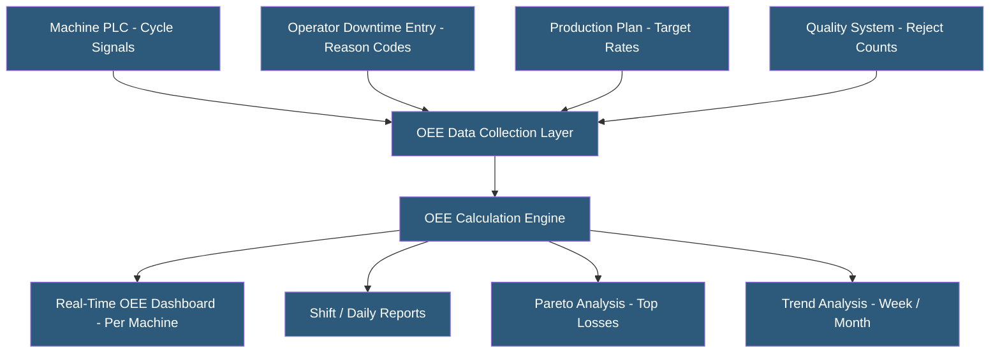

**Category:** Manufacturing & Supply Chain
**Difficulty:** Intermediate
**Reading time:** 6 min read

---

Overall Equipment Effectiveness (OEE) is the gold standard metric for measuring manufacturing productivity, combining Availability (uptime), Performance (speed), and Quality (yield) into a single percentage score. World-class OEE is considered 85%. Tracking platforms collect machine data automatically to calculate OEE components in real time, driving improvement by exposing the largest losses preventing theoretical maximum output.

- **OEE Formula** — OEE = Availability × Performance × Quality; a 90% available, 95% performing, 99% quality machine has 84.6% OEE
- **Availability** — Planned production time minus downtime, divided by planned production time; captures unplanned stops and changeovers
- **Performance** — Actual output rate as a percentage of theoretical maximum speed; captures speed losses and micro-stops
- **Quality** — Good units produced as a percentage of total units started; captures scrap, rework, and startup rejects
- **Six Big Losses** — Framework categorizing all production losses: breakdowns, setup/adjustment, minor stops, speed loss, startup rejects, production rejects
- **TEEP (Total Effective Equipment Performance)** — OEE extension including scheduled downtime and holidays; reveals maximum capacity potential
- **Downtime Reason Code** — Categorized explanation for machine stops enabling Pareto analysis of loss sources
- **Micro-Stop** — Brief stoppage under 5 minutes; individually minor but collectively significant, often representing 10–15% of production time

OEE tracking begins with reliable machine data collection. Availability requires knowing when machines are supposed to run (production schedule) versus when they actually run. Machine signals — cycle start, cycle complete, fault codes — feed the OEE system via PLC connections or sensor-based signal detection. Downtime events are automatically captured when no cycle signal appears during planned production time.

Downtime reason codes give availability losses meaning. When a machine stops, the operator or system assigns a category: mechanical breakdown, electrical fault, tooling change, material shortage, setup, or operator absence. Pareto analysis of downtime reasons directs maintenance investment to the most frequent causes.

Performance calculation requires knowing the theoretical cycle time — how fast the machine should run when producing correctly. Actual cycle counts per time period are compared to the theoretical maximum. Speed losses (running slower than maximum) and minor stops (brief hesitations that don't trigger long downtime events) both reduce performance. Many companies discover their machines run at 70–80% of theoretical speed due to accumulated conservative settings.

Quality losses are the simplest component when rejection data is captured at the machine level. First-pass yield (good units ÷ total units started) directly provides the quality OEE component.

OEE improvement programs use the six big losses framework to prioritize improvement efforts by loss category magnitude. A machine with 70% availability, 90% performance, and 98% quality has 61.7% OEE — improving availability from 70% to 85% increases OEE to 75%, a larger gain than improving performance or quality.

Cloud OEE platforms (Vorne XL, Tulip, MachineMetrics, Evocon) provide rapid deployment using sensor-based signal detection that doesn't require PLC programming access.

- Manufacturing plants implementing continuous improvement programs requiring baseline OEE data
- High-volume discrete manufacturers identifying capacity constraints in bottleneck machines
- Job shops benchmarking machine utilization to justify equipment investment decisions
- Companies implementing predictive maintenance programs using downtime trend data
- Food and packaging manufacturers meeting OEM equipment effectiveness guarantees

| Advantage | Disadvantage |
|-----------|--------------|
| Single metric immediately reveals production improvement potential | OEE can be gamed by adjusting planned production time or theoretical rates |
| Six big losses framework focuses improvement efforts effectively | Requires accurate downtime categorization to produce actionable Pareto analysis |
| Real-time dashboards enable immediate response to performance drops | Machine signal integration requires technical work and maintenance |
| Trend analysis demonstrates improvement program ROI | Theoretical rates for flexible machines with multiple products are difficult to set |
| Benchmarking against world-class 85% creates improvement urgency | High OEE on non-bottleneck machines has minimal impact on factory throughput |

- [Shop Floor Data Collection](shop-floor-data-collection.md)
- [MES (Manufacturing Execution System) Hosting](mes-manufacturing-execution-system-hosting.md)
- [Predictive Maintenance Platforms](predictive-maintenance-platforms.md)

---
*Part of the [Manufacturing & Supply Chain](index.md) category · [Back to Master Index](../../index.md)*
