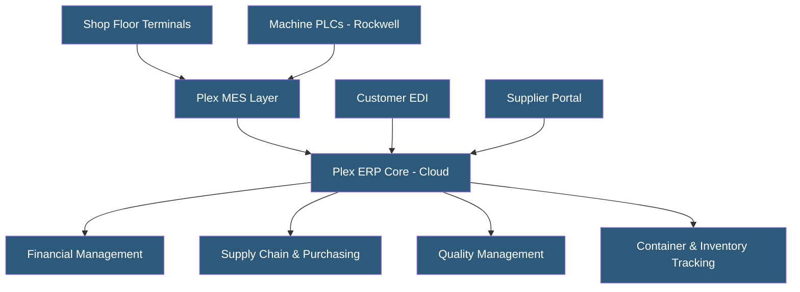

**Category:** Manufacturing & Supply Chain
**Difficulty:** Intermediate
**Reading time:** 6 min read

---

Plex Systems (acquired by Rockwell Automation in 2021) offers a cloud-native smart manufacturing platform combining ERP with MES and IoT capabilities in a single application. Plex was among the first true cloud-native manufacturing ERPs, having been built for the cloud from inception rather than migrated from on-premises software. It serves discrete and process manufacturers with strong automotive industry presence.

- **Smart Manufacturing Platform** — Plex's unified ERP + MES + IoT platform managing both business and shop floor operations
- **Container Tracking** — Plex-specific concept using barcode/RFID labels to track material movements through production
- **PCN (Production Control Number)** — Plex's unique identifier linking all transactions to a specific production job
- **Checksheet** — Quality data collection form embedded in production operations for in-process inspection
- **Plex DNC** — Direct numerical control integration downloading machine programs from the ERP to CNC machines
- **Supplier Portal** — Web-based supply chain collaboration for purchase order management and ASN processing
- **Rockwell Automation Integration** — Native connectivity to Allen-Bradley PLCs and FactoryTalk systems post-acquisition
- **UDO (User Defined Object)** — Plex extensibility mechanism for adding custom fields and logic without code modifications

Plex operates as a single unified application rather than a collection of integrated modules. The same database and application server handles both ERP transactions (purchase orders, financials, customer invoicing) and MES operations (production reporting, quality checks, machine monitoring). This eliminates the classic ERP-MES integration problem where production data arrives in the ERP hours after it was captured on the shop floor.

Container tracking is central to Plex's operational model. Every material movement — receiving, staging, production consumption, finished goods, shipping — is captured through container labels (printed barcodes or RFID tags). Each container carries a unique identifier linking it to specific production jobs, lot numbers, and supplier shipments. This creates complete traceability from raw material receipt to customer shipment.

Quality checksheets are embedded directly in production operations. When an operator reports production on a specific operation, the system automatically presents required inspection forms for dimensional checks, visual inspections, or test results. Failed checksheets trigger nonconformance workflows and can quarantine affected containers automatically.

Plex's cloud architecture uses a multi-tenant model on Microsoft Azure, with all customers sharing the same application version. Plex manages upgrades (typically monthly releases), infrastructure, and disaster recovery. The REST API enables integration with external systems including EDI networks, shipping carriers, and third-party analytics platforms.

Post-Rockwell acquisition, tighter integration with Allen-Bradley PLCs and FactoryTalk analytics enhances machine monitoring capabilities within the Plex environment.

- Automotive tier 1 and tier 2 suppliers managing IATF 16949 and customer-specific requirements
- Stamping, welding, and assembly manufacturers needing container-level traceability
- Food and beverage manufacturers requiring lot traceability from ingredient to finished product
- Manufacturers seeking to replace separate ERP and MES systems with a unified platform
- Companies needing EDI connectivity to multiple OEM customers simultaneously

| Advantage | Disadvantage |
|-----------|--------------|
| True ERP-MES integration with no synchronization lag | Multi-tenant model limits deep customization options |
| Complete lot and container traceability out of the box | Monthly updates require ongoing staff training and testing |
| Strong automotive industry support and experience | Less suitable for complex ETO or project-based manufacturing |
| Cloud-native architecture with no on-premises hardware | Plex-specific terminology has learning curve for ERP veterans |
| Single vendor for ERP, MES, and IoT reduces vendor complexity | Migration from legacy systems requires significant data mapping |

- [Manufacturing ERP Hosting](manufacturing-erp-hosting.md)
- [MES (Manufacturing Execution System) Hosting](mes-manufacturing-execution-system-hosting.md)
- [Shop Floor Data Collection](shop-floor-data-collection.md)

---
*Part of the [Manufacturing & Supply Chain](index.md) category · [Back to Master Index](../../index.md)*
