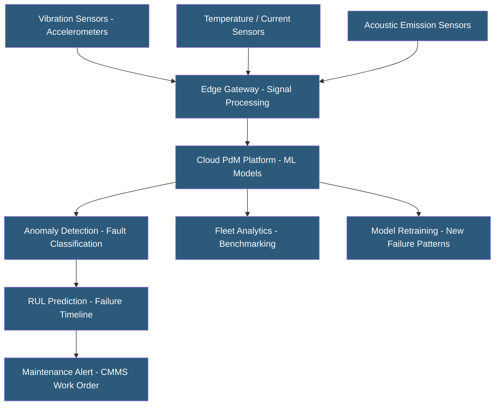

**Category:** Manufacturing & Supply Chain
**Difficulty:** Advanced
**Reading time:** 7 min read

---

Predictive maintenance (PdM) platforms use sensor data, machine learning, and signal processing to detect equipment deterioration before it causes unplanned downtime. By analyzing vibration, temperature, current draw, and acoustic emissions, PdM systems predict when a machine component will fail and recommend maintenance intervention at the optimal time — avoiding both unplanned breakdowns and unnecessary scheduled maintenance. Cloud-hosted PdM platforms combine edge data collection with cloud ML model training and deployment.

- **Condition Monitoring** — Continuous or periodic measurement of machine health indicators to detect developing faults
- **Vibration Analysis** — Measuring and analyzing machine vibration signatures to detect bearing wear, imbalance, misalignment, and gear defects
- **Remaining Useful Life (RUL)** — Predicted time until a component reaches its failure threshold, enabling proactive maintenance scheduling
- **Anomaly Detection** — ML models establishing normal operating patterns and flagging deviations indicating developing faults
- **Edge Computing** — Processing sensor data locally at the machine before sending aggregated insights to cloud, reducing bandwidth and latency
- **Digital Twin (Maintenance)** — Virtual model of a machine's physical state updated with sensor data to simulate health trajectories
- **CMMS Integration** — Connecting PdM alerts to Computerized Maintenance Management Systems for automatic work order creation
- **False Positive Rate** — Frequency of maintenance alerts on healthy equipment; high false positives erode maintenance team trust in the system

PdM platforms deploy sensor arrays on critical equipment: vibration accelerometers on bearing housings and gearboxes, temperature sensors on motor windings and hydraulic fluid, current transducers on motor phases, and acoustic emission sensors detecting early-stage micro-cracking. Sampling rates vary by sensor type — vibration requires high-frequency capture (kHz range), while temperature changes are slow (Hz or sub-Hz).

Edge gateways perform initial signal processing — FFT (Fast Fourier Transform) converts time-domain vibration signals to frequency spectra, isolating signature frequencies associated with specific fault types (bearing outer race defect frequency, gear mesh frequency). This reduces data volume by transmitting features rather than raw waveforms to the cloud.

Cloud ML models are trained on historical data including examples of normal operation, developing faults, and failure events. Supervised classification models identify specific fault types (e.g., bearing inner race, imbalance, misalignment). Unsupervised anomaly detection models baseline normal behavior and flag statistical deviations without requiring labeled failure examples — useful for equipment without historical failure data.

Remaining Useful Life prediction is the most valuable and difficult capability. RUL models combine current degradation indicators with historical failure progression patterns to estimate how many operating hours remain before intervention is needed. This enables just-in-time maintenance scheduling, ordering parts with lead time to spare and scheduling maintenance during planned production breaks.

CMMS integration (Maximo, SAP PM, eMaint) automatically generates work orders when PdM alerts trigger, attaching sensor data and fault details to guide technicians. Closing the loop — recording what was found during maintenance — continuously improves model accuracy.

Leading platforms include SKF @ptitude, Emerson AMS, Samsara, Augury, SparkCognition, and SparkPredict.

- High-value rotating equipment (compressors, turbines, CNC spindles) where unplanned failure causes significant downtime cost
- Remote or unmanned facilities where frequent manual inspections are impractical
- Manufacturers implementing TPM (Total Productive Maintenance) programs
- Utilities managing distributed assets across wide geographic areas
- Process plants where unexpected equipment failure creates safety hazards or environmental releases

| Advantage | Disadvantage |
|-----------|--------------|
| Prevents unplanned downtime on critical equipment | Sensor installation and edge gateway deployment requires capital investment |
| Extends maintenance intervals beyond fixed schedules reducing labor and parts costs | ML model accuracy requires sufficient failure event history for training |
| Remote monitoring enables centralized monitoring of distributed assets | High false positive rates erode maintenance team confidence and response rates |
| RUL prediction enables planned maintenance during production windows | Integration with CMMS and maintenance workflows requires technical configuration |
| Continuous monitoring improves safety by detecting developing faults before failure | PdM effectiveness depends on sensor placement quality and signal conditioning |

- [OEE (Overall Equipment Effectiveness) Tracking](oee-overall-equipment-effectiveness-tracking.md)
- [IoT Sensor Data Hosting](iot-sensor-data-hosting.md)
- [Industrial IoT Platforms](industrial-iot-platforms.md)

---
*Part of the [Manufacturing & Supply Chain](index.md) category · [Back to Master Index](../../index.md)*
