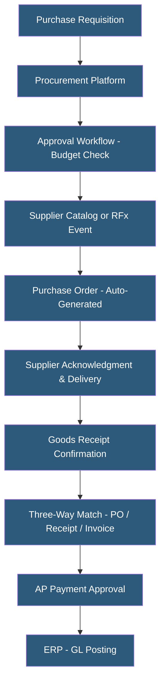

**Category:** Manufacturing & Supply Chain
**Difficulty:** Intermediate
**Reading time:** 6 min read

---

Procurement platforms automate the source-to-pay process — from sourcing and RFx events through purchase order management, receipt, and invoice payment. Cloud-hosted procurement suites replace fragmented email-based purchasing with structured workflows, approval routing, spend controls, and contract compliance. They connect buyers to suppliers through catalogs, e-auctions, and automated PO generation, reducing procurement cycle times and improving spend governance.

- **Source-to-Pay (S2P)** — End-to-end procurement process from supplier sourcing and RFx through invoice payment
- **Procure-to-Pay (P2P)** — Transactional subset of S2P covering purchase requisition through payment
- **RFx** — Request for Information (RFI), Request for Proposal (RFP), or Request for Quotation (RFQ) — competitive sourcing events
- **e-Auction / Reverse Auction** — Online competitive bidding event where suppliers compete on price in real time, driving prices down
- **Catalog Procurement** — Purchasing from pre-negotiated supplier catalogs with approved items and pricing, reducing maverick spend
- **Three-Way Match** — Automated matching of purchase order, receiving receipt, and supplier invoice before approving payment
- **Maverick Spend** — Purchasing outside approved channels and contracts, missing negotiated discounts and compliance requirements
- **Spend Under Management** — Percentage of total company spend flowing through controlled procurement processes

Cloud procurement platforms run as multi-tenant SaaS on hyperscaler infrastructure, handling the complete purchase-to-pay cycle. The process begins with a purchase requisition — an employee identifying a need and requesting approval to buy. The platform routes the requisition through configurable approval workflows based on spend amount, category, department, and cost center, with budget availability checks against ERP financial data.

Approved requisitions convert to purchase orders, either selecting from pre-approved supplier catalogs with negotiated pricing or triggering an RFx sourcing event. Catalog procurement presents employees with an Amazon-like shopping experience within approved suppliers and price points, eliminating manual price negotiations for routine purchases and enforcing contract compliance.

For larger or strategic purchases, RFx events invite multiple suppliers to submit proposals or quotes. E-auction functionality enables real-time competitive bidding where suppliers see their relative rank without seeing competitor prices, driving prices below initial quotes. Contract management stores resulting agreements with pricing commitments published back to catalogs.

Three-way matching automates the most labor-intensive AP process: verifying that invoice amounts, quantities, and unit prices match the purchase order and goods receipt within configured tolerances. Matched invoices flow straight-through to payment approval; mismatches route to exception queues for resolution.

Leading platforms include SAP Ariba, Coupa, Jaggaer, Oracle Procurement Cloud, Ivalua, and Zycus. Mid-market options include Procurify, Tradogram, and Precoro.

- Manufacturing companies implementing spend controls and approval workflows across facilities
- Companies seeking to reduce maverick spend and enforce supplier contract compliance
- Organizations automating three-way match to reduce AP processing costs and cycle times
- Procurement teams running competitive sourcing events for capital equipment and services
- Enterprises implementing supplier diversity tracking and ESG procurement reporting

| Advantage | Disadvantage |
|-----------|--------------|
| Spend governance and approval workflows reduce unauthorized purchases | Enterprise procurement platforms have high licensing and implementation costs |
| Catalog compliance captures negotiated discounts that would otherwise be missed | Change management required to shift employees to structured procurement processes |
| Three-way match automation reduces AP headcount and processing errors | Supplier catalog maintenance requires ongoing collaboration with vendors |
| E-auctions generate competitive pricing beyond traditional RFQ results | Implementation timelines are 6–18 months for large enterprises |
| Spend analytics enable category strategy and contract renegotiation | Integration with ERP for budget checking and GL posting requires technical work |

- [Vendor Management Systems](vendor-management-systems.md)
- [Supplier Portal Hosting](supplier-portal-hosting.md)
- [EDI (Electronic Data Interchange) Hosting](edi-electronic-data-interchange-hosting.md)

---
*Part of the [Manufacturing & Supply Chain](index.md) category · [Back to Master Index](../../index.md)*
